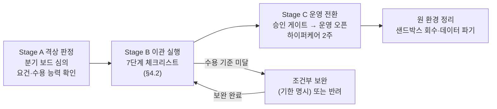

# AIFAB 격상 과제 이관·수용 절차 표준 (바텀업 → 탑다운)

- 문서 구분 : 운영 표준(안)
- 버전 : v1.0
- 작성일 : 2026. 07. 13.
- 작성자 : 신재우
- 상위 문서 : AWS 기반 탑다운(AIFAB) 과제 운영환경 구축·운영 기획안 v1.0 (§6), AWS 기반 바텀업 샌드박스 과제 운영환경 구축·운영 기획안 v1.0 (§7)

---

## 1. 개요

### 1.1 목적

바텀업 우수과제가 탑다운 운영환경으로 격상될 때의 **이관 절차와 수용 기준을 표준화**하여, ① 이관 시점의 재작업·분쟁을 방지하고 ② 수용 측(운영 조직·AI 인프라팀)이 인수 여부를 객관적으로 판정할 수 있게 하며 ③ 격상 건마다 절차가 달라지지 않도록 한다.

### 1.2 적용 범위

- 분기 보드 심의로 격상이 확정된 바텀업 과제의 이관 전 과정 (판정 → 이관 실행 → 운영 전환 → 원 환경 정리)
- 탑다운 파일럿 과제의 종료 후 운영 이관에도 본 표준을 준용한다

### 1.3 용어

| 용어 | 정의 |
|:---|:---|
| 격상 | 바텀업(dev급 샌드박스) 과제를 탑다운(운영급) 환경으로 전환하는 것 |
| 수용 기준 | 수용 측이 인수 가능 여부를 판정하는 측정 가능한 기준 (Acceptance Criteria) |
| 과제 오너 | 격상 대상 과제의 책임자 (이관 완료까지 인계 책임) |
| 운영 조직 | 격상 후 서비스 운영·장애 대응을 맡는 조직 (인수 책임) |
| 하이퍼케어 | 운영 오픈 직후 과제 오너가 운영 조직을 집중 지원하는 전환 기간 |

## 2. 표준화 방향 (원칙)

| # | 원칙 | 내용 |
|:---|:---|:---|
| 1 | **재작성 없는 이관** | 이관의 실체는 "재프로비저닝 + 재배포"다. 형상(Git)과 실행(컨테이너)의 분리가 바텀업 단계부터 유지되므로 애플리케이션 재작성은 발생하지 않아야 하며, 재작성이 필요한 과제는 격상 판정에서 걸러낸다 |
| 2 | **수용 기준 사전 공개** | 수용 기준(§5)은 격상 심의 이전, 바텀업 개발 단계부터 공개한다. 기준을 모른 채 개발하다 이관 시점에 재작업하는 상황을 방지하고, 격상을 노리는 과제가 처음부터 기준에 맞춰 개발하도록 유도한다 |
| 3 | **기술 부채는 측정 가능한 기준으로 판정** | AI 생성 코드는 기술 부채(중복·미리팩토링) 증가 경향이 보고되어 있다. "품질이 나쁘다/좋다"의 주관 판단이 아니라 측정 가능한 임계값(§5)으로 수용·조건부·반려를 판정한다 — 수용 기준 부재는 이관 거부·방치(Pilot Purgatory)의 최대 원인 |
| 4 | **단계별 완료 기준(DoD) 명시** | 체크리스트의 각 단계는 담당·산출물·완료 기준을 갖는다. "완료했다"가 아니라 "완료 기준을 충족했다"로 판정한다 |
| 5 | **데이터 등급 전환은 보안 절차 필수 경유** | 마스킹 데이터 → 실데이터 전환은 설계 재검토와 정보보호팀 재심사(탑다운 기획안 4.1)를 반드시 거친다. 어떤 경우에도 샌드박스 설계 그대로 실데이터를 연결하지 않는다 |

## 3. 표준화 방법 (표준의 운영)

- **문서 체계**: 본 표준(절차·기준) + 이관 체크리스트 템플릿(§6, 과제별 사본 생성) + 판정 기록(과제별 보존)
- **발동 시점**: 분기 보드 격상 심의 확정 시 자동 발동. 과제별 체크리스트 사본을 생성하고 이관 PM(AI Board 운영 전담)을 지정한다
- **판정 권한**: 단계별 통과 판정은 해당 단계 담당이, 최종 수용 판정은 운영 조직+AI 인프라팀 합의로, 분쟁 시 AI Board가 결정한다
- **개정 절차**: 격상 1건 완료 시마다 회고를 실시하고, 개선 사항을 AI Board 승인으로 반영한다 (버전 관리). 초기 임계값 중 (협의 확정) 표기 항목은 첫 격상 전까지 관련 조직과 협의하여 수치를 확정한다
- **표준 이탈**: 예외가 필요한 경우 사유·보완 계획을 명시해 AI Board 승인을 받는다. 구두 예외는 인정하지 않는다

## 4. 격상 프로세스 표준 (3-Stage)

### 4.1 Stage A — 격상 판정 (입구)

| 항목 | 기준 |
|:---|:---|
| 격상 요건 | 활성 사용자·사용 빈도·업무 효과·안정성 기준 충족 또는 상시 가용성 필요 (샌드박스 기획안 §7) |
| 수용 능력 확인 | 운영 조직 지정 가능 여부를 심의 단계에서 확인 — **운영 조직이 지정되지 않으면 격상을 확정하지 않는다** (소유권 공백 방지) |
| 사전 스크리닝 | 재작성 필요 여부(컨테이너·파이프라인 이탈 구조), 실데이터 전환 범위를 심의 자료에 포함 |
| 산출물 | 격상 확정 통보, 이관 체크리스트 사본, 이관 PM 지정, 목표 일정(표준 4~6주) |

### 4.2 Stage B — 이관 실행 (7단계 체크리스트 상세)

| # | 단계 | 담당 | 완료 기준 (DoD) | 표준 소요 |
|:---|:---|:---|:---|:---|
| 1 | 코드 리뷰 | AI 인프라팀 + 과제 오너 | §5.1 코드 품질 기준 전 항목 통과 판정 기록 | 1주 |
| 2 | 문서화 | 과제 오너 | §5.2 문서 3종 작성·운영 조직 검토 완료 | 1주 (1과 병행) |
| 3 | 실데이터 연동 재설계 | 과제 오너 + 정보보호팀 | 데이터 흐름 재설계서 + 정보보호팀 재심사 승인 (탑다운 기획안 4.1) | 1~2주 |
| 4 | 정식 운영 조직 지정 | AI Board | 운영 오너십·장애 대응 책임의 **서면 인수 확인** (§5.3) | Stage A에서 내정, 서면화 3일 |
| 5 | 환경 재프로비저닝 | AI 인프라팀(자동화) | Top-down OU 신규 계정 + `topdown-project` 모듈 스택 생성 완료 | 2~3일 |
| 6 | 이관·검증 | 과제 오너 + 보드 | Git 이관 → 스테이징 검증 통과 → 승인 게이트(보드·정보보호팀) 통과. 상세 이관 절차는 §4.2.1 참조 | 1주 |
| 7 | 원 환경 정리 | AI 인프라팀(자동화) | 샌드박스 자원 회수·데이터 파기 확인 (선셋 절차 준용) — **운영 오픈 + 하이퍼케어 종료 후 실행**. DoD: §7 데이터 파기 증적 요건 충족 | 오픈 후 2주 시점 |

### 4.2.1 계정 간 이관 기술 절차

> 6단계(이관·검증) 실행 시 리소스 유형별 표준 절차를 따른다.

**① S3 — 데이터 이관**
- 크로스어카운트 복제: 대상 버킷 정책 + 복제 IAM 롤 구성 후 S3 복제 활성화. 또는 `aws s3 sync` (대용량 시 S3 Batch Operations 권장)
- 암호화 전환: 소스 CMK(원 계정) → 대상 계정 CMK로 재암호화 후 복사 (SSE-KMS 버킷은 키 교차 권한 설정 필요)
- 완료 기준: 오브젝트 수·용량 일치 확인, 대상 버킷 퍼블릭 차단 설정 재확인

**② RDS — 스냅샷 이관**
- 소스 CMK로 암호화된 스냅샷을 대상 계정에 공유: `modify-db-snapshot-attribute`로 공유 → 대상 계정에서 `copy-db-snapshot` 실행 시 **대상 계정 CMK로 재암호화** 지정 → 복원
- 완료 기준: 대상 계정에서 복원된 DB에 접속 및 데이터 정합성 검증

**③ ECR — 이미지 이관**
- 크로스어카운트 pull 정책 부여 후 pull, 또는 `docker pull` → `docker tag` → 대상 레포 `docker push` (이미지 다이제스트 고정 권장 — 태그 변동 방지)
- 완료 기준: 대상 ECR에서 이미지 pull 및 컨테이너 기동 확인

**④ Secrets Manager — 시크릿 이관**
- 크로스어카운트 직접 복사 불가 — **대상 계정에서 신규 생성** 필수
- 체크리스트: ① 소스 시크릿 목록 추출 ② 대상 계정에 신규 시크릿 생성(값 동일) ③ 애플리케이션 참조 ARN 업데이트(Terraform 변수) ④ 소스 시크릿은 이관 완료 확인 후 삭제(즉시 삭제 금지 — 하이퍼케어 종료 후)

**⑤ DNS/ALB 전환**
- TTL 단축 (→ 60초) → 대상 ALB로 레코드 교체 → 30분 모니터링(5xx·응답시간) → TTL 복원(원래값)
- 다운타임 목표: 서비스 중단 없음(단, TTL 전파 구간 60초 내 일부 요청 구 ALB 도달 가능 — 수용 여부 사전 합의)

**⑥ Git 레포 이관**
- `git clone --mirror <소스 URL>` → 대상 레포 생성 → `git push --mirror <대상 URL>` (히스토리·태그·브랜치 전체 보존)
- Terraform 파이프라인 Source 변수를 대상 레포 URL로 교체
- 소스 레포는 이관 완료 후 **read-only 아카이브** 처리 (삭제 금지)

### 4.3 Stage C — 운영 전환

- 운영 오픈 시 **기본 SLO 템플릿**을 보드가 확정하고 모니터링·알람 자동 구성을 운영 전환 완료 기준에 포함한다:
  - 가용성: 99.5% / 월
  - 5xx 오류율: 1% 미만
  - P95 응답시간: 2초 미만
  - 구성: CloudWatch Composite Alarm + SNS 알람 (임계값 도달 시 운영 조직·AI 인프라팀 자동 통보)
- **하이퍼케어 2주**: 과제 오너가 운영 조직의 1차 대응을 지원한다. 종료 조건: 하이퍼케어 기간 중 발생 이슈의 Runbook 반영 완료 + 운영 조직 단독 대응 1건 이상 수행
- 하이퍼케어 종료 후 원 환경 정리(7단계)를 실행하고 이관 완료를 보드에 보고한다

## 5. 수용 기준 (Acceptance Criteria)

> 판정: 항목별 **통과 / 조건부(보완 기한 명시) / 미달**. 조건부가 하나라도 있으면 보완 완료까지 운영 오픈 불가, 미달이 있으면 반려(Stage A 재심의). (협의 확정) 표기 수치는 첫 격상 전 확정한다.

### 5.1 코드 품질·보안

> **도구 확정 데드라인**: 첫 격상 최소 4주 전(탑다운 파일럿 기준 **8/28**). 이하 기본안으로 운용하되, 해당 시점까지 관련 조직 협의로 수치 확정.

| 항목 | 기준 |
|:---|:---|
| 정적 분석(SAST) | Critical/High 취약점 0건. **기본 도구: Semgrep** (CodeBuild 단계 실행, Critical/High 시 빌드 실패) — 8/28 단일 도구 확정 |
| 시크릿 | 하드코딩 시크릿 0건 — 전량 Secrets Manager 이관. **기본 도구: gitleaks** (pre-receive hook + 파이프라인) |
| 테스트 커버리지 | 핵심 비즈니스 로직 단위 테스트 존재. **기본안: 핵심 모듈 70%** (협의 범위 60~80%) — 8/28 확정 |
| 기술 부채 | 코드 중복률 임계값 이내 (협의 확정), 미사용 코드·실험 코드 제거 |
| 구조 | 컨테이너 기반 실행·파이프라인 배포 구조 유지 (수동 배포 경로 없음), IaC 외 수기 인프라 없음 |

### 5.2 문서

| 문서 | 최소 요건 |
|:---|:---|
| 아키텍처 문서 | 구성도 1장 + 데이터 흐름 + 외부 연동 목록 |
| 운영 절차서(Runbook) | 기동·중지, 장애 유형별 대응, 롤백 절차 |
| 데이터 명세 | 취급 데이터 등급·보존 기간·파기 절차 (실데이터 재심사 결과 반영) |

### 5.3 운영 준비

| 항목 | 기준 |
|:---|:---|
| 운영 조직 인수 | 인수 범위·책임(1차 대응)·연락 체계의 서면 확인 — 기술 부채 잔여 항목(조건부 포함)을 인수 문서에 명기해 "몰랐던 부채"가 없게 한다 |
| SLO·모니터링 | SLO 정의 + 대시보드·알람 자동 구성 확인 |
| 비용 | 운영급 전환 후 월 비용 추정치 보드 보고 (비용태그 적용 확인) |

## 6. 이관 체크리스트 템플릿 (과제별 사본 생성)

| 과제명 | | 격상 확정일 | | 이관 PM | | 목표 오픈일 | |
|:---|:---|:---|:---|:---|:---|:---|:---|

| # | 단계 | 담당 | 완료 기준 충족 | 판정(통과/조건부/미달) | 판정자 | 일자 | 비고(조건부 보완 기한) |
|:---|:---|:---|:---|:---|:---|:---|:---|
| 1 | 코드 리뷰 (§5.1) | | ☐ | | | | |
| 2 | 문서화 (§5.2) | | ☐ | | | | |
| 3 | 실데이터 재설계·재심사 | | ☐ | | | | |
| 4 | 운영 조직 서면 인수 (§5.3) | | ☐ | | | | |
| 5 | 환경 재프로비저닝 | | ☐ | | | | |
| 6 | 이관·검증·승인 게이트 | | ☐ | | | | |
| 7 | 하이퍼케어 종료·원 환경 정리 | | ☐ | | | | |

## 7. 원 환경 정리 DoD — 데이터 파기 증적

> 4.2 7단계(원 환경 정리) 완료 기준 세부 요건. 하이퍼케어 종료 후 AI 인프라팀이 실행하고 정보보호팀에 제출한다.

| 항목 | 요건 |
|:---|:---|
| S3 | 버저닝 포함 전체 오브젝트 완전 삭제 (버킷 삭제 또는 객체 전량 Delete Marker + 버전 삭제 확인) |
| RDS | 스냅샷 전량 삭제 기록 (수동·자동 스냅샷 모두 포함) |
| 로그 | CloudWatch Logs 보존 기간 14일 자동 만료 설정 (또는 즉시 삭제 후 기록) |
| 파기 확인서 | 대상 리소스·파기 방법·파기 일자·담당자 명기 후 **정보보호팀 제출** (이관 완료 보고에 첨부) |

## 8. 예외·실패 처리

- **조건부 판정**: 보완 기한(최대 2주)과 보완 책임자를 명시. 기한 초과 시 자동으로 반려 상태 전환, 보드 보고
- **반려**: Stage A로 회송 — 바텀업 환경에서 계속 운영하며 차기 분기 재심의 (샌드박스 선셋 기준은 그대로 적용됨)
- **이관 중단**: 과제 오너 이탈·사업 판단 변경 시 보드 결정으로 중단하고, 진행된 탑다운 자원은 회수한다
- **분쟁**: 수용 측(운영 조직·AI 인프라팀)과 과제 오너 간 판정 이견은 AI Board가 최종 결정한다

## 9. 참고 문서

- 탑다운 기획안 v1.0 — §4.1 실데이터 취급, §5 개발·배포(승인 게이트), §6 격상 유입 절차
- 샌드박스 기획안 v1.0 — §7 격상·선셋 (격상 요건·심의)
- 리서치 근거 — `metasearch-aifab-topdown-pilot-ops-2026-07-11/05-conclusion.md` (이관 기술 부채 수용 기준 필요성, 소유권 공백 리스크, 하이퍼케어·서면 인수 모범 사례)
