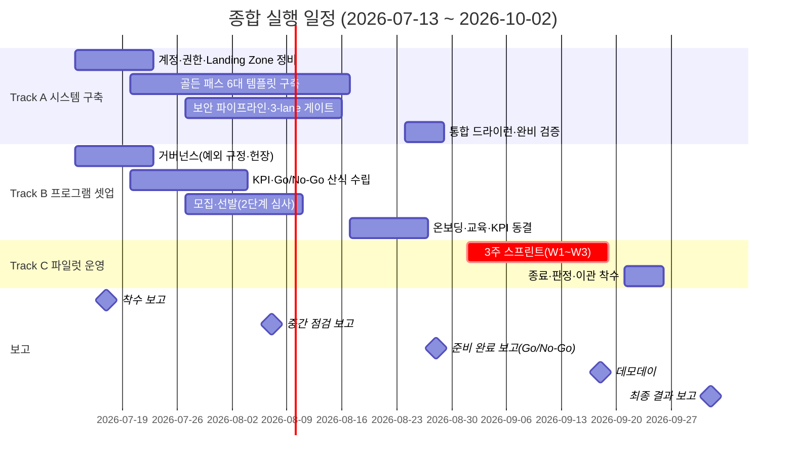

# AIFAB 탑다운 파일럿 — 구축·운영 종합 실행계획 (Master Plan)

> 버전: v1.0 | 작성: 2026-07-12
> **기준선: 7월 3주(7/13) 착수 → 8월 말(8/28) 인프라·프로그램 셋업 완료 → 9월 첫째 주(9/1) 파일럿 개시 → 9월 말 성과 판정 → 10월 초 경영 보고**
> 연관 문서: 구축 타임라인·운영시나리오(실무), 3주 스프린트 운영시간표(실무), 탑다운 AIFAB 운영환경 기획안 v1.0

---

## 1. 문서 목적·전체 구조

7월 중순부터 8월 말까지 **두 트랙을 병행**해 셋업을 완료하고, 9월 첫째 주에 파일럿을 개시한다. 본 문서는 트랙별 일정·R&R·완료 기준·보고 시점을 한눈에 확인하는 기준 문서다.

| 트랙 | 내용 | 주관 | 완료 시한 |
|---|---|---|---|
| **Track A — 시스템 구축** | 골든 패스 템플릿, 보안 파이프라인, 계정·권한, 게이트 체계 | AI 인프라팀 | **8/28(금)** |
| **Track B — 프로그램 셋업** | 거버넌스, 선발, KPI 동결, 온보딩, 지원 체계 편성 | AI Board | **8/28(금)** |
| **Track C — 파일럿 운영** | 3주 스프린트, 게이트 심사, 배포, 종료·이관 | AI Board + 전체 | 9/1~9/25 |
| **보고 체계** | 주간 진척 + 마일스톤 보고 5회 | AI Board → 경영진·스폰서 | 7월~10월 초 |

## 2. 주차별 마스터 일정

| 주차 | 기간 | Track A 시스템 구축 | Track B 프로그램 셋업 | 보고·의사결정 |
|---|---|---|---|---|
| 7월 3주 | 7/13~7/17 | **Landing Zone 점검**: OU·SCP 차등 적용 확인 + 파일럿 과제 계정 신규 발급(Account Factory/Organizations API, 이메일 앨리어스 확보 포함) + Config 필수 룰 적용. **선행 신청 즉시 착수**: Service Quotas 증설(Fargate vCPU·Bedrock RPM·TPM·Lambda·CodeBuild), Bedrock Claude 모델 접근 활성화, DX 대역폭·TGW Attachment 확인 (리드타임 최장 4~8주) | 파일럿 헌장·예외 규정 초안(기획안 §2 주체 조항 보완), 결정 권한자 지명 | **7/17 착수 보고** — 계획·예산·R&R 승인 |
| 7월 4주 | 7/20~7/24 | 골든 패스 구축 개시(ECS·Lambda 템플릿) | KPI·Go/No-Go 산식 수립 착수, 멘토(보드 내 도메인별 1:n)·기술상담 전담 지정 | 7/24 예외 규정 AI Board 승인 (M1) |
| 7월 5주 | 7/27~7/31 | RDS·비용태그 템플릿, SAST·시크릿 검출 파이프라인 착수 | **모집 공고**, 대상 부서 협의(2~3개) | 주간 진척 보고 |
| 8월 1주 | 8/3~8/7 | 관측성·Secrets 템플릿, 3-lane 분류 기준서 | 과제 접수 마감(8/7), 1차 비즈니스 검토 | **8/7 중간 점검 보고** — 구축 진척·접수 현황 |
| 8월 2주 | 8/10~8/14 | 파이프라인 통합 시험, 서비스 카탈로그 위생 점검 | 2차 기술 검토 → **선발 확정(8/14)**, 부서장 서면 합의 | 선발 결과 공지 |
| 8월 3주 | 8/17~8/21 | 참여자 계정·권한 프로비저닝(Entra ID). **SCIM 프로비저닝 E2E 테스트**: 테스트 그룹 → Identity Center 자동 동기화 확인 (온보딩 D1 완료 기준: 전원 로그인 확인 48h) | 온보딩 1주차: Claude Code·골든 패스 교육(2일), 챔피언 지정 | 주간 진척 보고 |
| 8월 4주 | 8/24~8/28 | **통합 드라이런**: 비개발자 폼 입력→스테이징 배포 1h 이내 검증, 완비 선언 | 온보딩 2주차: 전원 드라이런 배포 1회, 백로그 초안, **KPI 동결 서명** | **8/28 준비 완료 보고(Readiness Review)** — 킥오프 Go/No-Go 결정 |
| 9월 1주 | 8/31~9/4 | 운영 지원 모드 전환 (핫라인) | 8/31 최종 리허설·Gate 0 사전 점검 → **9/1(화) 킥오프** | 킥오프 (M6) — 스프린트 W1 |
| 9월 2주 | 9/7~9/11 | 파이프라인 운영 지원 | 스프린트 W2, **9/11 Gate 1 중간 심사** | **9/14(월) 오전까지 Gate 1 판정 통보(SLA 48h 단일화)** |
| 9월 3주 | 9/14~9/18 | Gate 2 자동 검사·배포 실행 | 스프린트 W3: 9/16~17 Gate 2·승인·**배포(9/17)** | **9/18 데모데이** (경영진 참석) |
| 9월 4주 | 9/21~9/25 | 이관/회수 기술 검토 | 회고·클로저 레코드·스코어카드 산정 | **9/24 AI Board 심의** → 9/25 출구 결정 |
| 10월 1주 | 9/28~10/2 | **이관 착수**(격상 표준 리드타임 4~6주, **완료 목표 10월 말~11월 초**) / 폐기 계정 Frozen | 최종 보고서 작성 | **10/2 최종 결과 보고** — 확대(2차 코호트) 여부 |

## 3. R&R (RACI)

> R=실행, A=최종 책임, C=협의, I=통보

| 활동 | AI Board (운영 전담 2~5명 포함) | AI 인프라팀 | 정보보호팀 | 멘토 | **기술상담 전담** | 챔피언 | 부서장 | 시티즌 개발자 |
|---|---|---|---|---|---|---|---|---|
| 파일럿 헌장·예외 규정 | **R/A** | C | C | I | I | — | I | — |
| 골든 패스·파이프라인 구축 | C | **R/A** | C | C | C | — | — | — |
| KPI·Go/No-Go 산식 수립·동결 | **R/A** | C | C | C | I | — | I | I |
| 모집·선발(2단계 심사) | **A**/R(1차) | R(2차) | C | R(2차) | C(기술 검토) | — | C(승인) | 지원 |
| 온보딩·교육 | **A**/R | R(계정) | I | C | C | R | I | R |
| 스프린트 일일 운영 | **A** | C | — | R(방향성 점검) | **R**(코드 블로커) | R(스탠드업) | I | **R** |
| Gate 0·1 심사 | **A**/R | C | — | R | C | — | I | 발표 |
| Gate 2 — 자동 검사·3-lane 리뷰 | C | R | R(Red lane) | C | **R**(Green lane 1차) | — | — | 제출 |
| Gate 2 — 배포 최종 승인 | **A** | R(배포 실행) | **A**(보안) | — | — | — | — | — |
| 데모데이 | **A**/R | C | — | C | C | C | I(참석) | 발표 |
| Go/No-Go 판정·출구 결정 | **A**/R(산정) | C | C | C | I | — | C | I |
| 이관(격상 절차) / 리소스 회수 | C | **R/A** | C | C | C | — | I(이관 수용) | 인수인계 |
| 주간·마일스톤 보고 | **R/A** | C | — | — | I | — | I | — |

> 보고 수신: 경영진·스폰서 (§5 보고 체계 참조)

## 4. 셋업 완료 기준 (8/28 Readiness Review 체크리스트)

킥오프 Go/No-Go는 아래 전 항목 충족 시에만 Go. **하나라도 미충족 시 킥오프 1~2주 순연** (일정보다 전제 충족 우선).

### Track A — 시스템 구축
- [ ] 골든 패스 **7대** 템플릿 완비 (ECS on Fargate / Lambda / RDS / 비용태그 / 관측성 / Secrets Manager / **Bedrock 연동**)
- [ ] 폼 입력 → CI/CD·IAM·모니터링 포함 레포 자동 생성 → 스테이징 배포 **1시간 이내** (비개발자 드라이런 통과)
- [ ] SAST(Semgrep)·시크릿 검출(gitleaks)·컨테이너 스캔(Inspector) 파이프라인 내장 (Critical/High 0건 게이트 동작 확인)
- [ ] 3-lane 분류 기준서·리뷰 절차 확정 (Green 피어 1인 4h / Yellow 시니어 24h / Red 3인 48h)
- [ ] 참여자 전원 계정·권한 발급 (Entra ID SAML·SCIM)
- [ ] Blue/Green 배포·자동 롤백 스테이징 검증 완료
- [ ] **Identity Center 권한 세트 전 역할 발급 확인** (시티즌 개발자·AI 인프라팀·정보보호팀·AI Board·멘토·기술상담 전담)
- [ ] **TGW-DX 경유 사내 DNS·NTP 통신 확인** (네트워크팀 검증 포함)
- [ ] **Bedrock VPC Endpoint 호출 테스트** (서울 리전 bedrock-runtime, 크로스리전 프로파일 포함)
- [ ] **ECR 프라이빗 엔드포인트 pull 테스트**
- [ ] **S3 게이트웨이 엔드포인트 확인**
- [ ] **CloudWatch Logs 수집 확인** (과제 계정 → 중앙 로그 버킷 경로)

### Track B — 프로그램 셋업
- [ ] 파일럿 예외 규정 AI Board 승인 (기획안 주체 조항 보완)
- [ ] 팀 2~3개(팀당 3~5명 혼합팀) 선발 확정, 부서장 3주 전담 서면 합의
- [ ] KPI 6종·Go/No-Go 스코어카드(자체 가중치·임계값) **서명 동결**
- [ ] 참여자 전원 교육 이수 + 드라이런 배포 1회 성공
- [ ] 도메인별 멘토(보드 내 팀원, 1:n)·기술상담 전담 1명·챔피언 팀당 1명 지정, 정기 기술상담(화·목 신청제)·전용 채널 개설
- [ ] 이관 후보 팀의 기술 부채 수용 기준 협의 개시 (W3 전 합의 목표)

## 5. 보고 체계

### 정기 보고
| 보고 | 주기 | 작성 | 수신 | 내용 |
|---|---|---|---|---|
| 주간 진척 보고 | 매주 금 | AI Board | 스폰서·경영진 | 트랙별 진척률, 이슈·리스크, 차주 계획 (1페이지). **보안 현황 포함**: GuardDuty Finding 건수·Security Hub 스코어 |
| 스프린트 데일리 | 매일 (9월) | 챔피언 | AI Board | 스탠드업 요약, 블로커 |

> **보안 이슈 긴급 통보**: Critical Finding 발생 시 정보보호팀에 **4h 이내** 통보 (주간 보고 대기 금지)

### 마일스톤 보고 (경영 보고 5회)
| # | 보고 | 시점 | 핵심 안건 | 의사결정 |
|---|---|---|---|---|
| 1 | 착수 보고 | **7/17(금)** | 종합 계획·R&R·예산 | 계획 승인, 자원 투입 확정 |
| 2 | 중간 점검 보고 | **8/7(금)** | 시스템 구축 진척, 과제 접수 현황 | 리스크 조치 승인 |
| 3 | 준비 완료 보고 | **8/28(금)** | Readiness 체크리스트 결과 | **킥오프 Go/No-Go** |
| 4 | 데모데이 | **9/18(금)** | 팀별 배포 결과 시연 (5~10분) | — (참관) |
| 5 | 최종 결과 보고 | **10/2(금)** | KPI 실측, 팀별 출구 결정 결과, 위험 조정 ROI | **확대(2차 코호트) 여부** |

> 별도: 9/24(목) AI Board 심의(Go/No-Go 스코어카드 기반 출구 결정)는 정기 보드 프로세스로 진행.

## 6. 핵심 리스크 (요약)

| 리스크 | 조기 신호 | 대응 |
|---|---|---|
| 골든 패스 구축 지연 | 8/7 중간 점검 시 템플릿 3종 미만 완성 | 범위 축소(핵심 2~3종 우선), 필요 시 킥오프 순연 결정을 8/28이 아닌 8/14에 조기 검토 |
| 선발 미달(지원 부족) | 8/7 접수 마감 시 부서 2개 미만 | 부서장 대상 설명회 추가, 모집 1주 연장(온보딩 압축으로 흡수) |
| 예외 규정 승인 지연 | 7/24 미승인 | 착수 조건이므로 최우선 에스컬레이션 — 미승인 상태로 선발 공고 금지 |
| 스프린트 중 품질 이슈 | Gate 1에서 Stop/Pivot 과반 | 데모데이 범위 조정, 원인을 최종 보고에 반영(파일럿 자체가 벤치마크 수립 목적) |

## 7. 참고 문서

- 상세 시나리오: `26.07.14_AIFAB_탑다운_파일럿_구축_타임라인_운영시나리오_실무_v1-0.md`
- 스프린트 일별 시간표: `26.07.13_AIFAB_3주_스프린트_운영시간표_실무_v1-0.md`
- 경영 보고용: `26.07.14_AIFAB_탑다운_파일럿_구축_타임라인_경영보고_v1-0.md`, `26.07.14_AIFAB_3주_스프린트_운영시간표_경영보고_v1-0.md`
- 리서치 근거: `metasearch-aifab-topdown-pilot-ops-2026-07-11/05-conclusion.md`
- **격상·이관 절차**: `26.07.13_AIFAB_격상과제_이관수용_절차_표준_v1-0.md`
