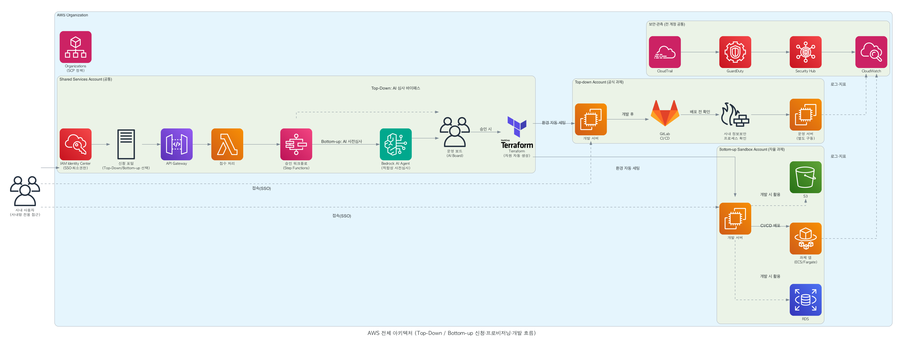
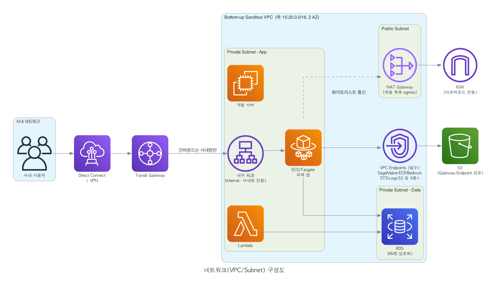
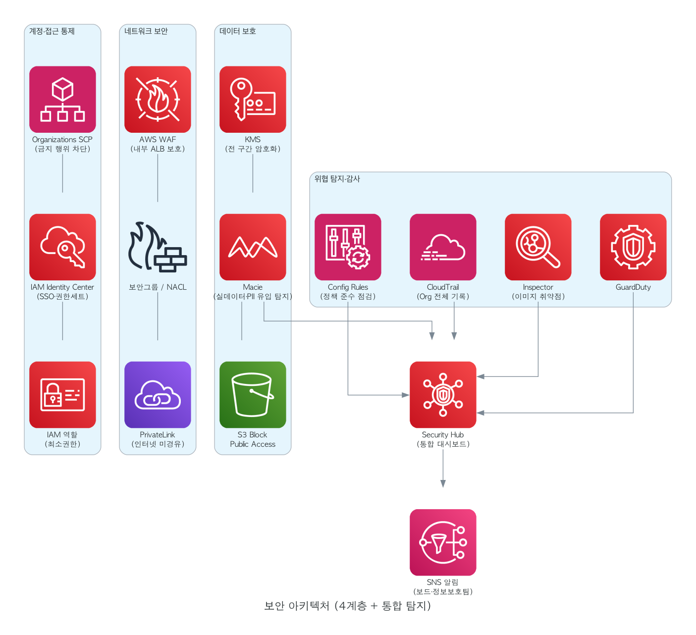
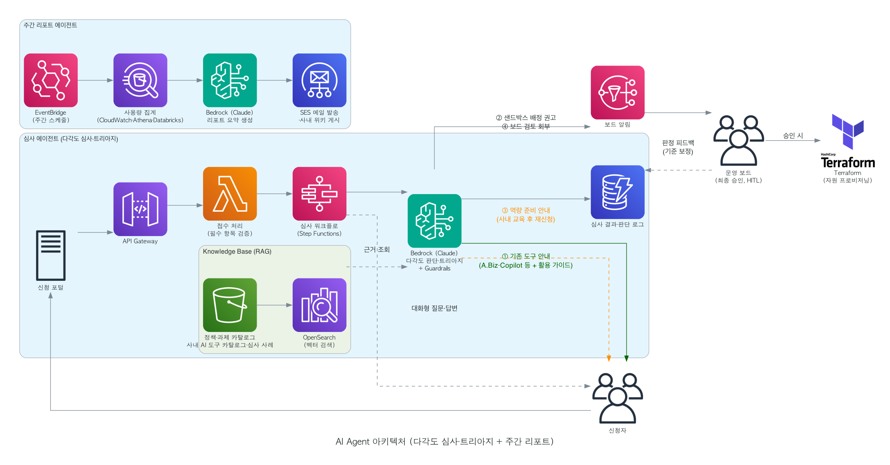
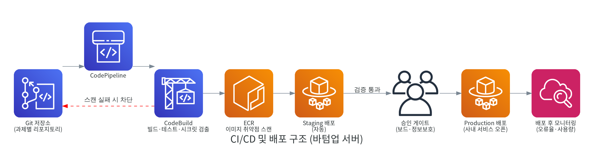
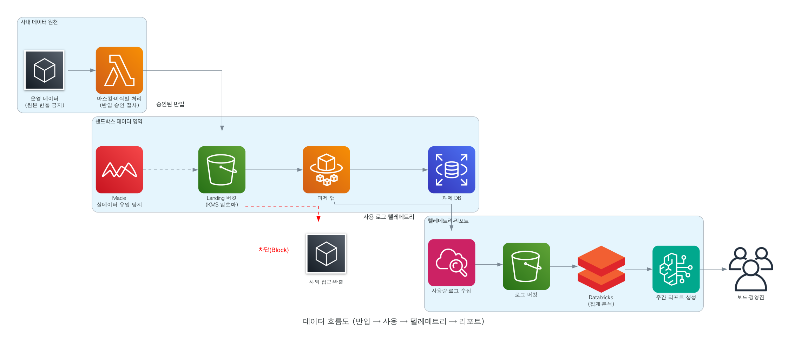
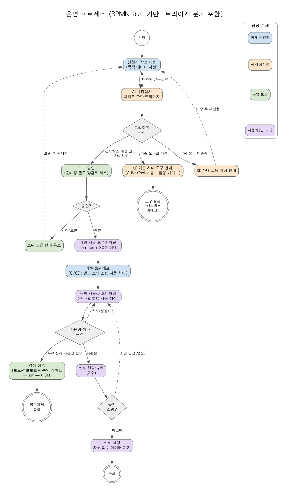

# AWS 기반 샌드박스 구축·운영 기획안

AI SAND BOX : 현장 주도(Bottom-up) 과제 지원 플랫폼

- 문서 구분 : 운영 기획(안)
- 버전 : v2.0 (재작성본, 기존 보완본 통합)
- 작성일 : 2026. 07. 10.
- 작성지 : AI Board 신재우 프로

---

## 1. 추진 배경 및 목적

### 1.1 추진 배경

- Capa. Belt 프로그램을 통해 클로드 코드 및 코파일럿 교육을 받은 사내 시티즌 개발인력을 확보함.
- AIFAB 프로그램은 T2Y 달성을 목표로 하는 탑다운 AI 과제 수행을 위해 기획되었으나, 탑다운 과제 범위에 해당하지 않는 현장의 개선 아이디어를 수행할 방법론이 부재함
- AIFAB을 위해 마련한 샌드박스를 일부 확대하여, 일반 시티즌 개발자가 자율(바텀업) 과제를 수행할 수 있는 환경을 제공하고자 함
- 다만 통제 없는 자율 개발을 허용할 경우 보안·데이터·자원 관리 리스크가 발생하므로, 정책이 플랫폼 차원에서 강제되는 샌드박스 운영이 필요
- 과제 심사·모니터링·보고를 수작업으로 수행하면 운영 보드의 부담이 과다해지므로 AI 기반 자동화가 전제 조건
- 신속한 자원 생성·회수, 계정 단위의 격리, 관리형 AI 서비스(Amazon Bedrock) 활용을 위해 AWS 클라우드 기반으로 구축

### 1.2 목적

- AWS Organization으로 탑다운/바텀업 환경을 계정 수준에서 분리·격리하고, 바텀업 과제의 신청부터 배포·선셋까지 전 생애주기를 플랫폼으로 지원
- Amazon Bedrock(Claude) 기반 AI Agent로 과제 적합성 심사와 주간 리포트를 자동화하여 최소 인력으로 지속 운영 가능한 체계 확보
- Security by Design: 민감정보 마스킹 원칙(실데이터 사용은 허용하되 민감정보는 마스킹), 사내망 한정 접근, 트래픽 통제 등 보안 정책을 아키텍처에 내재화
- 우수과제의 탑다운 격상(마이그레이션) 파이프라인과 저활용 과제의 자동 선셋 체계 확보

### 1.3 적용 범위

과제 신청 → AI 사전심사 → 보드 승인 → 자원 프로비저닝 → 개발 → 배포 → 운영 모니터링 → 격상 또는 선셋에 이르는 바텀업 과제 전 생애주기와, 이를 지원하는 AWS 인프라·보안·자동화 체계 전반을 대상으로 한다.

## 2. 운영 정책 및 거버넌스

### 2.1 역할 분담(R&R)

| **주체** | **담당 범위** |
|:---|:---|
| AI 인프라팀 | 샌드박스 사용자 확인·신청 프로세스, 전산자원 신청 프로세스 시스템 구현 및 AWS 플랫폼(Landing Zone) 운영 |
| AI Board | 샌드박스 정책 수립, 하네스(공통 개발·실행 환경과 가드레일) 구성, 과제 적합성 심사·승인, 격상·선셋 최종 판단 |
| AI Agent (Bedrock) | 과제 다각도 사전 심사와 수행 수단 트리아지(기존 사내 AI 도구 안내/샌드박스 배정), 사용량 모니터링, 주간 리포트 자동 생성 등 보드 판단 업무 보조 |
| 정보보호팀 | 배포 구간 보안 요건 협의·승인, 정기 보안 점검, 보안 사고 대응 공조 |
| 과제 수행자(현업) | 과제 신청·개발·운영 오너십, 담당자 변경 시 이관 책임 |

### 2.2 운영 원칙 (Human-in-the-loop)

AI Agent는 판단을 보조하고 최종 승인 권한은 AI Board 가 보유한다. 에이전트의 판단 정확도가 검증되면 저위험 건부터 자동 처리 범위를 단계적으로 확대한다.

### 2.3 핵심 운영 정책

| **구분** | **정책** |
|:---|:---|
| 데이터 | 실데이터(운영 데이터) 사용 허용 — 단, 민감정보(개인정보 등)는 마스킹·비식별 처리 후 사용하는 것을 원칙으로 한다. 반입 시 등급 분류와 승인 절차 적용 |
| 접근 통제 | 사내망 한정 접근(인터넷 인바운드 차단), IAM Identity Center 기반 SSO와 최소권한 원칙 |
| 자원·트래픽 | 과제별 쿼터(컴퓨팅·스토리지·API 호출량)와 Rate Limit 적용, 임계치 초과 시 자동 알람·차단 |
| 산출물 통제 | 산출물을 다운로드 하는 것을 금지(외부 공유 차단, 아웃바운드 화이트리스트, 문서 DRM·워터마크) |
| 감사 | 전 계정 CloudTrail 기록, 접근·배포·데이터 사용 이력 전수 보존, 정보보호팀 정기 점검 |

### 2.4 격상·선셋 기준

- 격상: 활성 사용자 수, 사용 빈도, 업무 효과(절감 공수), 안정성(오류율) 기준을 충족하거나 상시 가용성이 필요해진(시간제 가동으로 서비스 유지가 어려운) 과제를 분기 단위로 보드가 심의하여 탑다운 공식 과제로 전환. 격상 시 코드 리뷰·문서화·마스킹 해제(민감정보 원본 연동) 재설계(보안 재심사)·정식 운영 조직 지정을 체크리스트로 관리
- 선셋(예시 기준, 보드 확정): 최근 4주 접속 0건 또는 주간 활성 사용자 기준 미달이 4주 지속되면 1차 알람 → 2주 유예 → 접속 차단 → 4주 보관 후 자원 회수·데이터 파기. 오너가 소명하면 보드 판단으로 연장 가능
- 담당자 퇴직·부서이동으로 오너가 없는(Orphan) 과제는 즉시 선셋 후보로 분류하여 이관 또는 종료 처리

## 3. AWS 전체 아키텍처

AWS Organization으로 Shared Services(공통), Top-down(공식 과제), Bottom-up Sandbox(자율 과제) 계정을 분리한다. Shared Services 계정에는 신청 포털과 승인 자동화(API Gateway, Lambda, Step Functions), Bedrock AI Agent, Terraform을 배치하고, 승인이 완료되면 Terraform이 Sandbox 계정에 표준 스택(ECS/Fargate, EC2, S3, RDS)을 자동 생성한다. CloudTrail, GuardDuty, Security Hub, CloudWatch는 전 계정 공통의 보안·관측 계층으로 운영한다.



*그림 1. AWS 전체 아키텍처 (계정 분리 및 신청·프로비저닝 흐름)*

### 3.1 레이어별 서비스 구성

| **영역** | **AWS 서비스** | **역할** |
|:---|:---|:---|
| 계정 거버넌스 | AWS Organizations (SCP) | 탑다운/바텀업 계정 분리, 금지 행위의 조직 차원 차단 (상세: 3.2) |
| 인증·권한 | IAM Identity Center | 사내 SSO 연동, 권한세트 기반 최소권한 부여 (상세: 3.3) |
| 신청·승인 자동화 | API Gateway, Lambda, Step Functions | 신청 접수, 심사 워크플로, 승인·프로비저닝 오케스트레이션 (상세: 3.4) |
| AI 심사·리포트 | Amazon Bedrock(Claude), Knowledge Bases | 적합성 사전 심사, 주간 리포트 자동 생성(RAG 기반) |
| IaC | Terraform (CloudFormation 병용 가능) | 과제별 표준 스택 자동 생성·회수 (상세: 3.5) |
| 실행 환경 | ECS/Fargate, EC2, Lambda | 과제 앱 실행(dev 배포), 개발 서버, 경량 처리 (상세: 3.6) |
| 저장소 | S3, RDS, DynamoDB | 데이터·산출물 저장, 과제 DB, 심사 결과 저장 |
| 보안·관측 | CloudTrail, GuardDuty, Security Hub, CloudWatch, Config, Inspector, Macie | 감사 기록, 위협 탐지, 통합 대시보드, 로그·지표 |
| 분석·리포트 연계 | Athena + Databricks | 사용량 집계·분석, 리포트 데이터 공급 |

### 3.2 계정 거버넌스 세팅 (Organizations · SCP)

계정 거버넌스의 원칙은 **"계정 안에서는 자율, 조직의 금지선은 강제"**이다. 사내망 한정·아웃바운드 통제는 VPC 설정(4장)으로 구현하지만, 그 설정을 과제 수행자가 임의로 변경할 수 없도록 조직 레벨의 SCP로 잠근다. SCP는 계정 내부의 IAM 권한과 무관하게 적용되므로, 샌드박스 사용자에게 넓은 자율성을 부여하면서도 격리 전제가 훼손되지 않음을 플랫폼 차원에서 보장한다.

#### 3.2.1 조직(OU) 구조

```
Root (관리 계정: 조직·결제 관리 전용, 워크로드 배치 금지)
├── OU: Shared Services   — 신청 포털·승인 자동화·AI Agent·조직 로그 집적
├── OU: Top-down          — AIFAB 공식 과제 계정
└── OU: Bottom-up Sandbox — 바텀업 과제 계정 (아래 SCP 가드레일 적용)
```

- 관리 계정은 SCP가 적용되지 않는 유일한 계정이므로 워크로드를 두지 않고 접근을 최소 인원으로 제한한다.
- 신규 샌드박스 계정은 과제 승인 시 Bottom-up Sandbox OU 아래에 **자동 생성**되며, OU에 부착된 SCP를 즉시 상속받는다(계정별 개별 설정 불필요).
- **계정 벤딩 자동화**: 보드 승인 완료 시 Step Functions이 Organizations `CreateAccount` API(또는 Control Tower Account Factory)를 호출해 과제 계정을 자동 생성하고, 생성된 계정을 Bottom-up Sandbox OU에 이동하여 SCP를 즉시 상속시킨다.
- **선셋 시 계정 격리 및 폐기**: 선셋 확정 → 계정을 별도 Quarantine OU로 이동(Deny-all SCP 부착, 기존 접근 즉시 차단) → 90일 보관(데이터 감사·증거 보존) → `CloseAccount` API로 계정 폐기. Quarantine OU의 Deny-all SCP는 계정 내부 모든 API 호출을 차단하며, 90일 경과 전 복구가 필요한 경우 보드 결정으로 Sandbox OU 재이동 가능하다.

#### 3.2.2 SCP 가드레일 목록

기본 정책(FullAWSAccess)을 유지한 채 아래 Deny 가드레일을 Bottom-up Sandbox OU에 부착한다. 권한 부여는 Identity Center 권한세트가 담당하고, SCP는 차단 전용으로만 사용한다.

| **#** | **가드레일** | **차단 대상(예)** | **목적** |
|:---|:---|:---|:---|
| 1 | 서울 리전 외 API 호출 차단 | `aws:RequestedRegion ≠ ap-northeast-2` 전체 거부 | 사내망 연동·모니터링이 없는 리전으로 격리 환경이 번지는 것 방지 |
| 2 | 인터넷 경로 생성 금지 | Internet Gateway 생성·연결, EIP 할당 | 인터넷 인바운드 차단 전제를 사용자 변경으로부터 보호 |
| 3 | 네트워크 핵심 자원 변경 제한 | VPC·서브넷·라우팅·NAT·Transit Gateway 연결 변경 (Terraform 프로비저닝 역할만 예외 허용) | 사내망 한정·아웃바운드 화이트리스트 구조 유지 |
| 4 | 감사·보안 서비스 비활성화 금지 | CloudTrail 중지·삭제, GuardDuty·Config·Security Hub 해제 | 전수 감사 기록과 위협 탐지 체계 보호 |
| 5 | S3 퍼블릭 노출 금지 | Block Public Access 해제, 퍼블릭 버킷 정책 | 산출물·데이터의 사외 노출 방지 |
| 6 | 거버넌스 이탈 금지 | 조직 탈퇴(LeaveOrganization), 계정 폐쇄 | 통제 범위 밖으로의 계정 이탈 방지 |

- 가드레일 3의 예외는 `aws:PrincipalArn` 조건으로 Shared Services의 Terraform 프로비저닝 역할만 허용한다. 즉 네트워크 변경은 IaC 코드 리뷰(PR)를 거친 자동화 경로로만 가능하다.
- SCP는 무비용이며, 목록의 추가·변경은 AI Board 정책 심의를 거쳐 AI 인프라팀이 반영한다.

### 3.3 인증·권한 세팅 (Identity Center · Entra ID 연동)

인증·권한의 원칙은 **"AWS에 별도 자격증명을 만들지 않는다"**이다. 사내 MS Entra ID를 신원의 단일 원천(Single Source of Truth)으로 삼아 사번 기반으로 자동 연동하고, AWS 접근은 전부 임시 자격증명(STS)으로만 이뤄진다. 입사·퇴사·부서이동이 사내 인사 체계에 반영되면 AWS 접근 권한도 자동으로 따라간다.

#### 3.3.1 연동 구조 (SAML 인증 + SCIM 프로비저닝)

```
[MS Entra ID]                                 [AWS IAM Identity Center]
     │
     ├─ ① SAML 2.0 (인증) ─────────────────→  로그인 시 신원 확인
     │     사내 MFA·조건부 액세스 정책 그대로 적용
     │
     └─ ② SCIM (프로비저닝) ───────────────→  사용자·그룹 자동 동기화
           사번(employeeId) 속성 매핑,             (생성·수정·비활성화)
           입사·퇴사·부서이동 자동 반영
```

- **① SAML(인증)**: 사용자는 AWS 액세스 포털 접속 시 Entra ID 로그인으로 리다이렉트된다. 사내 MFA·조건부 액세스(사내망 한정 로그인 등)가 그대로 적용되고, AWS에는 별도 비밀번호가 존재하지 않는다.
- **② SCIM(프로비저닝)**: Entra ID의 사용자·그룹이 Identity Center로 자동 동기화된다. 사번(`employeeId`)을 속성 매핑으로 전달하며, Entra ID 앱 갤러리의 표준 앱(AWS IAM Identity Center)으로 설정한다.
- 권한은 권한세트(Permission Set)로 표준화하고, "그룹 × 계정 × 권한세트" 할당으로 부여한다.

| **권한세트** | **대상** | **범위** |
|:---|:---|:---|
| SandboxDeveloper | 과제 수행자 | 담당 과제 계정 내 광범위 개발 권한 (네트워크·조직 변경은 SCP가 차단) |
| SandboxReadOnly | AI Board·정보보호팀 | 샌드박스 전 계정 조회 (심사·점검용) |
| PlatformAdmin | AI 인프라팀 | Shared Services·Landing Zone 운영 |

#### 3.3.2 사번 기반 권한 부여 흐름 (승인 → 접근)

1. 보드 승인 완료 시 Step Functions 워크플로가 후속 자동화를 실행
2. Lambda가 Microsoft Graph API로 신청자 사번을 Entra ID 과제 그룹(예: `AWS-SBX-{과제ID}-Dev`)에 추가
3. SCIM이 그룹·멤버를 Identity Center로 동기화
4. Terraform이 해당 그룹을 "과제 계정 × SandboxDeveloper"에 할당
5. 사용자는 액세스 포털 → Entra 로그인(MFA) → 담당 과제 계정만 표시 → 임시 자격증명으로 콘솔/CLI 사용

퇴사·부서이동 시에는 역방향이 자동 동작한다: Entra 계정 비활성화 → SCIM 동기화 → 모든 AWS 접근 즉시 차단. 이 이벤트를 Orphan 과제(2.4) 탐지 트리거로도 활용한다.

#### 3.3.3 운영 원칙·확인 사항

- 권한 변경은 Entra ID 그룹 멤버십으로만 수행한다. SCIM 동기화 대상은 Identity Center 쪽에서 수정할 수 없으며, 수정해도 다음 동기화에서 덮어써진다(원천은 항상 Entra)
- SCIM 동기화는 약 40분 주기이므로, 승인 직후 온디맨드 프로비저닝을 트리거해 "승인 후 30분 내 자원 사용" 목표(9.1)를 보장
- SCIM은 중첩 그룹을 지원하지 않으므로 과제 그룹에 사용자를 직접 배치하는 평평한 구조로 설계
- Entra ID 자동 프로비저닝에는 P1 이상 라이선스가 필요(사내 M365 라이선스 포함 여부 확인)
- Identity Center는 조직당 1개(서울 리전)로 활성화하고, 관리 위임(delegated administration)으로 Shared Services 계정에서 운영(관리 계정 최소화 원칙 3.2.1과 일치)

### 3.4 신청·승인 자동화 개발 계획 (API Gateway · Lambda · Step Functions)

신청·승인 자동화 계층은 현재 구체적인 설계가 확정되지 않은 영역으로, 기성 서비스의 설정만으로 구성할 수 없는 **신규 개발 대상**이다. 신청 포털(UI·API), 접수·심사 워크플로(Step Functions), AI 트리아지(사전심사)·자동화 에이전트가 개발 범위에 해당하며, 서비스 구성(API Gateway·Lambda·Step Functions)은 방향으로만 정한 상태다.

| **구분** | **내용** |
|:---|:---|
| 개발 주체 | AI 인프라팀 — 트리아지·자동화 에이전트를 포함한 신청·승인 시스템의 설계·개발·운영 담당 |
| 검토 주체 | AI Board — 요구사항·심사 기준·정책 관점의 검토 및 의견 제시 |
| 현재 상태 | 상세 설계 미확정. 기능 요건은 6장(AI Agent 아키텍처)과 9장(운영 프로세스)을 기준으로 함 |
| 확정 시점 | 로드맵 2단계(신청 자동화) 착수 전, AI 인프라팀이 상세 설계·개발 기획을 수립하고 AI Board 검토를 거쳐 확정 |

### 3.5 IaC 세팅 (Terraform 표준 모듈)

IaC의 원칙은 **"인프라 변경은 코드 리뷰(PR)를 통과한 코드로만"**이다. 과제 자원은 콘솔 수작업 없이 Terraform 표준 모듈로만 생성·변경·회수하며, 이를 통해 보안 설정 내재화(KMS 암호화·프라이빗 배치·태깅·쿼터), 30분 내 프로비저닝(9.1), 선셋 시 누락 없는 자원 회수(2.4)를 구현한다.

| **구분** | **내용** |
|:---|:---|
| 표준 모듈 | `sandbox-project` 모듈 1종에 과제용 자원 세트(ECS/Fargate, EC2, S3, RDS, 태그·예산 알람)를 정의하고, 과제마다 변수(과제 ID·오너 사번·쿼터)만 바꿔 인스턴스화 |
| 실행 구조 | 승인 완료 → Step Functions → Shared Services의 Terraform 실행(CodeBuild) → cross-account 역할 AssumeRole 체인으로 과제 계정에 스택 생성. 이 프로비저닝 역할이 SCP 가드레일 3(3.2.2)의 유일한 네트워크 변경 예외 |
| State 관리 | S3 백엔드(암호화·버전 관리, `terraform-state-{env}` 버킷) + DynamoDB 잠금 테이블(`terraform-locks`)으로 동시 실행 충돌 방지. State는 `{env}/{project_id}/terraform.tfstate` 계층으로 환경·과제별 분리 |
| 자원 회수 | 선셋 확정 시 `terraform destroy`로 과제 스택 전체를 일괄 회수 (핵심 비용 통제 장치) |
| 드리프트 통제 | 콘솔 직접 변경은 SCP·권한세트로 차단하고, 주 1회 정기 `plan` 잡(EventBridge Scheduler + CodeBuild)으로 코드와 실제의 불일치 탐지 — 차이 발생 시 SNS 알람을 AI 인프라팀에 전송 |

CloudFormation은 조직 공통 골격(전 계정 CloudTrail 등) 배포에 한해 병용 가능하나, 관리 일원화를 위해 Terraform 통일을 기본으로 한다. 표준 모듈은 **SemVer 버전 정책**(MAJOR.MINOR.PATCH)으로 태그 관리하며, 모듈 변경 시 MINOR 이상은 기존 과제 영향도를 `plan`으로 확인 후 단계적으로 적용한다. MAJOR 변경 시에는 AI 인프라팀 공지 후 순차 마이그레이션 윈도우를 제공한다.

### 3.6 실행 환경·가동 정책 (상시 vs 시간제)

탑다운과 바텀업은 실행 환경의 등급과 가동 방식을 다르게 운영한다. 탑다운(공식 과제)은 별도 운영 환경에서 상시 가동하고, 바텀업(샌드박스)은 개발과 동일한 환경 안에 dev 등급으로 배포하며 정해진 시간에만 가동한다. **상시 가용성이 필요해진 바텀업 과제는 그 자체가 격상(2.4) 사유가 된다** — 운영급 환경은 격상을 통해서만 부여된다.

| **구분** | **탑다운 (공식 과제)** | **바텀업 (샌드박스)** |
|:---|:---|:---|
| 실행 환경 | 별도 운영 환경(계정)에서 실행 | 개발과 동일한 샌드박스 환경에 dev 배포 |
| 가용성 | 상시 가동 (서비스 수준 보장) | 시간제 가동 — 스케줄 기반 셧다운/웨이크업 |
| 배포 단계 | 스테이징 → 운영 (승인 게이트) | dev 배포까지 (운영급 배포 없음) |
| 비용 모델 | 상시 자원 (Savings Plans 대상) | 가동 시간만 과금 |

#### 3.6.1 셧다운/웨이크업 자동화 (바텀업)

- EventBridge Scheduler가 과제 태그 기준으로 일괄 제어한다. 기본 가동 시간은 평일 08:00~20:00(예시, AI Board 확정)
- EC2 개발 서버: stop/start — 디스크·작업 상태는 유지됨
- ECS/Fargate: 태스크 수를 0으로 축소 ↔ 원복 (컨테이너는 "중지"가 아닌 수량 조절 방식)
- RDS: stop/start — 정지 최대 7일 제한이 있어 자동 재정지 처리를 포함
- 시간 외 가동(야간 데모·장시간 배치 등)은 포털에서 연장·즉시 웨이크업을 신청하며, 저위험 건은 자동 승인
- ALB·NAT Gateway·VPC Endpoint 등 네트워킹 고정비는 셧다운 대상이 아니며, 절감 효과는 컴퓨팅(Fargate·EC2·RDS)에서 발생 (비용 반영: 11장)

#### 3.6.2 애플리케이션 런타임(WAS) 구성

애플리케이션 서버(WAS)는 별도 서버 티어(EC2 위 Tomcat·WebLogic·JBoss 등)를 두지 않는다. 애플리케이션을 컨테이너 이미지로 패키징해 ECS/Fargate에서 구동하고, 웹·로드밸런싱 티어는 내부 ALB(+WAF, 4·5장)가 담당한다. 전통적 3-tier는 다음과 같이 대응한다.

| **전통적 3-tier** | **본 아키텍처 대응** |
|:---|:---|
| 웹 서버 (Apache/nginx — 정적·리버스프록시) | 내부 ALB (+ WAF) — L7 라우팅·로드밸런싱, 사내망 인바운드만 수신 |
| **WAS (Tomcat/WebLogic/JBoss)** | 컨테이너 이미지에 내장 서버를 포함해 ECS/Fargate 태스크로 구동 (별도 WAS 설치 불필요) |
| DB | RDS (KMS 암호화, Private Data 서브넷) |

- 애플리케이션은 프레임워크 내장 서버(예: Spring Boot embedded Tomcat, Node/Express, FastAPI/uvicorn)로 기동하며, 이미지는 ECR에 저장하고 CI/CD(7장)를 경유해서만 배포한다(콘솔 직접 기동 금지, 형상-실행 분리).
- 샌드박스에서는 시간제 가동(3.6.1) 기준으로 단일·소수 Fargate 태스크로 구동한다.
- **Stateless 원칙(필수)**: Fargate 태스크는 시간제 셧다운·불변 배포로 수시 교체되므로 in-memory 세션에 상태를 두지 않는다. 세션·상태는 RDS 등 외부 저장소로 분리한다(격상 시 Multi-AZ 전환의 전제).
- 레거시 WAS 애플리케이션은 WAR를 Tomcat 등 베이스 이미지에 적재하여 컨테이너화하는 것을 원칙으로 하며, 컨테이너화가 곤란한 상용 WAS(WebLogic 등)의 EC2 예외 허용 여부는 AI Board·정보보호팀이 확정한다(미확정 시 컨테이너화 기본값).

## 4. 네트워크(VPC/Subnet) 구성도

Bottom-up Sandbox 계정에 전용 VPC(예: 10.20.0.0/16)를 2개 가용영역으로 구성한다. 인바운드는 Direct Connect/VPN과 Transit Gateway를 경유한 사내망 트래픽만 허용하고 인터넷 인바운드는 차단한다. Public Subnet에는 내부 ALB와 NAT Gateway(허용 목록 기반 아웃바운드 전용)만 두고, 애플리케이션과 데이터는 Private Subnet에 분리 배치한다. S3·ECR·Bedrock·Logs 등 AWS 서비스 통신은 VPC Endpoint를 사용해 인터넷을 경유하지 않는다.

VPC CIDR 대역 관리는 AWS VPC IPAM을 통해 조직 전체에서 중앙 집중화한다. 조직 CIDR 풀을 IPAM에 등록하고, 계정·OU별 하위 풀을 할당하여 신규 과제 계정 생성 시 CIDR 중복 없이 대역이 자동 할당된다. 이를 통해 계정 간 라우팅 충돌을 사전에 방지하고 Transit Gateway 페어링 계획을 안전하게 유지한다.

온프렘 DNS 연동은 Route 53 Resolver Inbound/Outbound Endpoint를 Shared Services 계정에 집중 배치하여 관리한다. 포워딩 룰(Forwarding Rule)로 사내 도메인 질의는 온프렘 DNS로, AWS 내부 도메인 질의는 Route 53으로 양방향 중계하며, RAM(Resource Access Manager)으로 룰을 조직 전 계정에 공유한다.



*그림 2. 네트워크(VPC/Subnet) 구성도*

### 4.1 서브넷 설계(예시)

| **서브넷** | **CIDR(예시)** | **배치 자원** | **통신 정책** |
|:---|:---|:---|:---|
| Public (AZ-a/c) | 10.20.0.0/24, 10.20.1.0/24 | 내부 ALB, NAT GW | 사내망 인바운드만 허용, 아웃바운드는 도메인 화이트리스트 |
| Private App (AZ-a/c) | 10.20.10.0/24, 10.20.11.0/24 | ECS/Fargate, Lambda, 개발 EC2 | ALB 경유 수신, VPC Endpoint로 AWS 서비스 통신 |
| Private Data (AZ-a/c) | 10.20.20.0/24, 10.20.21.0/24 | RDS(KMS 암호화) | App 서브넷에서만 접근 허용(보안그룹 제한) |

### 4.2 VPC Endpoint 목록

과제 계정 내 AWS 서비스 통신은 모두 VPC Endpoint를 경유하여 인터넷을 우회하지 않도록 한다. Terraform `sandbox-project` 모듈에 아래 Endpoint를 기본 포함한다.

| **유형** | **서비스** | **비고** |
|:---|:---|:---|
| Interface | `sagemaker.api` | SageMaker API 호출 |
| Interface | `sagemaker.runtime` | SageMaker 추론 엔드포인트 |
| Interface | `studio` | SageMaker Studio 접근 |
| Interface | `ecr.api` | ECR 컨트롤 플레인 |
| Interface | `ecr.dkr` | ECR 이미지 Pull/Push |
| Interface | `bedrock-runtime` | Bedrock 모델 호출 |
| Interface | `sts` | STS 임시 자격증명 발급 |
| Interface | `secretsmanager` | Secrets Manager 시크릿 조회 |
| Interface | `kms` | KMS 키 작업 |
| Interface | `ssm` | Systems Manager 에이전트 통신 |
| Interface | `logs` | CloudWatch Logs 수집 |
| Interface | `states` | Step Functions 호출 |
| Gateway | `s3` | S3 데이터 접근 (무료) |
| Gateway | `dynamodb` | DynamoDB 데이터 접근 (무료) |

- Interface Endpoint는 과제 계정의 Private App 서브넷에 ENI를 생성하며, 보안그룹으로 과제 앱 서브넷에서의 HTTPS(443) 인바운드만 허용한다.
- SageMaker·Bedrock Endpoint는 해당 서비스 사용 과제에만 선택 적용하여 비용을 최적화한다.

## 5. 보안 아키텍처

보안은 계정·접근 통제, 네트워크 보안, 데이터 보호, 위협 탐지·감사의 4개 계층으로 설계하고 모든 탐지 결과를 Security Hub로 통합하여 보드와 정보보호팀에 알림(SNS)한다. 특히 Macie로 샌드박스 내 마스킹되지 않은 민감정보 유입을 상시 탐지하여 "민감정보 마스킹" 정책의 실효성을 기술적으로 담보한다.



*그림 3. 보안 아키텍처 (4계층 + 통합 탐지)*

### 5.1 계층별 통제 항목

| **계층** | **주요 통제** |
|:---|:---|
| 계정·접근 | Organizations SCP로 금지 행위 차단(리전 제한, 퍼블릭 리소스 생성 금지 등), Identity Center SSO·권한세트, IAM 최소권한 |
| 네트워크 | 인터넷 인바운드 차단, 내부 ALB + WAF, 보안그룹/NACL, PrivateLink(VPC Endpoint)로 인터넷 미경유 통신 |
| 데이터 | KMS 전 구간 암호화, S3 Block Public Access, 버킷 정책으로 계정 외 접근 차단, Macie 비마스킹 민감정보·PII 탐지 |
| 탐지·감사 | GuardDuty 위협 탐지, Inspector 이미지 취약점 점검, CloudTrail 조직 전체 기록, Config Rules 정책 준수 상시 점검 |

### 5.2 KMS 키 전략

데이터 보호의 원칙은 **"과제 계정별 CMK(고객 관리형 키) 사용"**이다. AWS 관리형 키(aws/s3 등)는 키 정책 제어가 불가하므로 사용하지 않는다.

- **계정별 CMK**: S3(데이터 버킷·로그 버킷), RDS, EBS 볼륨 각각에 별도 CMK를 생성한다. Terraform `sandbox-project` 모듈이 계정 생성 시 자동으로 키를 프로비저닝한다.
- **크로스어카운트 키 정책**: 키 정책에 Shared Services 계정의 Terraform 프로비저닝 역할만 `kms:DescribeKey` · `kms:GenerateDataKey` 크로스어카운트 사용을 허용한다. 과제 계정 내 개발자 권한세트에는 `kms:ScheduleKeyDeletion` 권한을 부여하지 않는다(SCP에서 추가 차단).
- **Bedrock 호출 로그 전용 키**: Model Invocation Logging(6.3)에서 수집되는 프롬프트·응답 데이터는 별도 CMK(`bedrock-log-key`)로 암호화한다. 해당 키의 사용 권한은 Shared Services의 로그 집적 역할과 정보보호팀 감사 역할만 보유한다.
- **키 로테이션**: 모든 CMK에 자동 연간 로테이션을 활성화한다.

### 5.3 IAM Permission Boundary

샌드박스 개발자가 과제 계정 내에서 IAM 역할·정책을 자유롭게 생성할 경우, 자신보다 넓은 권한을 부여하는 권한 상승이 발생할 수 있다. 이를 차단하기 위해 모든 개발자 권한세트(SandboxDeveloper)에 Permission Boundary를 부착하며, 개발자가 생성하는 모든 IAM 역할에 동일한 Boundary를 강제 상속한다.

- **Boundary 정책 원칙**: ① 리전 제한(서울 리전 외 거부, SCP와 이중 차단) ② `iam:CreateRole` · `iam:PutRolePolicy` 시 자신이 보유하지 않은 Action 부여 금지 ③ `iam:*Permission*`, `iam:DeleteRolePolicy` 등 Boundary 변경·삭제 행위 금지
- **강제 상속 조건**: SandboxDeveloper 권한세트의 `iam:CreateRole` 허용 조건에 `iam:PermissionsBoundary` 태그가 지정된 Boundary ARN과 일치하지 않으면 역할 생성을 거부하는 IAM Condition을 포함한다.
- **운영 예외**: Terraform 프로비저닝 역할(Shared Services → 과제 계정)은 Boundary 적용 대상에서 제외되며, 해당 역할의 사용 범위는 SCP 가드레일 3(3.2.2)과 Terraform 코드 리뷰(PR)로 통제한다.

### 5.4 Secrets Manager 운영

시크릿(DB 자격증명, API 키 등)의 코드 하드코딩을 금지하고, 전부 Secrets Manager를 통해 주입한다.

- **RDS 자격증명 자동 로테이션**: RDS 인스턴스 생성 시 Secrets Manager에 자격증명 시크릿을 등록하고, 30일 자동 로테이션을 활성화한다. 로테이션 Lambda는 RDS Single-User 방식으로 AWS 관리형 로테이션 함수를 사용한다.
- **ECS Task Definition 주입**: 컨테이너의 환경변수로 시크릿을 참조할 때 Task Definition의 `secrets` 블록에 Secrets Manager ARN을 명시하여 런타임에 자동 주입한다. 환경변수 `valueFrom` 방식을 사용하며, `environment` 블록에 평문 시크릿을 절대 포함하지 않는다.
- **CI 파이프라인 하드코딩 검출**: CodeBuild 빌드 단계에서 `git-secrets` 또는 `truffleHog` 기반 시크릿 스캔을 수행하여 감지 즉시 파이프라인을 차단한다(7장 게이트 연계).
- **접근 범위**: 과제 계정의 ECS Task Role에만 해당 과제의 시크릿 `GetSecretValue` 권한을 부여하며, 개발자 권한세트에는 시크릿 조회 권한을 부여하지 않는다(개발 환경 변수는 Parameter Store 평문 파라미터로 별도 관리).

### 5.5 정보보호팀 협의 항목

- 격상(탑다운 이관) 시 운영 배포 승인 게이트 기준과, 바텀업 dev 배포 전 자동 보안 점검 항목의 확정
- 아웃바운드 허용 도메인(화이트리스트) 목록과 예외 승인 절차
- 로그 보존 기간, 정기 취약점 점검 주기, 감사 리포트 공유 방식
- 보안 사고 발생 시 대응 절차(격리·차단 권한)와 책임 주체

> 위 항목을 포함한 전 문서의 정보보호팀 협의 항목 총괄(22건 — 기본안·우선순위·시한·협의 일정)은 `26.07.14_AIFAB_정보보호팀_협의항목_정리_v1-0.md`에서 통합 관리한다.

## 6. AI Agent 아키텍처 (Amazon Bedrock 기반)

AI Board가 수행해야 하는 반복 판단 업무를 두 개의 에이전트로 자동화한다. 심사 에이전트는 신청 접수 시 Step Functions 워크플로에서 Bedrock(Claude)을 호출해 과제를 다각도로 사전 심사하고 최적 수행 수단으로 안내(트리아지)하며, 리포트 에이전트는 EventBridge 주간 스케줄로 사용량을 집계·요약해 배포한다.



*그림 4. AI Agent 아키텍처 (심사 에이전트 + 주간 리포트 에이전트)*

### 6.1 심사 에이전트 (다각도 심사·트리아지)

심사 에이전트의 역할은 단순 승인·반려 보조가 아니라, 신청 과제를 다각도로 분석해 **가장 적합한 수행 수단으로 안내하는 트리아지**다. 원칙은 "만들기 전에, 있는 것부터" — 사내에서 이미 활용 가능한 상용 AI 도구로 해결되는 과제는 해당 도구와 활용 가이드를 안내하고, 샌드박스는 새로운 에이전트 개발이 필요하며 신청자가 수행 자격을 갖춘 경우에만 배정한다. 에이전트는 권고만 하며 반려를 직접 결정하지 않는다(반려 권한은 보드에만 있음). 상세 설계·구현은 3.4의 R&R에 따라 AI 인프라팀이 담당하고 AI Board가 심사·트리아지 기준을 검토·확정한다.

#### 6.1.1 심사 파이프라인

Step Functions 워크플로가 접수부터 통지까지 6단계로 처리한다(처리 시간 10분 이내 목표, 9.1. 추가 질문·답변에 걸리는 시간은 별도).

1. **접수 검증** — 신청서 필수 항목(목적·기대효과·필요 데이터·필요 자원)의 완결성을 확인하고, 누락 시 심사 진입 전에 자동 보완 요청
2. **대화형 정보 수집** — 신청서만으로 파악이 어려운 내용을 추가 질문으로 확인하고, 답변을 종합해 과제에 실제로 필요한 것이 무엇인지 정리
3. **근거 조회(RAG)** — Knowledge Bases에서 운영 정책 문서·과제 카탈로그·사내 AI 도구 카탈로그·과거 심사 사례를 벡터 검색(OpenSearch)으로 조회
4. **다각도 판단** — 6.1.2의 판단 영역을 각각 평가하고 근거 문서 인용을 필수로 남김
5. **트리아지** — 6.1.3의 규칙으로 수행 수단 판정(기존 도구 안내 / 샌드박스 배정 / 역량 준비 안내 / 보드 검토)
6. **저장·통지** — 판정·가이드를 DynamoDB에 저장하고 SNS로 신청자·보드에 통지

#### 6.1.2 다각도 판단 영역

각 영역은 통과 / 조건부 / 우려의 3단계로 판정하며, 판단마다 근거 소스의 인용을 포함한다.

| **영역** | **판단 내용** | **근거 소스** |
|:---|:---|:---|
| 데이터 현황 | 사용할 데이터에 민감한 정보(회사 기밀·개인정보 등)가 포함되는지, 자료가 어디에 어떤 형태로 보관·관리되고 있는지, AI가 바로 활용할 수 있게 정리된 데이터인지(사전 정리 작업 필요 여부) | 데이터 통제 기준(8장), 등급 분류 기준, 대화형 수집 답변 |
| 업무 맥락 | 현행 업무 프로세스와 수행 목적, 에이전트 완성 시 기대 개선 효과(OI), 워크 프로세스 재설계인지 자동화인지 | 신청서, 대화형 수집 답변 |
| 활용 범위 | 산출물이 조직 내 공용 목적인지 개인 생산성 향상 목적인지 | 신청서, 대화형 수집 답변 |
| 정책 적합성 | 핵심 운영 정책(2.3) 위배 여부 — 민감정보 원본(비마스킹) 요구, 사외 공개 목적, 금지 업무 영역 해당 등 | 운영 정책 문서 |
| 중복성 | 기존 과제·기존 사내 AI 도구와의 중복도, 통합 가능성 | 과제 카탈로그, 사내 AI 도구 카탈로그 |
| 자원 적정성 | 요청 자원이 표준 스택·쿼터(3.5) 범위 내인지, 목적 대비 과다 여부 | 표준 스택 사양, 쿼터 기준 |

#### 6.1.3 트리아지 규칙 (수행 수단 판정)

사내 활용 가능 AI 도구 카탈로그(지속 갱신): **A.Biz, MS Copilot, Copilot Studio, Databricks, Claude Code**

| **판정** | **조건** | **안내·후속 처리** |
|:---|:---|:---|
| ① 기존 도구 안내 | 사내 상용 AI 도구로 목적 달성 가능 | 해당 도구와 신청 내용에 맞춘 단계별 활용 가이드라인을 함께 반환(예: 결과를 개인 저장소에 내려받아 Copilot으로 순서대로 수행). 샌드박스 자원은 배정하지 않음 |
| ② 샌드박스 배정 | 기존 도구로 불가하여 신규 에이전트 개발 필요 + Claude Code 활용 적합 + 신청자가 클로드 코드 교육 이수·개인 에이전트 작성 경험 보유 | 샌드박스 승인 절차 진행 → 6.1.4 종합 판정 |
| ③ 역량 준비 안내 | 신규 개발이 필요하나 신청자가 교육 이수·에이전트 작성 경험 요건 미충족 | 사내 AI 개발 교육 과정 안내 후 이수 시 재신청 유도 (상시 교육 운영 체계는 추후 확정) |
| ④ 보드 검토 | 수행 수단 판단이 애매하거나 정책 우려 존재 | 근거 리포트와 함께 보드 심의 회부 |

- 신청자의 교육 이수·에이전트 작성 경험은 사내 교육 이수 이력(사번 연동)과 신청서 기재 내용으로 확인한다
- ①의 활용 가이드라인은 일반 매뉴얼이 아니라 신청 내용에 맞춘 단계별 절차로 생성하여, 사용자가 안내받은 도구에 쉽게 진입할 수 있도록 한다

#### 6.1.4 종합 판정 규칙 (샌드박스 배정 건)

| **등급** | **조건** | **후속 처리** |
|:---|:---|:---|
| 승인 권고 | 전 판단 영역 통과 | 보드 확인 후 승인 → 프로비저닝 |
| 조건부 승인 | 조건부 영역 존재, 우려 없음 | 이행 조건 명시(예: 데이터 반입 승인 선행) 후 승인 |
| 보드 검토 필요 | 우려 1개 이상 또는 판단 근거 불충분 | 근거 리포트와 함께 보드 심의로 회부 |

#### 6.1.5 출력·저장

- 출력은 구조화된 형식(JSON)으로 고정: 과제 ID, 영역별 판정·근거(인용 출처 포함), 트리아지 판정, 활용 가이드라인(① 판정 시), 종합 등급, 이행 조건 목록, 판단 신뢰도
- Bedrock Guardrails로 정해진 출력 형식·범위 밖의 응답을 차단
- 판단 결과·프롬프트·정책 문서 버전을 함께 보존해 사후 감사 시 "당시 어떤 기준으로 판단했는지" 재구성 가능(6.3 연계)

#### 6.1.6 품질 관리·보정 (피드백 루프)

- 보드 최종 판정과 에이전트 권고의 불일치 사례를 축적하고, 분기 단위로 심사·트리아지 기준과 프롬프트를 개정(AI Board 심의)
- ① 기존 도구 안내 건은 사후에 실제 해결 여부를 표본 확인하여 도구 카탈로그와 트리아지 기준을 보정
- 도입 초기에는 전 건을 보드가 확인(에이전트는 권고만)하고, 권고-판정 일치율이 목표치(예: 90%, 보드 확정)에 도달하면 저위험 건부터 자동 승인으로 단계 확대(2.2 운영 원칙과 연계)
- 누적된 심사 사례는 평가셋으로 재사용해 프롬프트·기준 개정 시 정확도 회귀 여부를 검증

### 6.2 주간 리포트 에이전트

- EventBridge 주간 스케줄 → 사용량 집계(CloudWatch·Athena, Databricks 연계) → Bedrock 요약 생성 → SES 메일 발송 및 사내 위키(Confluence) 게시
- 리포트 구성: 신규 신청·승인 현황, 과제별 사용량·자원 사용률, 우수과제 후보, 선셋 후보, 배포 이력, 보안 이벤트

### 6.3 Bedrock 거버넌스

#### 6.3.1 서울 리전 모델 가용성 및 크로스리전 추론

- **모델 가용성 사전 확인**: 킥오프 4주 전 체크리스트(10장)에서 사용 모델의 서울 리전(`ap-northeast-2`) 가용성을 확인하고, Bedrock 콘솔에서 모델 접근 활성화(Model Access)를 완료한다.
- **크로스리전 추론 프로파일(APAC)**: 서울 리전에서 특정 모델이 용량 부족이거나 미지원인 경우, Bedrock 추론 프로파일(Inference Profile)을 생성하여 APAC 리전(도쿄·시드니) 간 자동 라우팅을 허용한다. 단, 크로스리전 추론 사용 시 SCP 리전 예외 처리가 필요하다. SCP 가드레일 1(서울 리전 외 차단)에 `bedrock:InvokeModel` · `bedrock:InvokeModelWithResponseStream` 액션의 리전 조건을 `ap-northeast-2, ap-northeast-1, ap-southeast-2`로 확장하는 예외를 적용한다. 단, 이 예외는 Bedrock 호출 액션에만 한정하며 여타 서비스에는 미적용한다.

#### 6.3.2 Model Invocation Logging

모든 Bedrock 모델 호출(심사 에이전트·리포트 에이전트 포함)에 대해 Model Invocation Logging을 활성화한다.

- **수집 대상**: 호출 메타데이터(모델 ID, 타임스탬프, 입력/출력 토큰 수, 지연시간) + 전체 프롬프트·응답(S3 저장). CloudWatch Logs에는 메타데이터만 스트리밍하여 비용을 최적화한다.
- **저장소**: Shared Services 계정의 전용 S3 버킷(`bedrock-invocation-logs`)에 저장하며, 5.2의 Bedrock 호출 로그 전용 CMK(`bedrock-log-key`)로 암호화한다.
- **보존 기간**: 기본 1년(사규 확인 후 조정).

#### 6.3.3 Bedrock Guardrails

심사 에이전트·리포트 에이전트의 Guardrails 구성을 다음과 같이 설정한다.

| **항목** | **기본 설정** | **비고** |
|:---|:---|:---|
| 민감정보(PII) 필터 | 주민등록번호, 신용카드 번호, 연락처, 이메일, 계좌번호 — 마스킹 처리 | Guardrails Sensitive Info Filter |
| 금지 주제 | 사내 기밀 데이터 반출, 경쟁사 비교 분석, 법적 자문 등 (보드 확정) | Guardrails Denied Topics |
| 콘텐츠 필터 | 혐오·폭력·음란 — HIGH, 불법 활동 — HIGH, 적대적 발언 — MEDIUM | Guardrails Content Policy |
| 출력 형식 강제 | 심사 에이전트 출력은 6.1.5의 JSON 형식 외 응답 차단 | Guardrails Grounding |

- Guardrails는 심사 에이전트와 리포트 에이전트에 각각 별도 구성을 적용하여 정책 변경 시 상호 영향을 최소화한다.
- 필터 레벨 상세는 정보보호팀 협의로 확정하며, 위 기본안을 출발점으로 한다.

#### 6.3.4 과제별 토큰 비용 통제

Bedrock 호출 비용은 사용량 과금이므로, 과제별 과다 호출을 사전에 차단하는 체계를 갖춘다.

- **CloudWatch 토큰 지표 알람**: Model Invocation Logging에서 수집된 `InputTokenCount` · `OutputTokenCount` 지표를 CloudWatch Metric으로 집계하고, 과제별(태그 기준) 주간 토큰 합산이 임계치(기본 1,000만 토큰/주, 보드 확정) 초과 시 SNS 알람을 운영 담당자에게 전송한다.
- **AWS Budgets 비용 상한**: Bedrock 서비스 비용을 Shared Services 계정의 Budgets에 등록하고, 월 예산의 80% 초과 시 경고, 100% 초과 시 보드·AI 인프라팀에 알림을 설정한다. 기본 예산은 11장 Bedrock 항목(월 100~200 USD)의 1.5배를 상한으로 설정한다.

### 6.4 에이전트 거버넌스

- 최종 승인 권한은 AI Board 보유(HITL), 판단 로그·프롬프트·정책 버전을 모두 보존하여 감사 가능성 확보
- 정확도 검증 후 저위험 건 자동 승인, 선셋 알람·집행 자동화로 단계적 확대

## 7. CI/CD 및 배포 구조

바텀업 파이프라인은 개발부터 샌드박스 내 dev 배포까지를 담당한다. 과제별 Git 리포지토리에서 시작해 CodePipeline이 빌드·보안 스캔·dev 배포(샌드박스 Fargate)를 자동 수행하며, 스캔 실패 시 파이프라인이 자동 차단된다. 바텀업에는 운영급 배포 단계가 없다 — 상시 가동이 필요한 과제는 격상(2.4)을 거쳐 탑다운 환경으로 이관하며, AI Board·정보보호팀의 승인 게이트는 이 격상 시점에 적용한다. 다만 바텀업 dev 배포도 컨테이너·파이프라인 경유 원칙을 유지하여 형상(Git)과 실행(컨테이너)을 분리하고 격상 시 이관이 쉽도록 한다. 인프라 변경은 Terraform 코드 리뷰(PR) 기반으로만 반영한다.



*그림 5. CI/CD 및 배포 구조*

### 7.1 단계별 게이트

| **단계** | **자동/수동** | **통과 기준** |
|:---|:---|:---|
| 빌드·테스트 (CodeBuild) | 자동 | 단위 테스트 통과, 하드코딩 시크릿 미검출 |
| 이미지 스캔 (ECR·Inspector) | 자동 | Critical/High 취약점 0건 (기준은 정보보호팀 협의로 확정) |
| dev 배포·검증 (샌드박스 Fargate) | 자동 + 오너 | 기능 검증 완료, 정책 준수 체크 통과 |
| 격상 시 운영 이관 (탑다운) | 수동 | 보드·정보보호팀 승인 게이트 통과 후 탑다운 환경 배포 |
| 배포 후 모니터링 | 자동 | 오류율·사용량 임계치 관리, 이상 시 알람 |

## 8. 데이터 흐름도

실데이터는 승인 절차를 거쳐 샌드박스로 반입하되, 민감정보(개인정보 등)는 마스킹·비식별 처리본만 KMS로 암호화된 Landing 버킷에 반입하는 것을 원칙으로 한다. Macie가 마스킹되지 않은 민감정보의 유입을 상시 탐지한다. 과제 사용 로그와 텔레메트리는 CloudWatch를 거쳐 로그 버킷에 적재되고, Databricks/Snowflake에서 집계된 뒤 Bedrock이 주간 리포트로 요약하여 보드·경영진에 전달된다. 사외 접근·반출 경로는 정책과 기술 통제로 차단한다.



*그림 6. 데이터 흐름도 (반입 → 사용 → 텔레메트리 → 리포트)*

### 8.1 구간별 데이터 통제

| **구간** | **통제 방안** |
|:---|:---|
| 반입 | 민감정보 마스킹·비식별 처리와 반입 승인 절차, Macie 자동 탐지로 이중 확인 |
| 저장 | KMS 암호화, S3 Block Public Access, 버킷 정책으로 계정 외 접근 차단 |
| 사용 | 과제별 IAM 격리, 자원·API 쿼터, 접근 이력 전수 기록(CloudTrail) |
| 반출 | 아웃바운드 화이트리스트, 외부 공유 차단, 산출물 사외 열람 방지(DRM·워터마크), DLP 연계 검토 |

## 9. 운영 프로세스 (BPMN)

신청부터 격상·선셋까지의 운영 프로세스를 BPMN 표기로 정의한다. 색상은 담당 주체(신청자·AI 에이전트·운영 보드·자동화)를 나타내며, 게이트웨이(마름모)에서 트리아지(수행 수단), 승인 여부, 사용량 판정에 따라 경로가 분기한다.



*그림 7. 운영 프로세스 (BPMN 표기 기반)*

### 9.1 단계별 정의

| **단계** | **수행 주체** | **내용** | **목표 소요** |
|:---|:---|:---|:---|
| 신청 접수 | 과제 신청자 | 포털에서 목적·기대효과·필요 데이터·필요 자원 입력 | 즉시 |
| AI 사전심사 | AI 에이전트 | 다각도 판단(6.1.2)과 수행 수단 트리아지(6.1.3) — 기존 사내 도구 안내 또는 샌드박스 배정, 근거 리포트 생성 | 10분 이내(대화형 보완 제외) |
| 보드 승인 | 운영 보드 | 에이전트 근거 확인 후 승인·조건부 승인·반려 결정 | 3영업일 이내 |
| 자원 프로비저닝 | 자동화 | Terraform으로 과제별 표준 스택 자동 생성 | 30분 이내 |
| 개발·배포 | 신청자/자동화 | CI/CD 파이프라인, 보안 스캔 통과 후 샌드박스 dev 배포 (운영급 배포는 격상 후 탑다운에서) | 과제별 상이 |
| 운영 모니터링 | 자동화 | 사용량 텔레메트리 수집, 주간 리포트 자동 생성 | 주 1회 |
| 격상 / 선셋 | 보드/자동화 | 우수과제 분기 심의·탑다운 이관 / 저활용 과제 알람·유예·자원 회수 | 분기 / 상시 |

## 10. 단계별 구축 로드맵

| **단계** | **기간(예시)** | **주요 작업** | **산출물** |
|:---|:---|:---|:---|
| 1단계: Landing Zone | M1 ~ M2 | Organizations 계정 분리(SCP), Identity Center SSO, VPC·사내망 연동, 기본 보안(CloudTrail·GuardDuty·Security Hub) | 격리된 샌드박스 기반 환경 |
| 2단계: 신청 자동화 | M2 ~ M3 | 신청 포털, API Gateway·Lambda·Step Functions 워크플로, Terraform 표준 모듈, 쿼터·태깅 표준, 가동 스케줄러(셧다운/웨이크업) | 신청부터 자원 생성까지 자동화 |
| 3단계: AI Agent·CI/CD | M3 ~ M5 | Bedrock 심사 에이전트와 Knowledge Base, 주간 리포트 에이전트, CodePipeline 표준 파이프라인·승인 게이트 | 자동 사전심사·리포트, 배포 체계 |
| 4단계: 정착·고도화 | M5 ~ M6 | 격상·선셋 자동화, 저위험 건 자동 승인 확대, 비용 최적화(Spot·수명주기) | 전 생애주기 운영 정착 |

기간은 예시이며, 정보보호팀 협의 일정과 사내망 연동(Direct Connect/VPN) 리드타임에 따라 조정한다.

### 10.1 킥오프 4주 전 완료 체크리스트 (리드타임 항목)

아래 항목은 리드타임이 길거나 외부 의존성이 있으므로 킥오프 4주 전까지 완료 확인이 필요하다.

| **#** | **항목** | **담당** | **완료 기준** |
|:---|:---|:---|:---|
| 1 | DX(Direct Connect)/TGW Attachment 신청 및 개통 | 네트워크팀 + AWS | 사내망 ↔ 샌드박스 VPC 통신 확인 |
| 2 | Service Quotas 증설 요청 완료 | AI 인프라팀 | Fargate On-Demand vCPU(기본 6→필요량), Bedrock RPM 한도(기본값 확인 후 상향), CodeBuild 동시 빌드 수(기본 20→필요량) |
| 3 | Bedrock 모델 접근 활성화(Model Access) | AI 인프라팀 | 사용 모델의 서울 리전 활성화 완료, 크로스리전 추론 프로파일 준비 |
| 4 | 조직(Organizations) 계정 설정 및 SCP 적용 | AI 인프라팀 | OU 구조 생성, 가드레일 SCP 6종 부착 확인 |
| 5 | Identity Center + Entra ID SAML/SCIM 연동 | AI 인프라팀 + IT | 테스트 계정으로 SSO 로그인·SCIM 동기화 검증 |
| 6 | 정보보호팀 보안 요건 협의 완료 | AI 인프라팀 + 정보보호팀 | 아웃바운드 화이트리스트, 로그 보존 기간, 초기 배포 보안 점검 기준 확정 |

## 11. 예상 비용 및 AWS 서비스 구성

### 11.1 산정 전제

- 서울 리전(ap-northeast-2), 과제 10~15개 운영 규모 가정
- 바텀업 시간제 가동(평일 08:00~20:00 예시, 가동률 약 36%) 적용 기준(3.6). 네트워킹 등 고정비는 상시 과금
- 2026년 상반기 요금 수준 기준의 개략 추정치이며, 확정 시 AWS Pricing Calculator로 재산정 필요
- Direct Connect 회선료, Databricks/Snowflake 라이선스, 인건비는 제외

### 11.2 월 예상 비용(추정)

| **항목** | **구성 가정** | **월 예상(USD)** |
|:---|:---|:---|
| ECS/Fargate | 태스크 10개(0.5 vCPU / 1GB), 시간제 가동 | 약 90 |
| EC2 개발 서버 | m5.large 2대, 시간제 가동 | 약 60 |
| RDS | db.t3.medium 2대(과제 공용) 시간제 가동 + 스토리지(상시) | 약 90 |
| 네트워킹 | 내부 ALB, NAT Gateway, VPC Endpoint 5종 | 약 150 |
| S3·로그 | 데이터 2TB + CloudWatch Logs | 약 80 |
| Bedrock (Claude) | 심사·리포트 월 2,000건, 평균 입력 10K/출력 2K 토큰 | 약 100 ~ 200 |
| 보안 서비스 | GuardDuty, Security Hub, Config, Inspector, Macie | 약 120 |
| CI/CD·기타 | CodeBuild, ECR, DynamoDB, Step Functions, SNS/SES | 약 50 |

**합계: 월 약 750 ~ 850 USD (환율 1,400원/USD 기준 약 105 ~ 120만 원) 수준으로 추정된다. 시간제 가동(3.6) 적용으로 상시 가동 대비 컴퓨팅 비용이 약 60% 절감된 수치이며, Bedrock은 사용량 과금이므로 과제 수와 호출량 증가에 비례한다.**

- **Bedrock 심사 에이전트 비용 귀속**: 심사 에이전트와 리포트 에이전트는 Shared Services 계정에서 실행되므로, 관련 Bedrock 호출 비용은 Shared Services 계정에 귀속되는 공통 비용으로 처리한다. 위 표의 `Bedrock (Claude)` 항목은 Shared Services 계정 계상 기준이며, 과제 계정 내 과제별 Bedrock 직접 호출이 있는 경우 별도 산정이 필요하다.

### 11.3 비용 최적화 방안

- 저활용 과제의 자동 선셋으로 유휴 자원 즉시 회수 (본 기획의 핵심 비용 통제 장치)
- 시간제 가동(3.6)으로 컴퓨팅 비용 통제(본 산정에 기반영), 비운영 워크로드에 Fargate Spot 추가 적용
- **S3 수명주기 기본안**: 로그 버킷 기준 — 30일 경과 시 S3 Standard-IA 전환, 90일 경과 시 S3 Glacier Instant Retrieval 전환. 데이터 버킷의 최장 보존 기간은 사규(정보보호 정책)를 확인하여 수명주기 만료일을 설정한다. 운영 정착 후 Savings Plans 검토

### 11.4 Service Quotas 사전 점검 목록

과제 수와 동시 작업량 증가에 따라 기본 Quota가 병목이 될 수 있다. 운영 착수 전 아래 항목을 점검하고 필요 시 증설 요청한다.

| **서비스** | **Quota 항목** | **기본값(예시)** | **권장 증설 기준** |
|:---|:---|:---|:---|
| ECS/Fargate | On-Demand Fargate vCPU | 6 vCPU | 과제당 평균 vCPU × 최대 동시 과제 수 |
| Bedrock | 모델별 RPM(요청/분) | 모델별 상이 | 심사 피크 시간대 트래픽 기준 |
| CodeBuild | 동시 빌드 수 | 20 | 동시 배포 파이프라인 수 × 1.5 |
| IAM | 계정당 역할 수 | 1,000 | 과제 계정별로 별도 관리하므로 Shared Services 계정의 역할 수 모니터링 |
| Organizations | 계정 수 | 10 (기본) | 과제 수 + 여유 10개 이상 사전 신청 |

### 11.5 SSM Patch Manager (패치 관리)

EC2 개발 서버의 OS 패치는 Systems Manager Patch Manager를 통해 자동화한다.

- **패치 베이스라인**: AWS 관리형 기본 베이스라인(Amazon Linux 2/Ubuntu)을 사용하고, 필요 시 사내 정보보호 정책 기준의 패치 승인 규칙을 커스텀 베이스라인으로 정의한다(정보보호팀 협의 확정).
- **Maintenance Window**: 주 1회 정기 패치 윈도우를 설정한다. 기본값은 매주 일요일 02:00~04:00(서울 시간). 패치 적용 대상 인스턴스는 `Patch Group` 태그로 관리하며, Terraform `sandbox-project` 모듈에 해당 태그를 자동 부착한다.
- **패치 알림**: Maintenance Window 완료 후 패치 결과(성공/실패 인스턴스 목록)를 SNS로 AI 인프라팀에 통보한다. 실패 건은 수동 확인 후 재패치 또는 예외 처리한다.

## 12. 기대 효과

### 12.1 정량 효과

- 심사 리드타임 단축: 수작업 심사 수 일 → AI 사전심사 10분 + 보드 확인으로 1일 이내 목표
- 환경 준비 시간 단축: 과제별 개발환경 수작업 구성 수 주 → Terraform 자동 프로비저닝 30분 이내
- 보드 운영 공수 절감: 심사·모니터링·주간 보고 자동화로 반복 업무 최소화
- 유휴 자원 자동 회수(선셋)로 클라우드 비용 상시 통제

### 12.2 정성 효과

- 보안 정책(민감정보 마스킹·사내망 한정·트래픽 통제)이 플랫폼에 내재화되어, 리스크 통제 하에 현장 주도 혁신 확산
- 우수과제의 탑다운 격상 파이프라인 확보로 바텀업 성과의 전사 확산
- 계정 수준 격리로 바텀업 과제의 장애·부하가 공식(탑다운) 환경에 영향을 주지 않음
- 주간 리포트 기반의 데이터 중심 의사결정과 감사 대응력 확보

### 12.3 운영 KPI

신청 건수, 승인율, 활성 과제 수, 격상 건수, 절감 공수, 평균 심사 소요시간, 선셋 회수 자원(비용)을 분기 단위로 측정하여 플랫폼 효과를 정량 관리한다.
