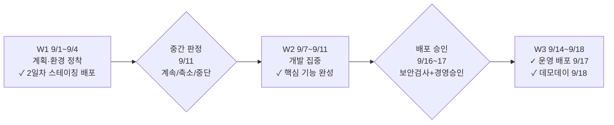

# AIFAB 3주 스프린트 운영 계획 (경영 보고)

> v1.0 | 2026-07-12 | **9/1 킥오프 → 9/17 운영 배포 → 9/18 데모데이 → 9/25 성과 판정**

---

## 1. 3주 만에 배포까지 — 어떻게 가능한가

일반 파일럿은 60~90일이 업계 표준이지만, 본 파일럿은 세 가지 장치로 3주를 실현합니다.

1. **사전 준비된 배포 자동화(골든 패스)** — 참여자는 폼 입력만으로 보안·모니터링·배포 파이프라인이 내장된 개발 환경을 즉시 확보 (첫 배포 목표: 스프린트 2일차)
2. **AI 코딩 도구(Claude Code)** — 개발 속도 향상은 검증된 플랫폼 위에서만 효과 (글로벌 조사: 플랫폼 없는 AI 단독 도입은 오히려 안정성 저하)
3. **주 1회 게이트 운영** — 문제를 조기에 걸러 마지막 주 실패를 방지

## 2. 3주 운영 구조

| 주차 | 목표 | 통제 장치 |
|---|---|---|
| W1 (9/1~4) | 계획 확정, 전 팀 스테이징 배포 | 착수 게이트(Gate 0), 미달 팀 즉시 지원 투입 |
| W2 (9/7~11) | 핵심 기능 완성 | 중간 게이트(Gate 1): 계속/범위 축소/조기 중단 판정 — 가망 없는 과제에 자원 낭비 방지 |
| W3 (9/14~18) | 운영 배포 + 데모데이 | 배포 게이트(Gate 2): 자동 보안 검사(코드·컨테이너 치명 취약점 0건, 의존성 점검 포함) + 위험 등급별 차등 리뷰 + AI Board·정보보호팀 승인 |

## 3. 품질·보안 통제 (핵심 질문: "비전문가 코드를 믿을 수 있나")

AI 생성 코드는 취약점 밀도가 통상 코드의 2.74배라는 조사가 있어, **사람 승인에만 의존하지 않는 3중 통제**를 설계했습니다.

| 통제 | 내용 |
|---|---|
| ① 기술 내재화 | 보안 검사(SAST)·시크릿 검출을 파이프라인에 내장 — 통과 없이는 배포 물리적 불가 |
| ② 위험 등급별 리뷰 | 저위험(조회 화면)은 신속 승인, 고위험(인증·개인정보)은 보안 전문가 포함 3인 승인 |
| ③ 최종 승인 게이트 | AI Board·정보보호팀 수동 승인 후 무중단 배포 — 이상 징후(오류율 급증 등) 감지 시 5분 내 자동 롤백 |

## 4. 지원 체계

- 2계층 지원: 과제 도메인별 멘토(AI Board 내 팀원, 방향성·에이전트 구조 조언) + 기술상담 전담 1명(코드 문제 해결)
- 정기 기술상담 주 2회(신청제, 긴급 블로커는 4시간 내 즉시 대응), 전용 질문 채널
- 플랫폼 장애 온콜(AI 인프라팀): 스프린트 기간 전담 로테이션 — 심각 장애 초동 대응 30분 이내 (개발 질문은 기술상담, 시스템 장애는 온콜로 분리)
- 팀 내 챔피언 지정 — 도구 사용 정착 촉진 (글로벌 조사: 자연 방치 시 10주 후 지속 사용 10% 미만)

## 5. 성과 측정·판정

- **성공 기준은 킥오프 전(8/28) 동결** — 사후 기준 변경으로 "항상 성공하는 파일럿"이 되는 것을 차단
- 핵심 지표: 팀별 운영 배포 완성 / 도구 주간 활성 사용률 70% / 거버넌스 위반 0건 / 만족도 4.0 이상
- **9/25 판정**: 사전 합의된 스코어카드로 팀별 이관·폐기·현업복귀 결정 → 10월 초 확대 여부 보고

> 상세: `AIFAB_3주_스프린트_운영시간표_실무_v1-0.md`
