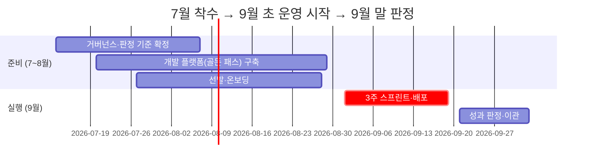

# AIFAB 탑다운 과제 파일럿 구축 타임라인 (경영 보고)

> v1.0 | 2026-07-12 | **목표: 9월 1일 파일럿 운영 시작, 9월 말 성과 판정**

---

## 1. 한 장 요약

시티즌 개발자 2~3팀(팀당 3~5명)을 선발해 **3주 스프린트로 AI 과제를 운영환경 배포까지 완성**하는 파일럿을 9월 초 시작합니다 (플랫폼은 확대 시 5~10팀 수용 기준으로 설계). 글로벌 조사에서 GenAI 파일럿의 88~95%가 성과 없이 종료되는 반면, 거버넌스를 갖춘 조직은 성공률이 2배(비용 절감 성공률 77% vs 39%, KPMG)입니다. 본 계획은 실패 원인(플랫폼 부재·소유권 공백·판정 기준 사후 정의)을 사전에 차단하는 구조로 설계했습니다.

## 2. 핵심 일정

| 시점 | 마일스톤 | 의미 |
|---|---|---|
| 7월 3주 | 장기 리드타임 항목 신청 착수 | 클라우드 사용 한도 증설·AI 모델 사용 승인·사내망 연동·계정 연동 등 최장 4~8주 소요 항목 선행 처리 |
| 7/24 | 거버넌스 확정 | 파일럿 예외 규정 승인, 판정 권한자 지명 |
| 8/14 | 선발 완료 | 부서 2~3개, 2~3팀 확정 |
| 8/28 | 플랫폼·온보딩 완료 | 배포 자동화 템플릿 7종 완비(AI 연동 포함), 성공 기준(KPI) 동결 |
| **9/1** | **파일럿 운영 시작** | 3주 스프린트 킥오프 |
| 9/17~18 | 운영 배포·데모데이 | 경영진 시연 |
| 9/25 | 성과 판정 | 사전 합의된 스코어카드로 이관/폐기/확대 결정 |

## 3. 필요 의사결정·자원 (승인 요청)

| # | 요청 | 규모 | 사유 |
|---|---|---|---|
| 1 | AI 인프라팀 골든 패스 구축 투입 | 4~6주 전담 | 배포 자동화 템플릿 없이는 3주 배포 완성 불가 — 파일럿 성패의 최대 전제 |
| 2 | AI Board 편성 | 2~5명 | 거버넌스 유무가 성공률 2배 차이 (KPMG 2024) |
| 3 | 파일럿 예외 규정 승인 | AI Board 안건 | 기존 기획안은 전담 조직 수행을 전제 — 시티즌 개발자 수행 근거 마련 |
| 4 | 참여자 시간 확보 | 3주 전담(부서장 합의) | 겸업 수행 시 3주 완성 불가 |
| 5 | 인프라 비용 | 기존 기획안 추정 범위 내 (탑다운 5과제 상시 기준 월 1,400~1,600 USD). 파일럿 개발환경(웹 IDE)·AI 사용 비용은 종량제 별도 — 2~3팀 기준 월 수백 USD 수준 (상세: 웹IDE 세팅 가이드 5장) | 신규 예산 불요 |

## 4. 주요 리스크와 대응

| 리스크 | 대응 |
|---|---|
| AI 생성 코드 품질(취약점 밀도 2.74배 보고) | 보안 검사 파이프라인 내장 + 위험 등급별 차등 승인(고위험은 3인 승인) + 정보보호팀 배포 승인 게이트 |
| 장기 리드타임 항목의 승인 지연(타 부서·클라우드 사업자 의존, 최장 4~8주) | 7월 3주 즉시 신청 착수, 8/28 준비 완료 점검(Readiness Review) 통과 조건에 포함 |
| 플랫폼 준비 지연 | 일정보다 전제 충족 우선 — 미완비 시 킥오프 순연 (실패 파일럿 강행 방지) |
| 배포 후 운영 이관 거부(방치 리스크) | 이관 조건을 스프린트 중 사전 합의, 판정 기준 킥오프 전 동결 |

## 5. 기대 효과·판정 방식

- **성공 기준(킥오프 전 동결)**: 팀별 운영 배포 완성, 도구 주간 활성 사용률 70%, 참여자 만족도 4.0/5.0, 거버넌스 게이트 위반 0건 등 6종
- **판정**: 9/25 사전 합의된 Go/No-Go 스코어카드로 팀별 이관/폐기/현업복귀 결정 → 10월 초 확대(2차 코호트) 여부 보고. 이관 확정 과제는 표준 절차(4~6주)에 따라 10월 말~11월 초 이관 완료
- **의의**: 국내외에 "비전문 개발자 3주 운영 배포"의 공개 선행 사례가 없어, 성공 시 사내 표준 방법론 및 대외 차별화 사례 확보

> 상세: `26.07.14_AIFAB_탑다운_파일럿_구축_타임라인_운영시나리오_실무_v1-0.md`
