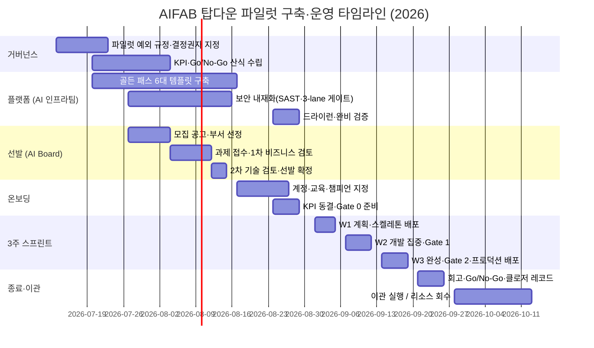

# AIFAB 탑다운 과제 파일럿 — 구축 타임라인·운영 시나리오 (실무용)

> 버전: v1.0 | 작성: 2026-07-12 | 대상: AI 인프라팀·AI Board·멘토단 실무자
> 근거: 메타서치 결론 보고서(`metasearch-aifab-topdown-pilot-ops-2026-07-11/05-conclusion.md`), AWS 기반 탑다운 AIFAB 과제 운영환경 구축·운영 기획안 v1.0
> 목표: **2026-09-01(화) 파일럿 운영 시작** → 3주 스프린트로 운영환경 배포 완성 → 9월 말 종료·이관 판정

---

## 1. 개요

- **목적**: 시티즌 개발자를 선발해 3주 스프린트로 탑다운 과제를 운영환경 배포까지 완성하는 파일럿의 구축 일정과, 시티즌 개발자 접수부터 배포 후 종료까지의 엔드투엔드 운영 시나리오를 정의한다.
- **설계 원칙** (리서치 결론 반영):
  1. 골든 패스 사전 완비 없이는 3주 배포 완성이 비현실적 — 킥오프 전 플랫폼 준비가 최우선 (R1)
  2. KPI·Go/No-Go 판정 기준은 킥오프 전 동결 (R2)
  3. Agile-Stage-Gate 하이브리드: Gate 0(착수) → Gate 1(중간) → Gate 2(배포 승인) (R3)
  4. 배포 게이트는 3-lane 위험 분류 + rubber-stamping 방지 장치 (R4)
  5. AI Board 선행 구축 + 2계층 지원 — 도메인 멘토(방향성, 1:n) / 기술상담 전담(코드, 1명) (R5)
  6. 종료는 3방향 출구(이관/폐기/현업복귀) + 자동 Frozen·보드 최종 결정 하이브리드 (R7)

## 2. 전체 타임라인

### 마일스톤

| # | 마일스톤 | 일자 | 완료 기준 (DoD) | 책임 |
|---|---|---|---|---|
| M1 | 거버넌스 확정 | 07-24(금) | 파일럿 예외 규정(기획안 §2 주체 조항 보완) AI Board 승인, Go/No-Go 결정 권한자 지명 | AI Board |
| M2 | KPI·스코어카드 동결안 확정 | 08-07(금) | KPI 6종 임계값 + Go/No-Go 가중치·임계값 산식 문서화 (자체 산식, 예시값 0.605 미사용) | AI Board |
| M3 | 선발 확정 | 08-14(금) | 부서 2~3개·팀 2~3개(팀당 3~5명) 확정, 부서장 시간 확보 서면 합의 | AI Board·부서장 |
| M4 | 골든 패스 완비 | 08-28(금) | **7대** 템플릿(ECS·Lambda·RDS·비용태그·관측성·Secrets·**Bedrock 연동**) 드라이런 통과 — 폼 입력→스테이징 배포 1시간 이내 | AI 인프라팀 |
| M5 | 온보딩 완료·KPI 동결 | 08-28(금) | 전원 계정·교육 이수, 드라이런 배포 성공 1회/인, KPI·스코어카드 서명 동결 | AI Board |
| M6 | **파일럿 킥오프 (운영 시작)** | **09-01(화)** | Gate 0 통과, 스프린트 백로그 확정 | 전체 |
| M7 | Gate 1 중간 판정 | 09-11(금) | 팀별 Go/Pivot/Stop 판정 (SLA 48h 내 — 9/14 월 오전까지 통보) | AI Board·멘토 |
| M8 | 프로덕션 배포 완료 | 09-17(목) | Gate 2 통과 + AI Board·정보보호팀 승인 + Blue/Green 배포 | AI Board·정보보호팀 |
| M9 | 데모데이 | 09-18(금) | 팀당 5~10분 발표, 경영진 참석 | AI Board |
| M10 | 종료 판정 | 09-25(금) | Go/No-Go 스코어카드 산정, 출구 결정(이관/폐기/현업복귀), 클로저 레코드 보존 | AI Board |
| M11 | 이관/회수 완료 | **이관 착수 9월 말, 완료 10월 말~11월 초** | 이관: 격상 표준 리드타임 4~6주 반영 — 착수는 9월 말(종료 판정 직후), 완료는 착수 기준 4~6주 후(10월 말~11월 초). 폐기: Frozen→접근 회수(14일)→리소스 삭제(21일). 상세: `AIFAB_격상과제_이관수용_절차_표준_v1-0.md` 참조 | AI 인프라팀 |

## 3. 단계별 운영 시나리오 (엔드투엔드)

### Phase 0 — 거버넌스 정비 (07-13 ~ 07-24)

| 항목 | 내용 |
|---|---|
| 활동 | ① 기획안 주체 조항 보완: 탑다운 수행 주체를 "지정된 개발·운영 조직"으로 전제한 기획안 §2에 시티즌 개발자 파일럿 예외 규정 신설 ② Go/No-Go 결정 권한자(named decision owner) 지명 ③ 파일럿 헌장(목적·범위·기간·예산) 승인 |
| 담당 | AI Board 주관·승인 |
| 산출물 | 파일럿 헌장, 예외 규정 개정안 |
| 리스크 | 이 단계 미완 시 파일럿 자체가 기획안과 구조적으로 불일치 — 착수 불가 사유 |

### Phase 1 — 플랫폼 준비 (07-20 ~ 08-28, AI 인프라팀)

| 항목 | 내용 |
|---|---|
| 활동 | ① 골든 패스 7대 템플릿 구축: ECS on Fargate·Lambda·RDS·비용태그·관측성(로그·메트릭 기본값)·Secrets Manager·**Bedrock 연동**(bedrock-runtime VPC Endpoint + 최소권한 IAM + 토큰 비용 태그) — 폼 입력만으로 CI/CD·IAM·모니터링 포함 레포 자동 생성 ② SAST(**Semgrep**, CodeBuild 단계 내장, Critical/High 시 빌드 실패)·시크릿 검출(**gitleaks**, pre-receive hook + 파이프라인)·컨테이너 스캔(**Inspector**, ECR push 시 자동 실행) 파이프라인 내장 — 도구 확정 데드라인 **8/28 이전** ③ 3-lane 게이트 분류 기준·리뷰 절차 확정 ④ 서비스 카탈로그 위생 점검(카탈로그 부정확 상태에서 AI 도입 시 변경 실패율 +30%) ⑤ 드라이런: 비개발자 1명이 폼 입력→스테이징 배포 1시간 이내 검증 |
| **선행 태스크 (7월 3주 착수 필수 — 리드타임 최장 4~8주)** | ① **Service Quotas 증설 신청**: Fargate vCPU, Bedrock RPM/TPM, Lambda 동시실행, CodeBuild 동시 빌드 — 승인 리드타임 최장 4~8주, 7월 3주 즉시 신청 ② **Bedrock Claude 모델 접근 활성화**: 서울(ap-northeast-2) 리전 가용성 확인 → 미제공 모델은 APAC 크로스리전 추론 프로파일로 대체 ③ **DX 대역폭·TGW Attachment 확인**: 사내망↔AWS 전용선 대역폭 및 Transit Gateway 연결 현황 점검 — 네트워크 팀 협조 필요, 7월 3주 착수 |
| **Entra ID 연동 착수 (7월 4주)** | IdP 관리팀에 협조 요청(SAML 앱 등록 + SCIM 프로비저닝), 승인 리드타임 1~2주 감안 → **8/14까지 E2E 동기화 검증 완료** (Identity Center → 참여자 계정 자동 동기화 확인) |
| 담당 | AI 인프라팀 (4~6주 전담 투입) |
| 산출물 | 골든 패스 템플릿 7종, 3-lane 분류 기준서, 드라이런 결과서 |
| 완료 기준 | M4 — 킥오프 최소 1영업일 전 완비. **미완 시 킥오프 연기** (조건부 가능 판정의 전제 조건) |

### Phase 2 — 선발 (07-27 ~ 08-14, AI Board)

| 항목 | 내용 |
|---|---|
| 대상 부서 | 2~3개 — 기준: ① 참여 의지(챔피언 후보 보유) ② 명확한 자동화·개발 백로그 ③ 부서장 후원 |
| 팀 구성 | 팀당 3~5명 혼합팀 — 최소 1명 도메인 전문가(비엔지니어) 포함. 코호트 규모(2~3팀·10~15명 내외)는 1차 가설값으로, 파일럿 결과로 재검증 |
| 자격 | Capa Belt 과정 이수(Claude Code 교육) 우대, 업무 프로세스 전문성, 부서장 승인(스프린트 3주간 과제 전담 서면 합의) |
| 심사 절차 | **1단계 비즈니스 검토**(AI Board + 도메인 전문가): 문제 중요성·전략 부합도·실현 가능성·잠재 영향 등 가중 기준 채점 → **2단계 기술 검토**(AI 인프라팀 + 기술상담 전담): 3주 내 배포 가능 범위인지, 골든 패스 템플릿 적합성, 실데이터 필요 여부(Red lane 해당 시 범위 축소 권고) |
| 산출물 | 선발 결과 공지, 과제 정의서(팀별), 부서장 합의서 |

### Phase 3 — 온보딩 (08-17 ~ 08-28, AI Board·AI 인프라팀)

| 항목 | 내용 |
|---|---|
| 1주차 (08-17~) | 계정·권한 프로비저닝(Entra ID SAML·SCIM), Claude Code·골든 패스 핸즈온 교육(2일), 팀별 챔피언 1명 지정(주 40분 챔피언 활동 예산) |
| 2주차 (08-24~) | 드라이런: 전원 골든 패스로 스켈레톤 앱 스테이징 배포 1회 성공, 과제 백로그 초안 작성(멘토 방향성 점검 시작), KPI·Go/No-Go 스코어카드 서면 동결(전 팀·결정 권한자 서명), Gate 0 심사 자료 준비 |
| 산출물 | 온보딩 체크리스트(인별), 동결된 KPI 문서, Gate 0 자료 |

### Phase 4 — 3주 스프린트 (09-01 ~ 09-18)

> 상세 일정은 `AIFAB_3주_스프린트_운영시간표_실무_v1-0.md` 참조

- **W1 (09-01~09-04)**: 킥오프 + Gate 0 → 스프린트 플래닝 → 골든 패스 스켈레톤 배포(D2 목표) → 주간 데모
- **W2 (09-07~09-11)**: 개발 집중(회의 최소화) → Gate 1 중간 심사(09-11) → 48h 내(9/14 월 오전까지) Go/Pivot/Stop 판정
- **W3 (09-14~09-18)**: 기능 동결 → Gate 2 심사(3-lane 리뷰 + CI/CD 자동 검사) → AI Board·정보보호팀 승인 → Blue/Green 프로덕션 배포(09-17) → 데모데이·회고(09-18)

### Phase 5 — 종료·이관 (09-21 ~ 10월 중)

| 항목 | 내용 |
|---|---|
| 회고 | 팀별 회고 + 프로그램 회고(09-21~22). 액션 아이템 완료율을 차기 코호트 첫 의제로 설정 |
| 클로저 레코드 | 팀당 15~20분 작성, 4항목: ①수행 내용·조건 ②KPI 대비 실제 결과 ③Scale/Stop/Redirect 결정·근거 ④차기 적용 학습 2~3건. 조직 시스템에 영구 보존 |
| Go/No-Go 판정 | 동결된 스코어카드(기술·재무·활용·자원 가중 — 자체 산식)로 산정 → AI Board 심의(09-24) → 팀별 출구 결정 |
| 출구 3방향 | **① 이관(Scale)**: 7단계 격상 체크리스트(코드 리뷰→문서화→데이터 재설계(마스킹 해제)→운영 조직 지정→재프로비저닝→이관·검증→원 환경 정리). 이관팀과 기술 부채 수용 기준(중복률·테스트 커버리지·취약점 0건) 사전 합의 필수 — 미합의 시 이관 보류 ② **폐기(Stop)**: 계정 Frozen → 14일 접근 회수 → 21일 리소스 삭제(비용 자동 통제). 최종 계정 폐쇄는 보드 심의로 결정 ③ **현업복귀(Redirect)**: 과제는 종료하되 참여자는 챔피언으로 전환, 백로그는 차기 코호트 후보로 등록 |
| 확대 판단 | DECIDE 4대 질문(결과 KPI 달성·비용 대비 가치·거버넌스 수용성·변화 관리 준비도) + 위험 조정 ROI 재계산 → 2차 코호트·확대 여부 보고(10월 초) |

## 4. R&R 요약

| 역할 | 구성 | 핵심 책임 |
|---|---|---|
| AI Board | 거버넌스 + 운영 전담 2~5명 | Gate 0·2 승인, Go/No-Go 최종 심의, 예외 규정 승인, 프로그램 총괄, 선발 심사, 정기 기술상담, KPI 측정·보고 |
| AI 인프라팀 | 기존 조직 | 골든 패스 구축·운영, 계정 프로비저닝, 배포 파이프라인, 리소스 회수 |
| 정보보호팀 | 기존 조직 | Gate 2 보안 승인, Red lane 리뷰 참여 |
| 멘토 | AI Board 내 팀원, 유사 과제군당 1명(1:n) | 과제 방향성·진행 점검, 간단한 에이전트 구조 조언 — 코드 작업 범위 외 |
| 기술상담 전담 | 1명 (초기: AI Board 내 FAB 전담 인원 → 전문 개발자 전환) | 코드 블로커 해결, 멘토 미해결 복합 이슈, Green lane 1차 리뷰, 상담 로그·FAQ 관리 |
| 챔피언 | 팀당 1명(참여자 중) | 데일리 스탠드업 주관, 팀-AI Board 연결, 사용 정착 촉진 |
| 부서장 | 참여 부서 | 시간 확보 보장, 과제 스폰서 |

### 4.1 역할별 IAM Identity Center 권한 세트 매핑

| 역할 | 권한 세트 | 적용 계정 | 비고 |
|---|---|---|---|
| 시티즌 개발자 | PowerUser (IAM 쓰기 제외, Permission Boundary 적용) | 해당 과제 계정 한정 | 타 과제 계정 접근 불가 |
| AI 인프라팀 | AdministratorAccess (플랫폼 관리) | 플랫폼 관리 계정·전 과제 계정 | 운영 전담 역할 |
| 정보보호팀 | SecurityAudit (읽기 전용) | 전 과제 계정 | CloudTrail·Config·GuardDuty 조회 |
| AI Board | ReadOnly + 승인 워크플로 실행 권한 | 전 과제 계정 | Gate 심사·보고 목적 |
| 멘토·기술상담 전담 | ReadOnly + CloudWatch Logs 조회 | 해당 담당 과제 계정 한정 | 과제 전담 범위로 제한 |

## 5. 리스크 관리

| # | 리스크 | 근거 | 대응 |
|---|---|---|---|
| 1 | 골든 패스 준비 지연 → 3주 배포 불가 | IDP 정석 구축 16주 vs 확보된 6주 | 범위를 6대 템플릿 MVP로 한정, M4 미달 시 킥오프 1~2주 연기 (원칙: 일정보다 전제 충족 우선) |
| 2 | 기획안 주체 불일치 미해소 | 기획안 §2는 지정 조직 전제 | Phase 0에서 예외 규정 선결 — M1을 착수 조건으로 설정 |
| 3 | AI 생성 코드 품질 (취약점 밀도 2.74배) | Veracode·Apiiro | SAST 내장 + 3-lane 리뷰 + Red lane 3인 승인 + 서면 정당화 |
| 4 | 게이트 rubber-stamping | AI 코드 승인율 +14.5%p 실증 | 리뷰어 로테이션, 서면 정당화 의무, SLA 차등(피어 4h/아키텍처 24h) |
| 5 | 이관팀의 기술 부채 수용 거부 → Pilot Purgatory | 기술 부채 +30~41% | W3 착수 전(09-14까지) 이관 후보 팀과 수용 기준 사전 합의 |
| 6 | 도구 지속 사용 이탈 (10주 지속률 <10%) | DORA 2025 | 챔피언 프로그램 + 3단계 체크인(주간→3개월 회고→분기 리뷰) |
| 7 | 3주 배포 완성 선행 사례 부재 | 인접 도메인 미발견 | 파일럿 자체를 벤치마크 수립 기회로 정의, KPI에 배포 완성률 포함해 실측 |

## 6. 참고 문서

- 메타서치 결론: `metasearch-aifab-topdown-pilot-ops-2026-07-11/05-conclusion.md` (권고 R1~R9, 출처 전체)
- 내부 기획안: `fab/AWS_기반_탑다운_AIFAB_과제_운영환경_구축운영_기획안_v1-0.md` (§5 배포, §6 격상, §7 운영)
- 스프린트 상세: `fab/AIFAB_3주_스프린트_운영시간표_실무_v1-0.md`
- **격상·이관 절차**: `fab/AIFAB_격상과제_이관수용_절차_표준_v1-0.md` (이관 7단계 체크리스트, 수용 기준, 데이터 파기 절차)
