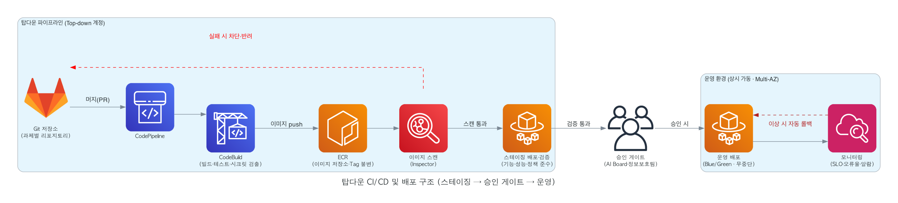
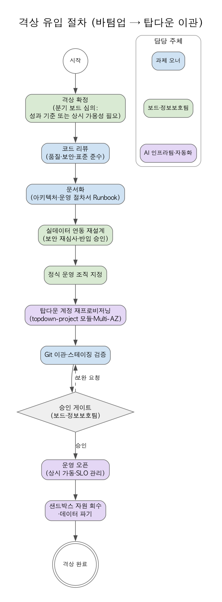

# AWS 기반 통합 운영환경 구축·운영 종합 기획안

탑다운(AIFAB)·바텀업(샌드박스)을 포괄하는 단일 플랫폼 구성안

- 문서 구분 : 운영 기획(안) — 통합본
- 버전 : v1.0
- 작성일 : 2026. 07. 13.
- 작성자 : AI Board 신재우
- 관련 문서 : AWS 기반 샌드박스 구축·운영 기획안 v2-1 (바텀업), AWS 기반 탑다운(AIFAB) 과제 운영환경 구축·운영 기획안 v1-0

---

## 1. 개요

### 1.1 배경 및 목적

AIFAB 프로그램은 두 갈래의 AI 과제를 함께 다룬다. 하나는 사업 계획으로 확정되어 실사용자에게 상시 서비스를 제공하는 **탑다운(공식) 과제**이고, 다른 하나는 현장 시티즌 개발자가 자율적으로 제안·수행하는 **바텀업(자율) 과제**다. 두 과제는 성격·가동 방식·데이터 정책이 다르지만, 계정 거버넌스·인증·네트워크·보안·IaC 등 **환경의 뼈대는 동일**하다.

본 문서는 두 환경을 각각 따로 구축하는 대신, **하나의 공통 기반(Landing Zone) 위에 운영 등급만 달리하는 두 환경을 올리는 통합 구성**을 정의한다. 목적은 다음과 같다.

- 공통 기반을 한 번 구축하여 재사용함으로써 구축 기간·비용을 최소화한다.
- 계정 수준 격리로 탑다운·바텀업 과제가 서로 영향을 주지 않도록 경계를 명확히 한다.
- 바텀업 우수과제가 재작성 없이 탑다운으로 격상되는 파이프라인을 플랫폼에 내재화한다.
- 보안 정책(실데이터 통제·사내망 한정·트래픽 통제)을 아키텍처에 강제하여 리스크 통제 하에 혁신을 확산한다.

### 1.2 핵심 설계 원칙 — "하나의 Landing Zone, 두 개의 운영 등급"

| **원칙** | **의미** |
|:---|:---|
| 공통 기반 재사용 | 계정 거버넌스·인증·네트워크·보안·IaC는 두 환경이 공유하는 단일 Landing Zone으로 구축 |
| 계정 수준 격리 | 탑다운/바텀업/공통을 OU·계정으로 분리하여 장애·부하·보안 경계를 물리적으로 분리 |
| 운영 등급 차등 | 가동 방식(상시 vs 시간제), 배포 체계(운영 배포+승인 게이트 vs dev 확인용 playground), 데이터 정책(실데이터 vs 마스킹)만 환경별로 차등 |
| 조직 차원 강제 | 격리·통제 전제는 사용자가 변경할 수 없도록 Organizations SCP로 조직 레벨에서 잠금 |
| 코드 기반 변경 | 모든 인프라·배포 변경은 IaC(Terraform)와 CI/CD 파이프라인의 코드 리뷰(PR)를 통해서만 반영 |
| 격상 경로 확보 | 바텀업 성과를 탑다운으로 승격하는 이관 파이프라인을 상시 가동 |

### 1.3 적용 범위

과제 유입(바텀업 신청·AI 심사 / 탑다운 사업 확정) → 자원 프로비저닝 → 개발 → 실행(바텀업 dev 확인용 / 탑다운 스테이징·운영 배포) → 운영 모니터링 → 격상·선셋·종료에 이르는 **두 트랙의 전 생애주기**와, 이를 지탱하는 AWS 인프라·보안·자동화 체계 전반을 대상으로 한다.

---

## 2. 통합 아키텍처 개관

AWS Organization으로 **Shared Services(공통)·Top-down(공식 과제)·Bottom-up Sandbox(자율 과제)** 세 영역을 계정 수준에서 분리한다. Shared Services 계정에는 신청 포털·승인 자동화(API Gateway, Lambda, Step Functions), Bedrock AI Agent, Terraform, 조직 로그 집적을 배치한다. 과제가 유입되면 Terraform이 대상 OU(탑다운/바텀업)에 표준 스택을 자동 생성하며, CloudTrail·GuardDuty·Security Hub·CloudWatch는 전 계정 공통의 보안·관측 계층으로 운영한다.


*그림 1. AWS 전체 아키텍처 (계정 분리 및 Top-Down/Bottom-up 이원 흐름)*

### 2.1 공통 기반과 환경별 분기의 구분

통합 구성의 핵심은 "어디까지가 공통이고, 어디부터가 환경별로 갈라지는가"를 명확히 하는 것이다.

| **구성 요소** | **공통(Shared Landing Zone)** | **환경별 분기** |
|:---|:---:|:---|
| 계정 거버넌스 (Organizations·SCP) | ● | 바텀업 전용 가드레일 추가 (시간제·네트워크 제약) — 3.2 |
| 인증 (Entra ID·Identity Center) | ● | 권한세트만 환경별 분리 (Sandbox*/Topdown*) — 4장 |
| 네트워크 원칙 (사내망 한정·VPC Endpoint) | ● | VPC 대역·스테이징/운영 서브넷 분리는 환경별 — 5장 |
| 보안 4계층·통합 탐지 | ● | 데이터 정책이 환경별로 상이 — 6·7장 |
| IaC 체계 (Terraform) | ● | 표준 모듈 분리 (`sandbox-project`/`topdown-project`) — 9장 |
| AI Agent (Bedrock) | ● | 심사 에이전트는 바텀업 전용, 리포트 에이전트는 공용 — 10장 |
| CI/CD 골격 | ● | 게이트·배포 단계가 환경별로 상이 — 11장 |
| 실행·가동 정책 | ○ | **핵심 분기점** — 상시 vs 시간제 — 8장 |
| 데이터 정책 | ○ | **핵심 분기점** — 실데이터 vs 마스킹 — 7장 |

(● 공통 재사용, ○ 원칙은 공통이나 정책이 환경별로 갈라지는 핵심 분기점)

### 2.2 환경별 차이 요약 (탑다운 vs 바텀업)

두 환경은 같은 플랫폼 기반 위에서 운영 등급만 달리한다.

| **구분** | **탑다운 (공식 과제)** | **바텀업 (샌드박스)** |
|:---|:---|:---|
| 과제 성격 | 사업 계획으로 확정된 공식 과제 | 현장 자율 제안 과제 |
| 유입·심사 | AI 사전심사 바이패스, 보드 확인 | AI 다각도 심사·트리아지 후 보드 승인 |
| 실행 환경 | 별도 운영 환경(계정), 스테이징·운영 분리 | 개발과 동일 환경에서 dev 확인용 실행(playground, 배포 아님) |
| 가동 | 상시 가동(24×365, 서비스 수준 관리) | 시간제 가동(셧다운/웨이크업) |
| 배포 | 스테이징 → 운영 + 승인 게이트(보드·정보보호팀) | dev 확인용까지 (승인 게이트·운영급 배포 없음) |
| 데이터 | 통제 하 실데이터 연동 허용 | 실데이터 금지 (마스킹·비식별만) |
| 수행 주체 | 지정된 개발·운영 조직 | 시티즌 개발자 (교육 이수자) |
| 종료 | 사업 판단에 따른 종료·이관 | 저활용 자동 선셋 |

---

## 3. 계정·조직 거버넌스 (공통)

계정 거버넌스의 원칙은 **"계정 안에서는 자율, 조직의 금지선은 강제"**다. 사내망 한정·아웃바운드 통제는 VPC 설정으로 구현하되, 그 설정을 과제 수행자가 임의로 변경할 수 없도록 조직 레벨 SCP로 잠근다. SCP는 계정 내부 IAM 권한과 무관하게 적용되므로, 사용자에게 넓은 자율성을 주면서도 격리 전제가 훼손되지 않음을 플랫폼 차원에서 보장한다.

### 3.1 조직(OU)·계정 구조

```
Root (관리 계정: 조직·결제 관리 전용, 워크로드 배치 금지)
├── OU: Shared Services   — 신청 포털·승인 자동화·AI Agent·조직 로그 집적 (공용)
├── OU: Top-down          — 탑다운 공식 과제 계정 (과제별 계정 분리, 계정 내 스테이징·운영 분리)
└── OU: Bottom-up Sandbox — 바텀업 자율 과제 계정 (바텀업 전용 SCP 가드레일 적용)
```

- 관리 계정은 SCP가 적용되지 않는 유일한 계정이므로 워크로드를 두지 않고 접근을 최소 인원으로 제한한다.
- 바텀업 신규 계정은 과제 승인 시 Bottom-up Sandbox OU 아래에 자동 생성되며, OU에 부착된 SCP를 즉시 상속한다.
- 탑다운은 과제별 계정 분리를 기본으로 하고 계정 안에서 스테이징·운영을 VPC/서브넷으로 분리한다. 규모가 큰 과제는 스테이징·운영 계정 분리도 허용한다.

### 3.2 SCP 가드레일 (공통 + 바텀업 전용)

기본 정책(FullAWSAccess)을 유지한 채 아래 Deny 가드레일을 부착한다. 권한 부여는 Identity Center 권한세트가 담당하고, SCP는 차단 전용으로만 사용한다. 공통 가드레일은 전 OU에, 바텀업 전용 가드레일은 Bottom-up Sandbox OU에만 부착한다.

| **#** | **가드레일** | **적용 범위** | **목적** |
|:---|:---|:---:|:---|
| 1 | 서울 리전(ap-northeast-2) 외 API 호출 차단 | 공통 | 모니터링 없는 리전으로 격리 환경 확산 방지 |
| 2 | 감사·보안 서비스 비활성화 금지 (CloudTrail·GuardDuty·Config·Security Hub) | 공통 | 전수 감사·위협 탐지 체계 보호 |
| 3 | S3 퍼블릭 노출 금지 (Block Public Access 해제 차단) | 공통 | 산출물·데이터의 사외 노출 방지 |
| 4 | 거버넌스 이탈 금지 (조직 탈퇴·계정 폐쇄) | 공통 | 통제 범위 밖 계정 이탈 방지 |
| 5 | 인터넷 경로 생성 금지 (IGW 생성·연결, EIP 할당) | 바텀업 전용 | 인터넷 인바운드 차단 전제 보호 |
| 6 | 네트워크 핵심 자원 변경 제한 (VPC·서브넷·라우팅·NAT·TGW) | 바텀업 전용 | 사내망 한정·아웃바운드 화이트리스트 구조 유지 |

- 가드레일 6의 예외는 `aws:PrincipalArn` 조건으로 Shared Services의 Terraform 프로비저닝 역할만 허용한다. 즉 네트워크 변경은 IaC 코드 리뷰(PR)를 거친 자동화 경로로만 가능하다. **탑다운은 이 예외를 운영 조직의 IaC 역할까지 확장**한다.
- SCP는 무비용이며, 목록의 추가·변경은 AI Board 정책 심의를 거쳐 AI 인프라팀이 반영한다.

---

## 4. 인증·권한 (공통 기반 + 환경별 권한세트)

인증·권한의 원칙은 **"AWS에 별도 자격증명을 만들지 않는다"**다. 사내 MS Entra ID를 신원의 단일 원천으로 삼아 사번 기반으로 자동 연동하고, AWS 접근은 전부 임시 자격증명(STS)으로만 이뤄진다. 입사·퇴사·부서이동이 사내 인사 체계에 반영되면 AWS 접근 권한도 자동으로 따라간다. 이 연동 구조는 **두 환경이 그대로 공유**하며, 권한세트만 환경에 맞게 분리한다.

### 4.1 연동 구조 (SAML 인증 + SCIM 프로비저닝) — 공통

```
[MS Entra ID]                                 [AWS IAM Identity Center]
     │
     ├─ ① SAML 2.0 (인증) ─────────────────→  로그인 시 신원 확인
     │     사내 MFA·조건부 액세스 정책 그대로 적용
     │
     └─ ② SCIM (프로비저닝) ───────────────→  사용자·그룹 자동 동기화
           사번(employeeId) 속성 매핑,             (생성·수정·비활성화)
           입사·퇴사·부서이동 자동 반영
```

- **SAML(인증)**: AWS 액세스 포털 접속 시 Entra ID 로그인으로 리다이렉트되며, 사내 MFA·조건부 액세스가 그대로 적용된다. AWS에는 별도 비밀번호가 존재하지 않는다.
- **SCIM(프로비저닝)**: Entra ID의 사용자·그룹이 Identity Center로 자동 동기화된다. 사번(`employeeId`)을 속성 매핑으로 전달하며 표준 앱(AWS IAM Identity Center)으로 설정한다.
- 권한은 권한세트로 표준화하고 "그룹 × 계정 × 권한세트" 할당으로 부여한다.

### 4.2 권한세트 (환경별 분리)

| **권한세트** | **대상** | **범위** | **환경** |
|:---|:---|:---|:---:|
| SandboxDeveloper | 바텀업 과제 수행자 | 담당 샌드박스 계정 내 광범위 개발 권한 (네트워크·조직 변경은 SCP 차단) | 바텀업 |
| SandboxReadOnly | AI Board·정보보호팀 | 샌드박스 전 계정 조회 (심사·점검용) | 바텀업 |
| TopdownDeveloper | 탑다운 과제 개발자 | 스테이징 환경 개발 권한 (운영 환경 변경 불가) | 탑다운 |
| TopdownOperator | 지정 운영 조직 | 운영 환경 모니터링·장애 대응 (인프라 변경은 IaC 경유) | 탑다운 |
| PlatformAdmin | AI 인프라팀 | Shared Services·Landing Zone 운영 | 공용 |

### 4.3 권한 부여·회수 흐름

1. 과제 유입 확정(바텀업 보드 승인 / 탑다운 사업 확정) 시 Step Functions 워크플로가 후속 자동화를 실행
2. Lambda가 Microsoft Graph API로 수행자 사번을 Entra ID 과제 그룹(예: `AWS-SBX-{과제ID}-Dev`, `AWS-TD-{과제ID}-Dev`)에 추가
3. SCIM이 그룹·멤버를 Identity Center로 동기화 (약 40분 주기 → 승인 직후 온디맨드 프로비저닝 트리거로 "승인 후 30분 내 자원 사용" 보장)
4. Terraform이 해당 그룹을 "과제 계정 × 권한세트"에 할당
5. 사용자는 액세스 포털 → Entra 로그인(MFA) → 담당 과제 계정만 표시 → 임시 자격증명으로 콘솔/CLI 사용

퇴사·부서이동 시 역방향이 자동 동작한다: Entra 계정 비활성화 → SCIM 동기화 → 모든 AWS 접근 즉시 차단. 이 이벤트는 바텀업 Orphan 과제(선셋 후보) 탐지 트리거로도 활용한다.

> **운영 확인 사항**: 권한 변경은 Entra ID 그룹 멤버십으로만 수행하며 원천은 항상 Entra다. SCIM은 중첩 그룹을 지원하지 않으므로 평평한 그룹 구조로 설계한다. 자동 프로비저닝에는 P1 이상 라이선스가 필요하다. Identity Center는 조직당 1개(서울 리전)로 활성화하고 관리 위임으로 Shared Services 계정에서 운영한다.

---

## 5. 네트워크 (공통 원칙 + 환경별 격리)

네트워크는 두 환경이 동일 원칙을 따른다: **사내망 한정 접근(인터넷 인바운드 차단)**, Direct Connect/VPN + Transit Gateway 경유, VPC Endpoint로 AWS 서비스 통신(인터넷 미경유), 아웃바운드 화이트리스트. VPC 대역과 스테이징/운영 서브넷 분리만 환경별로 다르다.


*그림 2. 네트워크(VPC/Subnet) 구성도*

- **바텀업**: Bottom-up Sandbox 계정에 전용 VPC(예: 10.20.0.0/16)를 2개 가용영역으로 구성. Public Subnet에는 내부 ALB와 NAT Gateway(허용 목록 기반 아웃바운드 전용)만 두고, 애플리케이션·데이터는 Private Subnet에 분리 배치.
- **탑다운**: 과제 계정별 전용 대역을 할당하고 스테이징·운영 서브넷을 분리. 바텀업 VPC와는 계정·네트워크 모두 격리되어 상호 영향이 없음.

### 5.1 서브넷 설계 (바텀업 예시)

| **서브넷** | **CIDR(예시)** | **배치 자원** | **통신 정책** |
|:---|:---|:---|:---|
| Public (AZ-a/c) | 10.20.0.0/24, 10.20.1.0/24 | 내부 ALB, NAT GW | 사내망 인바운드만 허용, 아웃바운드는 도메인 화이트리스트 |
| Private App (AZ-a/c) | 10.20.10.0/24, 10.20.11.0/24 | ECS/Fargate, Lambda, 개발 EC2 | ALB 경유 수신, VPC Endpoint로 AWS 서비스 통신 |
| Private Data (AZ-a/c) | 10.20.20.0/24, 10.20.21.0/24 | RDS(KMS 암호화) | App 서브넷에서만 접근 허용(보안그룹 제한) |

탑다운 운영 VPC는 동일 3티어 구조를 과제 계정별 전용 대역으로 구성하고, 애플리케이션 티어를 Multi-AZ로 이중화한다(8장).

---

## 6. 보안 아키텍처 (공통 4계층)

보안은 **계정·접근 통제, 네트워크 보안, 데이터 보호, 위협 탐지·감사**의 4계층으로 설계하고 모든 탐지 결과를 Security Hub로 통합하여 보드·정보보호팀에 SNS 알림한다. 이 4계층은 두 환경에 공통 적용되며, CloudTrail·GuardDuty·Config·Inspector는 조직 전체 공통 계층으로 이미 적용된다. 유일한 환경별 차이는 **데이터 정책**이며 이는 7장에서 별도로 다룬다.


*그림 3. 보안 아키텍처 (4계층 + 통합 탐지)*

| **계층** | **주요 통제** |
|:---|:---|
| 계정·접근 | Organizations SCP로 금지 행위 차단(리전 제한, 퍼블릭 리소스 생성 금지 등), Identity Center SSO·권한세트, IAM 최소권한 |
| 네트워크 | 인터넷 인바운드 차단, 내부 ALB + WAF, 보안그룹/NACL, PrivateLink(VPC Endpoint)로 인터넷 미경유 통신 |
| 데이터 | KMS 전 구간 암호화, S3 Block Public Access, 버킷 정책으로 계정 외 접근 차단, Macie 실데이터·PII 탐지 |
| 탐지·감사 | GuardDuty 위협 탐지, Inspector 이미지 취약점 점검, CloudTrail 조직 전체 기록, Config Rules 정책 준수 상시 점검 |

### 6.1 정보보호팀 협의 항목

- 격상(탑다운 이관) 시 운영 배포 승인 게이트 기준과, 바텀업 dev 확인용 실행 전 자동 보안 점검 항목의 확정
- 탑다운 실데이터 반입 절차(등급 분류·사전 심사·보존 기간)의 확정
- 아웃바운드 허용 도메인(화이트리스트) 목록과 예외 승인 절차
- 로그 보존 기간, 정기 취약점 점검 주기, 감사 리포트 공유 방식
- 보안 사고 발생 시 대응 절차(격리·차단 권한)와 책임 주체

---

## 7. 데이터 정책 (핵심 분기점)

데이터 취급은 두 환경이 가장 크게 갈라지는 지점이다. 바텀업은 실데이터를 금지하고, 탑다운은 통제된 절차 하에 실데이터 연동을 허용한다. 두 경우 모두 Macie가 등급 외 데이터·개인정보 유입을 상시 탐지하여 정책의 실효성을 기술적으로 담보한다.


*그림 6. 데이터 흐름도 (반입 → 사용 → 텔레메트리 → 리포트)*

### 7.1 바텀업 — 실데이터 금지

원본 운영 데이터는 샌드박스로 반출하지 않는다. 승인 절차를 거친 마스킹·비식별 처리본만 KMS로 암호화된 Landing 버킷에 반입하며, Macie가 실데이터·개인정보 유입을 상시 탐지한다.

| **구간** | **통제 방안** |
|:---|:---|
| 반입 | 마스킹·비식별 처리와 반입 승인 절차, Macie 자동 탐지로 이중 확인 |
| 저장 | KMS 암호화, S3 Block Public Access, 버킷 정책으로 계정 외 접근 차단 |
| 사용 | 과제별 IAM 격리, 자원·API 쿼터, 접근 이력 전수 기록(CloudTrail) |
| 반출 | 아웃바운드 화이트리스트, 외부 공유 차단, 산출물 사외 열람 방지(DRM·워터마크), DLP 연계 검토 |

### 7.2 탑다운 — 통제 하 실데이터 연동

탑다운 과제는 실제 업무 시스템 수준의 서비스를 위해 통제된 절차 하에 실데이터 연동을 허용한다.

| **단계** | **통제** |
|:---|:---|
| 반입 승인 | 데이터 등급 분류 → 정보보호팀 사전 심사·승인 (연동 범위·보존 기간 명시) |
| 연동 방식 | 원본 복사 최소화 원칙 — 가능하면 API·조회 연동, 복제 시 KMS 암호화 저장 |
| 접근 통제 | 과제 계정 격리 + IAM 최소권한 + 접근 이력 전수 기록(CloudTrail) |
| 상시 탐지 | Macie로 등급 외 데이터·개인정보 유입 탐지, 위반 시 보드·정보보호팀 알림 |
| 종료 시 | 과제 종료·이관 시 데이터 파기 확인을 종료 체크리스트에 포함 |

> **격상 시 재설계**: 바텀업 과제가 탑다운으로 격상될 때는 마스킹 데이터 기반 설계를 실데이터 연동으로 재설계하고 7.2 절차에 따라 보안 재심사를 받는다(12장 3번 항목).

---

## 8. 실행 환경·가동 정책 (핵심 분기점)

실행 환경의 등급과 가동 방식이 두 번째 핵심 분기점이다. 탑다운은 별도 운영 환경에서 상시 가동하고, 바텀업은 개발과 동일한 환경에서 개발 서버를 playground처럼 활용해 dev 확인용으로만 실행하며(별도 서비스 배포 아님) 정해진 시간에만 가동한다. **상시 가용성이 필요해진 바텀업 과제는 그 자체가 격상 사유가 된다** — 운영급 환경은 격상을 통해서만 부여된다.

| **구분** | **탑다운 (공식 과제)** | **바텀업 (샌드박스)** |
|:---|:---|:---|
| 실행 환경 | 별도 운영 환경(계정)에서 실행, Multi-AZ 이중화 | 개발과 동일한 샌드박스 환경에서 dev 확인용 실행(playground, 배포 아님) |
| 가용성 | 상시 가동 (서비스 수준 보장), 오토스케일링 | 시간제 가동 — 스케줄 기반 셧다운/웨이크업 |
| 배포 단계 | 스테이징 → 운영 (승인 게이트) | dev 확인용까지 (승인 게이트·운영급 배포 없음) |
| 비용 모델 | 상시 자원 (Savings Plans 대상) | 가동 시간만 과금 |

### 8.1 셧다운/웨이크업 자동화 (바텀업)

- EventBridge Scheduler가 과제 태그 기준으로 일괄 제어한다. 기본 가동 시간은 평일 08:00~20:00(예시, AI Board 확정)
- EC2 개발 서버: stop/start — 디스크·작업 상태 유지
- ECS/Fargate: 태스크 수를 0으로 축소 ↔ 원복
- RDS: stop/start — 정지 최대 7일 제한이 있어 자동 재정지 처리 포함
- 시간 외 가동(야간 데모·장시간 배치)은 포털에서 연장·즉시 웨이크업 신청, 저위험 건은 자동 승인
- ALB·NAT Gateway·VPC Endpoint 등 네트워킹 고정비는 셧다운 대상이 아니며, 절감 효과는 컴퓨팅(Fargate·EC2·RDS)에서 발생

### 8.2 상시 가동·이중화 (탑다운)

- 과제 앱: ECS/Fargate 상시 태스크, Multi-AZ 기본. 오토스케일링으로 부하 대응
- 개발·스테이징 스택은 야간 자동 중지 등 비용 최적화를 적용할 수 있으나 운영 환경만 상시 가동
- 운영 수준 목표(SLO)를 과제별로 정의(가용성 예: 99.5%, 오류율, 응답시간)하고 CloudWatch 대시보드·알람으로 관리(13장)

### 8.3 애플리케이션 런타임(WAS) 구성

애플리케이션 서버(WAS)는 **별도 서버 티어(EC2 위 Tomcat·WebLogic·JBoss 등)를 두지 않는다.** 애플리케이션을 컨테이너 이미지로 패키징해 **ECS/Fargate**에서 구동하고, 웹·로드밸런싱 티어는 **내부 ALB(+WAF, §5·§6)**가 담당한다. 두 환경 공통의 런타임 모델이며, 상시성·이중화만 §8.1·§8.2에 따라 달라진다.

| **전통적 3-tier** | **본 아키텍처 대응** |
|:---|:---|
| 웹 서버 (Apache/nginx — 정적·리버스프록시) | 내부 ALB (+ WAF) — L7 라우팅·로드밸런싱, 사내망 인바운드만 수신 |
| **WAS (Tomcat/WebLogic/JBoss)** | 컨테이너 이미지에 **내장 서버**를 포함해 **ECS/Fargate 태스크**로 구동 (별도 WAS 설치 불필요) |
| DB | RDS (KMS 암호화, Private Data 서브넷) |

**런타임 표준 원칙**

- 애플리케이션은 프레임워크 내장 서버(예: Spring Boot embedded Tomcat, Node/Express, FastAPI/uvicorn)로 기동하며, 이미지는 ECR에 저장하고 CI/CD(§11)를 경유해서만 배포한다(콘솔 직접 기동 금지, Fargate 불변 배포).
- 환경별 런타임: 바텀업은 dev 확인용 단일·소수 태스크(시간제, playground), 탑다운은 상시 Multi-AZ 태스크에 오토스케일링을 적용한다.
- **Stateless 원칙(필수)**: Fargate 태스크는 오토스케일링·불변 배포·시간제 셧다운으로 수시 교체되므로 in-memory 세션에 상태를 두지 않는다. 세션·상태는 RDS·ElastiCache 등 외부 저장소로 분리한다(격상·Multi-AZ 전환의 전제).

**레거시 WAS 수용 방안**

- 기존 WAS 기반 애플리케이션은 WAR를 Tomcat 등 베이스 이미지에 적재하여 컨테이너화하는 것을 원칙으로 한다.
- 컨테이너화가 곤란한 상용 WAS(WebLogic 등)에 대한 EC2 기반 예외 허용 여부는, 골든패스(컨테이너·파이프라인 표준)·SCP·격상 파이프라인과의 정합성을 함께 검토하여 **AI Board·정보보호팀·AI 인프라팀이 확정**한다(미확정 시 컨테이너화가 기본값).

---

## 9. IaC 표준화 (공통 체계 + 모듈 분리)

IaC의 원칙은 **"인프라 변경은 코드 리뷰(PR)를 통과한 코드로만"**이다. 과제 자원은 콘솔 수작업 없이 Terraform 표준 모듈로만 생성·변경·회수한다. 이를 통해 보안 설정 내재화(KMS·프라이빗 배치·태깅·쿼터), 30분 내 프로비저닝, 선셋·종료 시 누락 없는 자원 회수를 구현한다. 실행 체계는 공통이며 **표준 모듈만 환경별로 분리**한다.

| **구분** | **내용** |
|:---|:---|
| 표준 모듈 (바텀업) | `sandbox-project` — 과제용 자원 세트(ECS/Fargate, EC2, S3, RDS, 태그·예산 알람), 시간제 가동 태깅 |
| 표준 모듈 (탑다운) | `topdown-project` — Multi-AZ·모니터링·알람이 포함된 운영급 스택 |
| 실행 구조 | 유입 확정 → Step Functions → Shared Services의 Terraform 실행(CodeBuild) → cross-account 역할로 대상 계정에 스택 생성. 이 프로비저닝 역할이 SCP 네트워크 변경 예외(3.2) |
| State 관리 | S3 백엔드(암호화·버전 관리) + 잠금으로 동시 실행 충돌 방지, 과제별 state 분리 |
| 자원 회수 | 선셋·종료 확정 시 `terraform destroy`로 과제 스택 전체 일괄 회수 (핵심 비용 통제 장치) |
| 드리프트 통제 | 콘솔 직접 변경은 SCP·권한세트로 차단, AWS Config·정기 plan으로 코드-실제 불일치 탐지 |

CloudFormation은 조직 공통 골격(전 계정 CloudTrail 등) 배포에 한해 병용 가능하나, 관리 일원화를 위해 Terraform 통일을 기본으로 한다. 표준 모듈은 버전 태그로 관리하며 변경 시 기존 과제 영향도를 `plan`으로 확인 후 단계적으로 적용한다.

---

## 10. AI Agent (Amazon Bedrock 기반)

AI Board의 반복 판단 업무를 두 개의 에이전트로 자동화한다. **심사 에이전트는 바텀업 전용**(탑다운은 사업 확정 과제이므로 사전심사를 바이패스)이고, **주간 리포트 에이전트는 두 환경 공용**이다.


*그림 4. AI Agent 아키텍처 (심사 에이전트 + 주간 리포트 에이전트)*

### 10.1 심사 에이전트 (바텀업 — 다각도 심사·트리아지)

심사 에이전트의 역할은 신청 과제를 다각도로 분석해 **가장 적합한 수행 수단으로 안내하는 트리아지**다. 원칙은 "만들기 전에, 있는 것부터" — 사내 상용 AI 도구로 해결되는 과제는 도구·가이드를 안내하고, 샌드박스는 신규 에이전트 개발이 필요하며 신청자가 수행 자격을 갖춘 경우에만 배정한다. 에이전트는 권고만 하며 반려 권한은 보드에만 있다.

**심사 파이프라인(6단계, 10분 이내 목표)**: ① 접수 검증 → ② 대화형 정보 수집 → ③ 근거 조회(RAG, Knowledge Bases·OpenSearch) → ④ 다각도 판단 → ⑤ 트리아지 → ⑥ 저장·통지(DynamoDB·SNS)

**다각도 판단 영역**: 데이터 현황 / 업무 맥락 / 활용 범위 / 정책 적합성 / 중복성 / 자원 적정성 — 각 영역을 통과·조건부·우려로 판정하고 근거 소스 인용을 필수로 남긴다.

**트리아지 규칙** (사내 도구 카탈로그: A.Biz, MS Copilot, Copilot Studio, Databricks, Claude Code):

| **판정** | **조건** | **후속 처리** |
|:---|:---|:---|
| ① 기존 도구 안내 | 사내 상용 AI 도구로 목적 달성 가능 | 신청 내용에 맞춘 단계별 활용 가이드 반환, 샌드박스 자원 미배정 |
| ② 샌드박스 배정 | 신규 에이전트 개발 필요 + Claude Code 적합 + 신청자 교육 이수·작성 경험 보유 | 승인 절차 진행 → 종합 판정 |
| ③ 역량 준비 안내 | 신규 개발 필요하나 요건 미충족 | 교육 과정 안내 후 이수 시 재신청 유도 |
| ④ 보드 검토 | 수행 수단 판단이 애매하거나 정책 우려 존재 | 근거 리포트와 함께 보드 심의 회부 |

출력은 구조화된 JSON으로 고정하고 Bedrock Guardrails로 형식·범위를 강제한다. 판단 로그·프롬프트·정책 문서 버전을 함께 보존해 사후 감사 시 판단 근거를 재구성할 수 있게 한다. 도입 초기에는 전 건을 보드가 확인하고, 권고-판정 일치율이 목표치(예: 90%)에 도달하면 저위험 건부터 자동 승인으로 단계 확대한다(HITL 운영 원칙).

### 10.2 주간 리포트 에이전트 (공용)

- EventBridge 주간 스케줄 → 사용량 집계(CloudWatch·Athena, Databricks 연계) → Bedrock 요약 생성 → SES 메일 발송 및 사내 위키(Confluence) 게시
- 리포트 구성: 신규 신청·승인 현황, 과제별 사용량·자원 사용률, 우수과제 후보, 선셋 후보, 배포 이력, 보안 이벤트
- 탑다운 과제의 사용량·가용성·배포 이력도 동일 에이전트로 집계하여 보드·경영진에 보고

### 10.3 에이전트 거버넌스

최종 승인 권한은 AI Board가 보유(HITL)하고, 판단 로그·프롬프트·정책 버전을 모두 보존하여 감사 가능성을 확보한다. 정확도 검증 후 저위험 건 자동 승인, 선셋 알람·집행 자동화로 단계적으로 확대한다.

---

## 11. CI/CD·배포 (공통 골격 + 환경별 게이트)

두 환경 모두 과제별 Git 리포지토리에서 시작해 형상(Git)과 실행(컨테이너)을 분리하고, 인프라 변경은 Terraform 코드 리뷰(PR)로만 반영한다. 차이는 **게이트와 배포 단계**다. 바텀업은 dev 확인용(playground)까지 — 승인 게이트가 없고 별도 서비스로 배포하지 않으며, 개발 서버를 playground처럼 활용해 dev 확인·검증만 수행한다. 탑다운은 스테이징 → 승인 게이트 → 운영 배포다. 바텀업도 컨테이너·파이프라인 경유 원칙을 유지하여 격상 시 이관이 쉽도록 한다.

<table>
<tr><td width="50%">


*그림 5. 바텀업 CI/CD 및 배포 구조*

</td><td width="50%">



*그림 8. 탑다운 CI/CD 및 배포 구조*

</td></tr>
</table>

| **단계** | **바텀업** | **탑다운** |
|:---|:---|:---|
| 빌드·테스트 (CodeBuild) | 자동 — 단위 테스트, 시크릿 미검출 | 자동 — 단위 테스트, 시크릿 미검출 |
| 이미지 스캔 (ECR·Inspector) | 자동 — Critical/High 0건 | 자동 — Critical/High 0건 |
| 검증 단계 | dev 확인용 실행·검증 (샌드박스 Fargate playground, 자동+오너) | 스테이징 배포·검증 (기능·성능, 자동+오너) |
| 운영 승인 게이트 | **없음** (상시 가동 필요 시 격상) | **AI Board·정보보호팀 승인 (수동)** |
| 운영 배포 | 해당 없음 | 무중단 배포(Blue/Green·Rolling), 실패 시 자동 롤백 |
| 배포 후 모니터링 | 오류율·사용량 임계치, 이상 시 알람 | 오류율·응답시간 임계치, 이상 시 알람·롤백 판단 |

탑다운은 운영 환경 직접 수정 경로가 존재하지 않는다(Fargate 불변 배포). 모든 변경은 Git 머지 → 파이프라인 재통과로만 반영한다.

---

## 12. 격상 파이프라인 (바텀업 → 탑다운) — 두 환경을 잇는 축

통합 구성의 목적 중 하나는 바텀업 성과를 탑다운으로 승격하는 경로를 확보하는 것이다. 격상은 분기 보드 심의로 확정되며(활성 사용자·사용 빈도·업무 효과·안정성 기준 또는 상시 가용성 필요), 확정 시 아래 7단계 체크리스트로 이관한다.



*그림 9. 격상 유입 절차 (바텀업 → 탑다운 이관)*

| **#** | **항목** | **내용** | **담당** |
|:---|:---|:---|:---|
| 1 | 코드 리뷰 | 코드 품질·보안 리뷰, 표준 준수 확인 | AI 인프라팀 + 과제 오너 |
| 2 | 문서화 | 아키텍처·운영 문서, 운영 절차서(Runbook) 작성 | 과제 오너 |
| 3 | 실데이터 연동 재설계 | 마스킹 기반 설계를 실데이터 연동으로 재설계, 보안 재심사(7.2 절차) | 과제 오너 + 정보보호팀 |
| 4 | 정식 운영 조직 지정 | 운영 오너십·장애 대응 책임 조직 확정 | AI Board |
| 5 | 환경 재프로비저닝 | Top-down OU에 신규 계정 생성, `topdown-project` 모듈로 운영급 스택 구성 | AI 인프라팀(자동화) |
| 6 | 이관·검증 | Git 리포지토리 이관, 스테이징 검증, 승인 게이트 통과 후 운영 오픈 | 과제 오너 + 보드 |
| 7 | 원 환경 정리 | 샌드박스 계정 자원 회수·데이터 파기 (선셋 절차 준용) | AI 인프라팀(자동화) |

샌드박스의 코드·형상(Git)과 컨테이너 기반 실행 구조가 그대로 유지되므로, 이관의 실체는 **"재프로비저닝 + 재배포"**이며 애플리케이션 재작성이 발생하지 않도록 하는 것이 격상 파이프라인의 핵심이다.

---

## 13. 운영 프로세스·모니터링

### 13.1 바텀업 운영 프로세스 (BPMN)

신청부터 격상·선셋까지의 운영 프로세스를 BPMN 표기로 정의한다. 게이트웨이에서 트리아지(수행 수단), 승인 여부, 사용량 판정에 따라 경로가 분기한다.


*그림 7. 운영 프로세스 (BPMN 표기 기반)*

| **단계** | **수행 주체** | **목표 소요** |
|:---|:---|:---|
| 신청 접수 | 과제 신청자 | 즉시 |
| AI 사전심사 (다각도 판단·트리아지) | AI 에이전트 | 10분 이내(대화형 보완 제외) |
| 보드 승인 | 운영 보드 | 3영업일 이내 |
| 자원 프로비저닝 (Terraform 표준 스택) | 자동화 | 30분 이내 |
| 개발·확인 (CI/CD·보안 스캔 → dev 확인용 실행) | 신청자/자동화 | 과제별 상이 |
| 운영 모니터링 (텔레메트리·주간 리포트) | 자동화 | 주 1회 |
| 격상 / 선셋 | 보드/자동화 | 분기 / 상시 |

**선셋 기준(예시, 보드 확정)**: 최근 4주 접속 0건 또는 주간 활성 사용자 미달이 4주 지속되면 1차 알람 → 2주 유예 → 접속 차단 → 4주 보관 후 자원 회수·데이터 파기. 오너 부재(Orphan) 과제는 즉시 선셋 후보로 분류한다.

### 13.2 탑다운 운영·모니터링

- SLO를 과제별로 정의(가용성·오류율·응답시간, 오픈 시 보드 확정), CloudWatch 대시보드·알람을 표준 모듈에 포함하여 프로비저닝 시 자동 구성
- 장애 대응: 운영 조직 1차 대응(Runbook 기반) → AI 인프라팀 인프라 지원 → 보안 사고 시 정보보호팀 공조
- 과제 종료·축소는 사업 판단(보드 심의)으로 결정하며 종료 시 데이터 파기·자원 회수 체크리스트를 적용(자동 선셋은 미적용)

### 13.3 역할 분담(R&R) — 공통

| **주체** | **담당 범위** |
|:---|:---|
| AI 인프라팀 | Landing Zone 운영, 신청·자원 프로비저닝 시스템 구현, 표준 모듈·파이프라인·격상 자동화 |
| AI Board | 정책 수립, 과제 심사·승인, 격상·선셋·종료 최종 판단 |
| AI Agent (Bedrock) | 바텀업 사전 심사·트리아지, 사용량 모니터링, 주간 리포트 자동 생성 (보드 판단 보조) |
| 정보보호팀 | 배포 게이트·실데이터 반입 심사·승인, 정기 보안 점검, 보안 사고 대응 |
| 과제 수행자(현업) | 과제 신청·개발·운영 오너십, 담당자 변경 시 이관 책임 |

---

## 14. 통합 구축 로드맵

공통 Landing Zone은 두 환경이 **공동으로 1단계에서 구축**하고, 이후 바텀업·탑다운 트랙이 각자의 표준화·배포 체계를 병행 구축한다. 하나의 기반 위에 두 환경을 올리므로 탑다운의 추가 작업은 표준 모듈·배포 체계·격상 수용에 한정된다.

| **단계** | **기간(예시)** | **공통 / 바텀업 / 탑다운** | **주요 작업** |
|:---|:---|:---|:---|
| 1단계: 공통 Landing Zone | M1 ~ M2 | **공통** | Organizations·SCP, Identity Center SSO, VPC·사내망 연동, 공통 보안(CloudTrail·GuardDuty·Security Hub) |
| 2단계: 환경 표준화 | M2 ~ M3 | 바텀업 / 탑다운 | (바텀업) 신청 포털·Step Functions 워크플로·`sandbox-project` 모듈·가동 스케줄러 / (탑다운) `topdown-project` 모듈(Multi-AZ)·권한세트 분리·실데이터 반입 절차 확정 |
| 3단계: AI Agent·배포 체계 | M3 ~ M5 | 바텀업 / 탑다운 | (바텀업) Bedrock 심사 에이전트·Knowledge Base·주간 리포트·CodePipeline / (탑다운) CI/CD 승인 게이트·무중단 배포·자동 롤백 |
| 4단계: 정착·격상 파이프라인 | M5 ~ M6 | **공통** | 격상 체크리스트·이관 자동화, 선셋 자동화, 저위험 건 자동 승인 확대, SLO·Runbook 표준, 비용 최적화(Spot·Savings Plans·수명주기) |

기간은 예시이며, 정보보호팀 협의 일정과 사내망 연동(Direct Connect/VPN) 리드타임에 따라 조정한다.

---

## 15. 예상 비용 (통합)

### 15.1 산정 전제

- 서울 리전(ap-northeast-2), 2026년 상반기 요금 수준의 개략 추정치. Direct Connect 회선료·Databricks/Snowflake 라이선스·인건비는 제외
- 바텀업: 과제 10~15개, 시간제 가동(평일 08:00~20:00 예시, 가동률 약 36%). 네트워킹 등 고정비는 상시 과금
- 탑다운: 과제 5개 상시 운영(과제당 계정 1개), 운영 환경 상시 가동 + Multi-AZ, 스테이징은 업무 시간 가동
- 확정 시 AWS Pricing Calculator로 재산정 필요

### 15.2 환경별 월 예상 비용(추정)

| **환경** | **주요 구성** | **월 예상(USD)** | **원화(1,400원/USD)** |
|:---|:---|:---|:---|
| 바텀업 (샌드박스) | Fargate·EC2·RDS 시간제 가동, 네트워킹, S3·로그, Bedrock, 보안 서비스, CI/CD | 약 750 ~ 850 | 약 105 ~ 120만 원 |
| 탑다운 (공식 과제) | Fargate 상시·Multi-AZ, RDS Multi-AZ, 계정별 네트워킹(5계정), 보안 서비스(5계정), CI/CD | 약 1,400 ~ 1,600 | 약 200 ~ 220만 원 |
| **통합 합계** | — | **약 2,150 ~ 2,450** | **약 300 ~ 345만 원** |

- 바텀업은 시간제 가동(8장)으로 상시 대비 컴퓨팅 비용이 약 60% 절감된 수치이며, Bedrock은 사용량 과금이므로 과제 수·호출량에 비례한다.
- 탑다운은 상시 가동·Multi-AZ가 전제이므로 운영 정착 후 Compute Savings Plans(1년 약정) 적용 시 컴퓨팅 비용의 20~30% 절감이 가능하다.
- 공통 Landing Zone·Shared Services·조직 공통 보안 계층은 중복 구축 없이 한 번만 구성하므로, 두 환경을 따로 구축하는 대비 기반 비용이 절감된다.

### 15.3 비용 최적화 방안

- 바텀업 저활용 과제의 **자동 선셋**으로 유휴 자원 즉시 회수 (핵심 비용 통제 장치)
- 바텀업 시간제 가동 + 비운영 워크로드 Fargate Spot 적용
- 탑다운 스테이징·개발 자원의 업무 시간 외 자동 중지 (운영 환경 제외), 운영 정착 후 Savings Plans
- 두 환경 공통: 과제 종료·선셋 시 `terraform destroy` 즉시 회수, S3 수명주기 정책(로그 장기 보관 Glacier 전환)

---

## 16. 기대 효과

### 16.1 정량 효과

- 심사 리드타임 단축: 바텀업 수작업 심사(수 일) → AI 사전심사 10분 + 보드 확인 1일 이내
- 환경 준비 시간 단축: 과제별 개발환경 수작업 구성(수 주) → Terraform 자동 프로비저닝 30분 이내
- 보드 운영 공수 절감: 심사·모니터링·주간 보고 자동화로 반복 업무 최소화
- 기반 구축 비용·기간 절감: 공통 Landing Zone 재사용으로 탑다운 환경의 증분 작업을 표준 모듈·배포 체계로 한정
- 유휴 자원 자동 회수(선셋)로 클라우드 비용 상시 통제

### 16.2 정성 효과

- 보안 정책(실데이터 통제·사내망 한정·트래픽 통제)이 플랫폼에 내재화되어 리스크 통제 하에 현장 주도 혁신 확산
- 계정 수준 격리로 바텀업 과제의 장애·부하가 탑다운 운영 환경에 영향을 주지 않고, 실데이터 취급 과제의 보안 경계가 명확
- 바텀업 우수과제를 재작성 없이 수용하는 격상 파이프라인으로 현장 혁신의 전사 확산 경로 완성
- 스테이징 → 운영 승인 게이트와 SLO·Runbook 기반 운영 표준화로 과제 수 증가에도 운영 부담의 선형 증가 방지
- 주간 리포트 기반의 데이터 중심 의사결정과 감사 대응력 확보

### 16.3 운영 KPI

신청 건수, 승인율, 활성 과제 수, 격상 건수, 절감 공수, 평균 심사 소요시간, 선셋 회수 자원(비용), 탑다운 과제 SLO 달성률을 분기 단위로 측정하여 플랫폼 효과를 정량 관리한다.
