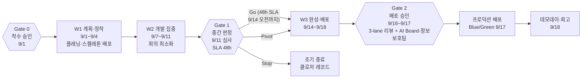
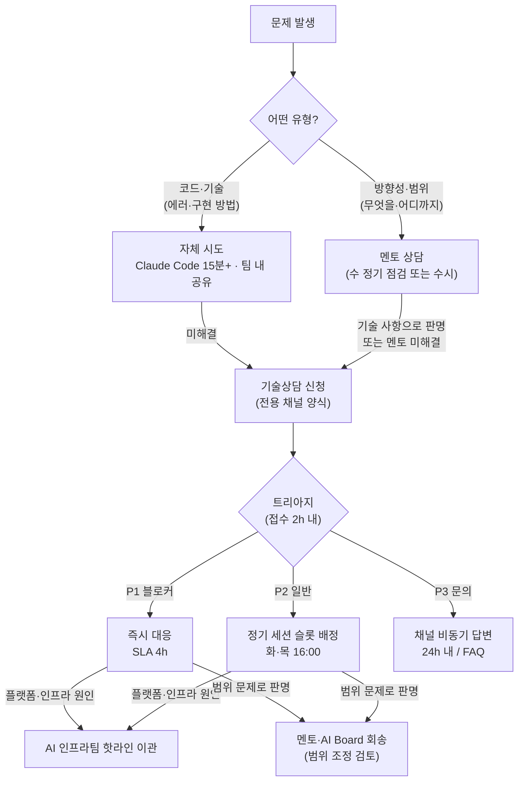

# AIFAB 탑다운 파일럿 — 3주 스프린트 운영 시간표 (최종)

> 최종 v1-0 | 2026-07-14 | 대상: AI Board·멘토·챔피언·시티즌 개발자 팀
> 기간: **2026-09-01(화) ~ 09-18(금)** + 종료 주간 09-21~09-25
> 구조: Agile-Stage-Gate 하이브리드 — Gate 0(착수) → Gate 1(중간) → Gate 2(배포 승인)

---

## 1. 스프린트 구조 개요

### 정례 이벤트 (매주 반복)

| 이벤트 | 일정 | 시간 | 주관 | 비고 |
|---|---|---|---|---|
| 데일리 스탠드업 | 매일 | 09:30, 15분 | 챔피언 | 진행·블로커 공유, 팀 단위 |
| 정기 기술상담 | 화·목 | 16:00~17:00, 25분 슬롯×2 | 기술상담 전담 | **신청제** (당일 12:00 마감) — §4.3 규칙 참조 |
| 멘토 방향성 점검 | 수 | 팀별 1h | 멘토(보드 내 팀원) | 과제 방향·범위·에이전트 구조 조언 — 코드 작업 범위 외 |
| 주간 데모·체크포인트 | 금 | 15:00, 팀당 10분 | AI Board | 리스크 점검, 다음 주 계획 조정 |

## 2. 주차별 상세 시간표

### W1 — 계획·정착 (9/1 화 ~ 9/4 금) · 목표: 전 팀 스테이징 스켈레톤 배포 완료

| 일자 | 오전 | 오후 | 산출물·완료 기준 |
|---|---|---|---|
| 9/1(화) D1 | **킥오프**: 프로그램 오리엔테이션(30분), Gate 0 승인 확인, 팀별 과제 목표 발표 | 스프린트 플래닝 #1 (2h): 백로그 작성, 3주 범위 확정 (멘토 참여) | 스프린트 백로그 v1 |
| 9/2(수) D2 | **골든 패스 스켈레톤 생성**: 폼 입력 → CI/CD·IAM·모니터링 포함 레포 자동 생성 → 스테이징 배포 | 개발 착수 + 멘토 방향성 점검 #1 (1h) | **전 팀 스테이징 배포 성공** (당일 목표). **드라이런 사전 조건 충족 확인**: CodeBuild 실행 롤·ECR push 권한 검증 완료 |
| 9/3(목) D3 | 개발 | 개발 + 정기 기술상담(16:00) | 첫 기능 커밋 |
| 9/4(금) D4 | 개발 | **주간 데모 #1** (15:00): 스켈레톤+첫 기능 시연, 리스크 점검 | 주간 체크포인트 기록 |

> W1 종료 기준: 전 팀 스테이징 배포 + 백로그 확정. 미달 팀은 AI Board가 주말 전 원인 분석·지원 계획 수립 (조기 경보 — 중간 게이트 "한계 통과" 팀의 80%+가 최종 실패한다는 GSoC 데이터 반영, 문제를 W2로 이월하지 않음)

### W2 — 개발 집중 (9/7 월 ~ 9/11 금) · 목표: 핵심 기능 완성, Gate 1 통과

| 일자 | 오전 | 오후 | 산출물·완료 기준 |
|---|---|---|---|
| 9/7(월) D5 | 개발 (no-meeting) | 개발 (no-meeting) | — |
| 9/8(화) D6 | 개발 | 개발 + 정기 기술상담 | — |
| 9/9(수) D7 | 개발 | 멘토 방향성 점검 #2 + 기술상담 전담의 코드 사전 점검(중복·구조) | 중간 코드 리뷰 메모 |
| 9/10(목) D8 | 개발 | 정기 기술상담 + **Gate 1 자료 준비** (기능 증분 데모 시나리오) | Gate 1 데모 자료 |
| 9/11(금) D9 | **Gate 1 중간 심사**: 팀당 15분 — 동작하는 기능 증분 데모 + 잔여 범위·리스크 보고 | 개발 계속 | 심사 기록 |

> **Gate 1 판정 (AI Board·멘토 합의, SLA 48h — 9/14(월) 오전까지 통보)**
> - **Go**: 계획대로 W3 진행
> - **Pivot**: 범위 축소·방향 전환 후 진행 (W3 첫날 백로그 재확정)
> - **Stop**: 조기 종료 → 클로저 레코드 작성, 참여자는 회고·데모데이 참관으로 전환

### W3 — 완성·배포 (9/14 월 ~ 9/18 금) · 목표: Gate 2 통과, 프로덕션 배포, 데모데이

| 일자 | 오전 | 오후 | 산출물·완료 기준 |
|---|---|---|---|
| 9/14(월) D10 | Gate 1 판정 반영, 범위 재확정 | 개발·마무리 | **기능 동결(EOD)** — 이후 신규 기능 금지 |
| 9/15(화) D11 | 테스트·버그 수정 | 운영 문서화(운영 매뉴얼·트러블슈팅 초안) + 정기 기술상담 | 운영 문서 v1 |
| 9/16(수) D12 | **Gate 2 심사 1부 — 자동 검사**: 단위 테스트, 시크릿 미검출(gitleaks), SAST Critical/High 0건(Semgrep), **Inspector 컨테이너 스캔 Critical CVE 0건**, 의존성 SCA 확인, GuardDuty 활성 확인 | **Gate 2 심사 2부 — 3-lane 코드 리뷰** (아래 §3) | 심사 결과서 |
| 9/17(목) D13 | **AI Board·정보보호팀 승인 게이트** (수동). 배포 전 스모크 테스트(헬스체크 3종: 앱 헬스체크 엔드포인트·DB 커넥션·외부 API 응답) 통과 | 스테이징 최종 검증 → **Blue/Green 프로덕션 배포** (ECS Blue/Green — CodeDeploy, Canary 방식. 모니터링 창에서 5xx > 5% 또는 P95 > 2초 시 자동 롤백 — 보드 확정) | **운영 배포 완료** |
| 9/18(금) D14 | 데모데이 리허설 | **데모데이** (팀당 5~10분, 경영진 참석) + 스프린트 회고(팀별 1h) | 데모 영상, 회고 기록 |

## 3. Gate 2 — 3-lane 위험 분류 리뷰

| Lane | 대상 | 리뷰 체계 | SLA |
|---|---|---|---|
| 🟢 Green | 내부 조회용 UI, 문서, 읽기 전용 기능 | 피어 리뷰 1인(기술상담 전담) | 4시간 |
| 🟡 Yellow | 비즈니스 로직, 내부 API, 쓰기 기능 | 시니어 개발자 사인오프 | 24시간 |
| 🔴 Red | 인증·권한, 개인정보/실데이터, 인프라 변경 | **3인 승인**: 주 리뷰어 + 시니어 + 보안 오너 | 24~48시간 |

**Rubber-stamping 방지 장치** (AI 생성 코드 승인율 +14.5%p·리뷰 코멘트 -22% 실증 대응):
1. 승인 시 서면 정당화(무엇을 확인했는지 1줄 이상) 의무
2. 리뷰어 로테이션 — 동일 팀 코드 연속 승인 금지
3. Red lane은 심사 분산 배치(W3에 몰리지 않도록 W2부터 부분 제출 권장)

**선발 단계 연계**: 과제 심사(2단계 기술 검토)에서 Red lane 비중이 높은 과제는 3주 범위에서 Green/Yellow 중심으로 축소 권고 — Red 전면 과제는 파일럿 부적합.

## 4. 지원 체계 — 2계층 모델 (멘토 / 기술상담)

### 4.1 구조와 문제 라우팅

| 계층 | 담당 | 다루는 것 | 다루지 않는 것 |
|---|---|---|---|
| 1선 — 멘토 | AI Board 내 팀원 (유사 과제군당 1명, **1:n** 담당) | 과제 방향성·범위 관리, 진행 점검, 간단한 에이전트 구조 조언 | 코드 작성·디버깅 (→ 기술상담으로 연결) |
| 2선 — 기술상담 전담 | **1명 전담** — 초기: AI Board 내 FAB 전담 인원, 이후 전문 개발자 1명 전환 | 코드 작업 중 막히는 문제, 멘토 상담으로 해결되지 않은 기술 사항, 방향+기술 복합 이슈 | 과제 범위·우선순위 결정 (→ 멘토·AI Board 회송) |

### 4.2 멘토링 운영 규칙

- **지정 방식**: 과제 내용이 유사한 과제군 단위로 해당 도메인의 AI Board 내 팀원 1명을 멘토로 지정 — 멘토 1명이 유사 과제 1~3팀 담당(1:n)
- **초점**: ① 과제 방향성·범위가 3주 목표에 맞는지 점검 ② 진행상황에서 필요한 의사결정 지원 ③ 간단한 에이전트 구조 조언. **코드 작업은 범위 외** — 코드 문제는 기술상담으로 연결한다
- **정례**: 수요일 팀별 1시간 방향성 점검 + Gate 1 심사 참여. 수시 문의는 채널 멘션으로 접수
- **권한 경계**: 범위 확대·축소 등 과제 변경 제안은 멘토 경유로 AI Board에 보고 후 확정

### 4.3 기술상담 운영 규칙 (Tech Desk)

**담당**: 전담 1명 — 초기에는 AI Board 내 FAB 전담 인원이 수행하고, 상담 부하 임계 도달 또는 파일럿 확대 시 전문 개발자 1명으로 전환

**대상 문제**: ① 코드 작업 중 막히는 부분(에러, 디버깅, 골든 패스·Claude Code 사용) ② 멘토 상담으로 해결되지 못한 기술 사항 ③ 방향+기술이 얽힌 복합 사항(필요 시 멘토 동석)

**신청 방법**
1. 전용 채널(Teams/Slack)의 **기술상담 신청 양식**(스레드 템플릿)으로 접수
2. 필수 기재 5항목: ① 팀/신청자 ② 문제 요약(1~3줄) ③ 에러 메시지·재현 절차 ④ 이미 시도한 것(Claude Code 시도 결과, 팀 내 논의, 멘토 상담 여부) ⑤ 관련 레포·브랜치 링크
3. **신청 전 자체 시도 규칙**: Claude Code로 15분 이상 시도 + 팀 내 공유 후에도 미해결일 때 신청. 방향성 문제로 보이면 멘토 먼저 (단, 작업이 완전히 중단된 블로커는 즉시 신청 가능)

**접수·우선순위 (트리아지)** — 전담 인원이 접수 후 2시간 내 분류·회신

| 등급 | 기준 | 대응 |
|---|---|---|
| P1 블로커 | 팀 작업 완전 중단 (배포 불가, 환경 장애 등) | 정기 세션 대기 없이 즉시 대응 — 응답 SLA 4시간(업무 시간) |
| P2 일반 | 우회 가능하나 해결 필요 | 다음 정기 세션 슬롯 배정 |
| P3 문의·개선 | 궁금증, 더 나은 방법 탐색 | 채널 비동기 답변(24시간 내) 또는 FAQ 링크 |

**정기 세션 진행**
- 화·목 16:00~17:00, **25분 슬롯 × 2** (신청 기반 배정, 당일 12:00 신청 마감, 배정은 선착순이 아닌 트리아지 우선순위)
- 화면 공유로 문제 재현 → 함께 해결 → 해결 방법 3줄 기록
- 원칙: 코드를 대신 작성하지 않고 참여자가 스스로 해결하도록 안내 (learning by doing). 단, P1 블로커는 직접 해결 허용
- 노쇼 또는 준비 미비(문제 재현 불가) 시 슬롯 반납 후 재신청

**기록·환류**
- 모든 상담을 상담 로그(문제 유형·해결 내용·소요 시간)로 기록, 주간 집계
- 동일 유형 3회 이상 반복 → FAQ/가이드로 문서화(채널 고정), 골든 패스·온보딩 교육 개선에 반영
- 주간 진척 보고에 상담 건수·유형 분포·미해결 건 포함 (KPI 보조 지표)

**에스컬레이션·부하 관리**
- 플랫폼·인프라 원인으로 판명 → AI 인프라팀 핫라인 이관 (전담 인원이 이관 후 해결까지 추적)
- 기술이 아닌 범위 문제로 판명 → 멘토·AI Board 회송 (범위 조정 검토)
- **증원 트리거**: 주 10건 초과 또는 P1 주 3건 이상 → 전문 개발자 조기 전환·증원을 주간 보고에서 판단

### 4.4 기타 지원 채널

| 채널 | 내용 |
|---|---|
| 커뮤니케이션 | 전용 채널(Teams/Slack): 질문 응답 SLA 4시간(업무 시간 기준) |
| 도구 | Claude Code + 골든 패스 템플릿 (폼 기반 셀프서비스), 사용량 대시보드 주간 공유 |
| 챔피언 | 팀당 1명, 주 40분 활동 예산 — 스탠드업 주관, 사용 정착 촉진, AI Board 연결 |

## 5. 스프린트 기간 온콜 체계 (9/1 ~ 9/18)

> 온콜 = **플랫폼·인프라 장애** 대응. 개발 블로커는 기술상담(§4.3) 경로로 분리.

| 항목 | 내용 |
|---|---|
| 운영 주체 | AI 인프라팀 온콜 로테이션 (9/1~9/18, 스프린트 기간 전체) |
| 에스컬레이션 채널 | 핫라인(전화) + 전용 Slack/Teams 채널(#aifab-oncall) |
| P1 플랫폼 전면 장애 SLA | 초동 대응 30분 이내, 해소 목표 4시간 이내 |
| 알람 경로 | CloudWatch Alarm → SNS → 온콜 담당자 PagerDuty/문자 에스컬레이션 |
| 기술상담과의 구분 | **온콜**: 플랫폼·인프라 장애(배포 파이프라인 중단, 계정 접근 불가, VPC 연결 이슈 등) // **기술상담**: 팀 개발 블로커(코드 에러, 골든 패스 사용법 등) — 기술상담 전담이 인프라 원인으로 판명 시 온콜 핫라인으로 이관 |

## 6. 종료 주간 (9/21 월 ~ 9/25 금)

| 일자 | 활동 | 산출물 |
|---|---|---|
| 9/21(월) | 프로그램 통합 회고 (전 팀 + AI Board + 멘토) | 회고 보고서, 액션 아이템 |
| 9/22(화) | 클로저 레코드 작성 (팀당 15~20분): 수행 내용·KPI 대비 결과·출구 결정 초안·학습 2~3건 | 클로저 레코드 |
| 9/23(수) | KPI 실측 집계, Go/No-Go 스코어카드 산정 (동결본 기준) | 스코어카드 결과 |
| 9/24(목) | **AI Board 심의**: 팀별 출구 결정 — 이관(Scale)/폐기(Stop)/현업복귀(Redirect) | 심의 결과 |
| 9/25(금) | 결과 공유회, 이관 팀 → 격상 절차 착수(리드타임 4~6주, 완료 목표 10월 말~11월 초) / 폐기 팀 → 계정 Frozen 개시 | 파일럿 최종 보고 초안 |

## 7. 측정 KPI (킥오프 전 동결 — 8/28 확정)

| KPI | 목표(초안) | 측정 방법 |
|---|---|---|
| 운영 배포 완성 | 팀별 Gate 2 통과·배포 | 배포 파이프라인 기록 |
| 도구 주간 활성 사용률(WAU) | 70% 이상 | 사용량 대시보드 |
| 사이클 타임 | 백로그→배포 리드타임 실측 (벤치마크 수립) | 파이프라인 메트릭 |
| 거버넌스 준수 | 게이트 우회·위반 0건 | 심사 기록 |
| 참여자 만족도 | 4.0/5.0 이상 | 종료 설문 |
| 주당 시간 절감(자가 보고) | 3시간 이상 | 주간 설문 |
| **팀별 예산 준수율** | Budgets 알람 미발동 (초과 없음) | AWS Budgets 알람 기록. 매주 금요일 체크포인트에 Cost Explorer 태그 뷰 리뷰 정례화 |

> 목표값은 초안이며 8/28 동결 시 결정 권한자 서명으로 확정. 동결 후 변경 금지.

## 8. 참고

- 전체 타임라인·시나리오: `../fab/AIFAB_탑다운_파일럿_구축_타임라인_운영시나리오_실무_v1-0.md`
- 종합 계획(PMO 제출용): `AIFAB_기획_상세준비_운영계획_PMO제출_v1-0.md`
- 리서치 근거: `../metasearch-aifab-topdown-pilot-ops-2026-07-11/05-conclusion.md`
