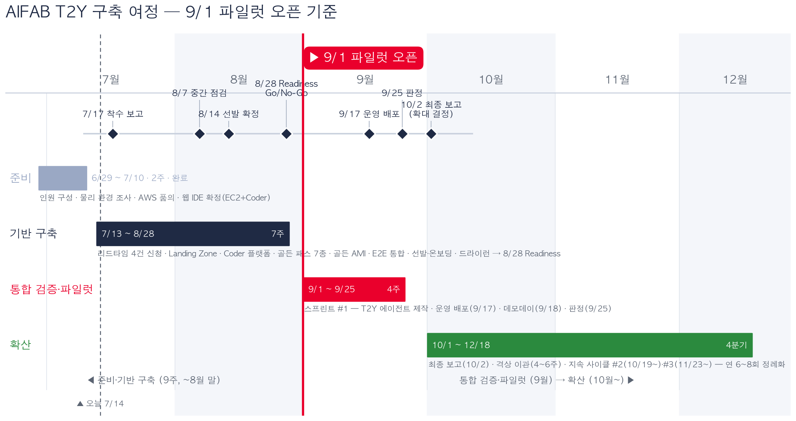

# AIFAB AWS 환경 구축 백서 (최종)

**AI SAND BOX — 시티즌 개발자를 위한 통제된 AI 개발 플랫폼의 설계와 구축**

| 구분 | 내용 |
|:---|:---|
| 문서 구분 | 백서 (White Paper) — **최종 v1-0** |
| 작성일 | 2026-07-14 |
| 작성 | AI 인프라팀 · AI Board |
| 원본 문서 | AWS 기반 바텀업 샌드박스 과제 운영환경 구축·운영 기획안 v1-0 (및 상세 기획안 v2-1, 탑다운 기획안 v1-0) |
| 상태 | 구축 진행(7월 3주) 기준 최종본 — 파일럿 실측 결과·협의 확정 수치는 파일럿 종료(10월) 후 개정판(v2-0)에서 갱신 |

---

## 서문

사내 교육으로 Claude Code·Copilot을 다루는 시티즌 개발 인력이 확보되었지만, 이들이 아이디어를 실제 서비스로 만들 수 있는 **통제된 실행 환경**은 존재하지 않았다. 통제 없는 자율 개발은 보안·데이터·비용 리스크를 수반하고, 반대로 과도한 통제는 현장의 혁신 동력을 꺼뜨린다.

AIFAB의 방향은 사내 노스폴(North Star)인 **T2Y**가 정의한다. T2Y 달성에 직결되는 과제를 **탑다운(Top-down) 과제**로 정의하고, AIFAB AWS 환경은 이 **T2Y 달성을 위한 과제와 에이전트(Agent)를 개발·지원하는 플랫폼**으로 구축되었다. 탑다운 트랙은 T2Y 공식 과제의 에이전트를 운영 수준으로 개발·배포하고, 바텀업 샌드박스는 현장의 자율 아이디어를 수용해 검증한 뒤 우수 과제를 격상시켜 T2Y로 수렴시킨다 — 두 트랙 모두 종착점은 T2Y다.

AIFAB AWS 환경은 자율과 통제의 딜레마에 대한 답으로 설계되었다. 핵심 명제는 하나다 — **"계정 안에서는 자율, 조직의 금지선은 강제."** 정책을 문서가 아닌 플랫폼 차원에서 강제하고, AI가 심사와 모니터링을 자동화하며, 사람(AI Board)은 판단이 필요한 지점에만 개입한다.

본 백서는 이 환경의 설계 철학, 아키텍처, 구축 과정을 기록한다.

## 1. 설계 철학 — 5원칙

| # | 원칙 | 구현 방식 |
|:--|:---|:---|
| 1 | **Security by Design** | 보안을 절차가 아닌 아키텍처에 내재화 — 민감정보 마스킹 원칙(샌드박스), 사내망 한정, SCP 가드레일은 계정 내 누구도 해제 불가 |
| 2 | **계정 격리 + 조직 가드레일** | 과제별 AWS 계정 분리로 장애·부하·보안 이슈의 전파 차단, OU 단위 SCP로 금지선 일괄 상속 |
| 3 | **전 생애주기 자동화** | 신청 → AI 심사 → 승인 → 프로비저닝(30분) → 개발·배포 → 모니터링 → 격상/선셋까지 사람 개입 최소화 |
| 4 | **"만들기 전에, 있는 것부터"** | 가이드 챗봇이 기존 사내 도구로 해결되는 과제를 걸러 도구·사용법을 안내 — 신규 개발이 꼭 필요한 과제에만 자원 집중 |
| 5 | **비용의 구조적 통제** | 시간제 가동 + 자동 선셋 + 쿼터의 3중 장치 — 절약을 운영자의 노력이 아닌 구조로 보장 |

각 원칙의 선언(규범)과 상세 근거는 아래와 같다. 문서 표기는 약어를 사용하며 전문은 부록(`백서부록/` 폴더)을 따른다 — **바텀업 v1-0**(부록1), **상세 v2-1**(부록2), **탑다운 v1-0**(부록3), **격상 표준**(부록6). 하위 문서에 명시가 없는 선언은 *(본 백서 신규 선언)* 으로 표기한다.

### 1.1 원칙 1 — Security by Design

**선언**
- 보안 통제는 문서·절차가 아니라 아키텍처로 구현한다. 사람이 지키는 규칙은 어겨질 수 있지만, 구조가 강제하는 규칙은 어길 수 없다. *(본 백서 신규 선언)*
- 실데이터 사용은 허용되나 **민감정보는 마스킹하여 사용하는 것을 원칙**으로 한다 — Macie가 마스킹되지 않은 민감정보 유입을 상시 탐지한다. (바텀업 v1-0 §4 — 본 백서에서 개정 후 전 문서 반영 완료, 정보보호팀 승인은 협의 항목 B-6)
- 모든 접근은 사내망으로 한정하고 인터넷 인바운드를 차단한다. (상세 v2-1 4장)
- 가드레일(SCP)은 계정 내 관리자 권한으로도 해제할 수 없다. (바텀업 v1-0 §3.1)

**상세 근거**

| 내용 | 문서 위치 |
|:---|:---|
| 데이터 반입 정책(민감정보 마스킹 원칙)·Macie 상시 탐지·산출물 유출 통제 | 바텀업 v1-0 §4 |
| 보안 4계층 설계·KMS CMK 전략·Permission Boundary·Secrets Manager | 상세 v2-1 5장 (5.2~5.4) |
| 탑다운 실데이터 보호 SCP 3종·데이터 등급 분류 | 탑다운 v1-0 3.1·4.1.1 |
| Bedrock 거버넌스 (Guardrails·호출 로깅) | 상세 v2-1 6.3 |
| 본 백서 상세 | 6장·7장 |

### 1.2 원칙 2 — 계정 격리 + 조직 가드레일

**선언**
- "계정 안에서는 자율, 조직의 금지선은 강제" — 개발자에게 넓은 자율성을 주되, 격리 전제는 계정 안에서 누구도 변경할 수 없다. (바텀업 v1-0 §3.1)
- 과제 하나의 실험 실패가 다른 과제·공식 환경에 영향을 주지 않는 구조를 계정 경계로 보장한다. *(본 백서 신규 선언 — 바텀업 v1-0 §11 기대 효과에서 도출)*

**상세 근거**

| 내용 | 문서 위치 |
|:---|:---|
| OU 구조(Shared Services/Top-down/Sandbox)·SCP 가드레일 6종 | 상세 v2-1 3.2 (3.2.2) |
| 계정 벤딩 자동화·선셋 시 격리·폐기 절차 | 상세 v2-1 3.2.1 |
| 본 백서 상세 | 3장 |

### 1.3 원칙 3 — 전 생애주기 자동화

**선언**
- 사람의 개입은 판단이 필요한 지점(HITL — 보드 승인·게이트 심사)으로 한정하고, 나머지는 플랫폼이 수행한다. *(본 백서 신규 선언 — 바텀업 v1-0 §5 HITL 조항에서 도출)*
- 환경 준비는 신청 승인 후 30분 이내, AI 심사는 10분 이내를 목표로 한다. (바텀업 v1-0 §11, 상세 v2-1 6.1.1)
- 인프라 변경은 Terraform 코드 리뷰(PR)로만 반영한다 — 수기 변경 경로를 두지 않는다. (바텀업 v1-0 §6)

**상세 근거**

| 내용 | 문서 위치 |
|:---|:---|
| 전 생애주기 적용 범위 (신청→격상/선셋) | 바텀업 v1-0 §1.3 |
| 심사 파이프라인 6단계·Terraform 모듈·state 운영 | 상세 v2-1 6.1·3.5 |
| 인증·권한 자동 체인 (Entra ID→SCIM→권한세트) | 상세 v2-1 3.3, 바텀업 v1-0 §3.2 |
| 격상·선셋 자동화 | 바텀업 v1-0 §7, 격상 표준 전체 |
| 본 백서 상세 | 4장·8장·10장·11장 |

### 1.4 원칙 4 — "만들기 전에, 있는 것부터"

**선언**
- 기존 사내 AI 도구로 해결되는 과제는 만들지 않는다 — 도구와 활용 가이드를 안내하고 샌드박스를 배정하지 않는다. (상세 v2-1 6.1, 바텀업 v1-0 §1.2·§5)
- 가이드 챗봇(AI)이 승인/미승인/보류를 판정하고, 최종 승인 결정 권한은 AI Board에 있다. *(본 백서 개정 선언 — 상세 v2-1 6.1의 "에이전트는 권고만" 구조를 AI 판정 + 보드 결정으로 개정, 8.3 참조)*

**상세 근거**

| 내용 | 문서 위치 |
|:---|:---|
| 도구 추천·자격 판별·판정 흐름 (구 트리아지 4분기) | 바텀업 v1-0 §5, 본 백서 8장 |
| 다각도 판단 기준·대화형 보완·Knowledge Base | 상세 v2-1 6.1 |
| 저위험 자동 승인 단계 확대 | 바텀업 v1-0 §5, 상세 v2-1 10장(4단계) |
| 본 백서 상세 | 8장 |

### 1.5 원칙 5 — 비용의 구조적 통제

**선언**
- 비용 절약은 운영자의 노력이 아니라 구조(시간제 가동·자동 선셋·쿼터)로 보장한다. (바텀업 v1-0 §10 "3중 구조")
- 운영급(상시) 가동은 격상을 통해서만 부여한다 — 상시 가용성 필요 자체가 격상 사유다. (바텀업 v1-0 §3.3)
- 태그 없는 자원은 존재할 수 없다 — 표준 태그를 정책으로 강제하고 계정별 예산 알람을 상시 가동한다. *(본 백서 신규 선언 — 탑다운 v1-0 9.4에서 도출)*

**상세 근거**

| 내용 | 문서 위치 |
|:---|:---|
| 시간제 가동 정책 (셧다운/웨이크업·연장 신청) | 바텀업 v1-0 §3.3, 상세 v2-1 3.6 |
| 자동 선셋·Orphan 탐지 | 바텀업 v1-0 §7 |
| 쿼터·Rate Limit·비용 추정(월 750~850 USD) | 바텀업 v1-0 §8·§10, 상세 v2-1 11장 |
| Tag Policy·Budgets 알람·Bedrock 토큰 상한 | 탑다운 v1-0 9.4, 상세 v2-1 6.3 |
| 본 백서 상세 | 10장 |

## 2. 전체 아키텍처

AIFAB 환경은 하나의 Landing Zone 위에서 운영 등급이 다른 **두 트랙**으로 구성된다. **최종 아키텍처는 AI 인프라팀(AI Infra Team)과 협의하여 결정한다** — 본 장의 구성은 현 시점 기준 설계안이다.


*그림 1. AWS 전체 아키텍처 — 계정 분리 및 신청·프로비저닝·개발 흐름*

| 구분 | 바텀업 샌드박스 | 탑다운 (공식 과제) |
|:---|:---|:---|
| 과제 성격 | 현장 자율 제안 (실험·검증) | 사업 계획 확정 과제 |
| 심사 | 가이드 챗봇 상담 → AI 판정(승인/미승인/보류) → 보드 승인 결정 | AI 심사 바이패스(적합성 심사 한정), 보드 확인 |
| 실행 환경 | 개발과 동일 환경에 dev 배포 | 스테이징·운영 분리 |
| 가동 | 시간제 (셧다운/웨이크업) | 상시 (서비스 수준 관리) |
| 배포 | dev까지 (게이트 없음) | 스테이징 → 승인 게이트 → 운영 |
| 데이터 | **실데이터 허용 — 민감정보 마스킹 원칙** | 통제 하 실데이터 허용 (등급 심사, 민감정보 원본은 심사 후 허용) |
| 종료 | 저활용 자동 선셋 | 사업 판단 종료·이관 |

우수한 바텀업 과제는 **격상 경로**(10장)를 통해 재작성 없이 탑다운 운영 환경으로 이관된다 — 현장 혁신이 전사 서비스로 확산되는 파이프라인이다.

## 3. 계정·거버넌스

계정 거버넌스의 원칙은 **"계정 안에서는 자율, 조직의 금지선은 강제"**다. 사내망 한정·아웃바운드 통제 같은 격리 전제는 VPC 설정으로 구현되지만, 그 설정을 과제 수행자가 임의로 변경할 수 없도록 조직 레벨(SCP)에서 잠근다. 자율성과 통제가 충돌하지 않는 이유가 바로 이 이중 구조에 있다.

### 3.1 OU 구조 — 격리와 정책 상속의 1차 경계

```
Root (관리 계정: 조직·결제 관리 전용, 워크로드 배치 금지)
├── OU: Shared Services   — 신청 포털·승인 자동화·AI Agent·조직 로그 집적
├── OU: Top-down          — 탑다운(T2Y) 공식 과제 계정 (운영급, 추가 SCP 3종)
├── OU: Bottom-up Sandbox — 바텀업 과제 계정 (SCP 가드레일 6종)
└── OU: Quarantine        — 선셋·폐기 대기 계정 격리 (Deny-all SCP)
```

- **OU는 정책의 상속 단위다.** 계정이 OU에 배치되는 순간 부착된 SCP를 즉시 상속받으므로, 계정별 개별 보안 설정이 필요 없고 — 더 중요하게는 — 개별 계정에서 설정을 빠뜨릴 수도 없다
- **관리 계정(Root)은 SCP가 적용되지 않는 유일한 계정**이므로 워크로드를 두지 않고 접근을 최소 인원으로 제한한다
- 과제 승인 시 해당 트랙 OU 아래에 계정이 자동 생성된다(3.3) — 과제당 계정 1개가 격리의 기본 단위이며, 한 과제의 장애·부하·보안 이슈가 계정 경계를 넘지 못한다

### 3.2 SCP 가드레일 — 관리자도 넘을 수 없는 금지선

SCP(Service Control Policy)는 계정 내부의 IAM 권한과 **무관하게** 적용된다. 계정 안에서 관리자 권한을 가진 사용자도 SCP가 차단한 행위는 수행할 수 없다 — "규칙을 지켜달라"가 아니라 "어길 수 없다"를 구현하는 장치다. 기본 정책(FullAWSAccess)은 유지한 채 Deny 가드레일만 부착하며, 권한 부여는 Identity Center 권한세트가, 차단은 SCP가 담당하도록 역할을 분리한다.

**공통 가드레일 6종 (Bottom-up Sandbox OU):**

| # | 가드레일 | 차단 대상(예) | 목적 |
|:--|:---|:---|:---|
| 1 | 서울 리전 외 API 호출 차단 | `aws:RequestedRegion ≠ ap-northeast-2` 전체 거부 | 사내망 연동·모니터링이 없는 리전으로 격리 환경이 번지는 것 방지 |
| 2 | 인터넷 경로 생성 금지 | Internet Gateway 생성·연결, EIP 할당 | 인터넷 인바운드 차단 전제를 사용자 변경으로부터 보호 |
| 3 | 네트워크 핵심 자원 변경 제한 | VPC·서브넷·라우팅·NAT·TGW 연결 변경 (IaC 역할만 예외) | 사내망 한정·아웃바운드 화이트리스트 구조 유지 |
| 4 | 감사·보안 서비스 비활성화 금지 | CloudTrail 중지·삭제, GuardDuty·Config·Security Hub 해제 | 전수 감사 기록과 위협 탐지 체계 보호 |
| 5 | S3 퍼블릭 노출 금지 | Block Public Access 해제, 퍼블릭 버킷 정책 | 산출물·데이터의 사외 노출 방지 |
| 6 | 거버넌스 이탈 금지 | 조직 탈퇴(LeaveOrganization), 계정 폐쇄 | 통제 범위 밖으로의 계정 이탈 방지 |

**탑다운 OU 추가 가드레일 3종** — 탑다운 계정은 실데이터와 운영 서비스를 다루므로 보호 수위를 높인다:

| # | 가드레일 | 차단 대상 | 목적 |
|:--|:---|:---|:---|
| T-1 | KMS 키 즉시·단기 삭제 금지 | `kms:ScheduleKeyDeletion` — 삭제 대기 30일 미만 요청 거부 | 실데이터 암호화 키의 성급한 삭제로 인한 데이터 영구 손실 방지 |
| T-2 | Macie 비활성화 금지 | `macie2:DisableMacie` | 실데이터 취급 환경의 민감정보 상시 탐지 체계 보호 |
| T-3 | CloudTrail 중지·삭제 금지 (강화) | `cloudtrail:StopLogging`·`DeleteTrail` | 운영 환경 감사 기록 무결성 보호 (공통 4번과 이중 차단) |

- **예외는 단 하나의 경로**: 가드레일 3과 T계열의 예외는 `aws:PrincipalArn` 조건으로 Shared Services의 Terraform 프로비저닝 역할에만 한정한다. 즉 네트워크·보안 설정의 변경은 코드 리뷰(PR)를 거친 IaC 자동화 경로로만 가능하고, 운영 조직 역할이나 개발자 권한세트에는 예외를 부여하지 않는다
- SCP는 무비용이며, 목록의 추가·변경은 AI Board 정책 심의를 거쳐 AI 인프라팀이 반영한다

### 3.3 계정 벤딩·회수 — 생성부터 폐기까지의 전 자동화

계정은 수작업으로 만들지도, 방치하지도 않는다. 발급(벤딩)과 회수가 하나의 자동화 파이프라인으로 정의되어 있다.

**벤딩 (승인 → 사용 가능까지 30분 목표):**

| 단계 | 내용 |
|:--|:---|
| 1. 승인 트리거 | 보드 승인 완료 시 Step Functions 워크플로가 계정 생성 개시 |
| 2. 계정 생성 | Organizations `CreateAccount` API 호출 (이메일 앨리어스 자동 지정) |
| 3. OU 배치 | 생성 계정을 트랙 OU(Top-down/Sandbox)로 이동 — SCP 가드레일 즉시 상속 |
| 4. 표준 스택 프로비저닝 | Terraform 표준 모듈로 VPC·개발환경·CI/CD·태그·예산 알람 자동 구성 |
| 5. 권한 연결 | Entra ID 과제 그룹 → SCIM 동기화 → 권한세트 할당 (4장) |

**회수 (선셋 → 폐기의 역방향 절차):**

| 단계 | 내용 |
|:--|:---|
| 1. 선셋 확정 | 저활용 자동 탐지(4주 기준) 또는 보드 판정 |
| 2. Quarantine 격리 | 계정을 Quarantine OU로 이동 — **Deny-all SCP 부착으로 계정 내 모든 API 호출 즉시 차단** |
| 3. 보관 (90일) | 데이터 감사·증거 보존 기간. 복구 필요 시 보드 결정으로 Sandbox OU 재이동 가능 |
| 4. 폐기 | `CloseAccount` API로 계정 폐기, 데이터 파기 증적을 정보보호팀 제출 |

역방향 절차를 사전에 정의한 이유는 명확하다 — **방치된 계정은 비용이자 공격 표면**이다. 회수가 자동화되어 있지 않으면 실험 환경은 시간이 지날수록 관리되지 않는 자산으로 누적되고, 이것이 통제된 샌드박스가 "그림자 IT"로 변질되는 전형적 경로다.

## 4. 인증·권한

인증·권한의 원칙은 **"AWS에 별도 자격증명을 만들지 않는다"**이다. 사내 MS Entra ID를 신원의 단일 원천(Single Source of Truth)으로 삼고, AWS 접근은 전부 임시 자격증명(STS)으로만 이뤄진다. AWS에 비밀번호가 존재하지 않으므로 유출될 비밀번호도 없고, 인사 체계(입사·퇴사·부서이동)의 변화가 AWS 접근 권한에 자동으로 따라온다.

### 4.1 연동 구조 — SAML 인증 + SCIM 프로비저닝

```
[MS Entra ID]                                 [AWS IAM Identity Center]
     │
     ├─ ① SAML 2.0 (인증) ─────────────────→  로그인 시 신원 확인
     │     사내 MFA·조건부 액세스 정책 그대로 적용
     │
     └─ ② SCIM (프로비저닝) ───────────────→  사용자·그룹 자동 동기화
           사번(employeeId) 속성 매핑,             (생성·수정·비활성화)
           입사·퇴사·부서이동 자동 반영
```

- **① SAML(인증)**: 사용자가 AWS 액세스 포털에 접속하면 Entra ID 로그인으로 리다이렉트된다. 사내 MFA·조건부 액세스(사내망 한정 로그인 등)가 그대로 적용되며, AWS에는 별도 비밀번호가 존재하지 않는다
- **② SCIM(프로비저닝)**: Entra ID의 사용자·그룹이 Identity Center로 자동 동기화된다. 사번(`employeeId`)을 속성으로 매핑하여 사내 인사 체계와 AWS 신원이 1:1로 연결된다
- 권한은 권한세트(Permission Set)로 표준화하고 **"그룹 × 계정 × 권한세트"** 할당으로만 부여한다 — 개인 단위 권한 부여가 존재하지 않으므로 권한 현황이 항상 그룹 멤버십으로 설명된다

### 4.2 권한 부여 흐름 — 승인에서 접근까지의 자동 체인

| 단계 | 내용 |
|:--|:---|
| 1. 승인 트리거 | 보드 승인 완료 시 Step Functions 워크플로가 후속 자동화 실행 |
| 2. 그룹 추가 | Lambda가 Microsoft Graph API로 신청자 사번을 Entra ID 과제 그룹(예: `AWS-SBX-{과제ID}-Dev`)에 추가 |
| 3. 동기화 | SCIM이 그룹·멤버를 Identity Center로 동기화 |
| 4. 권한 할당 | Terraform이 해당 그룹을 "과제 계정 × 권한세트"에 할당 |
| 5. 접근 | 액세스 포털 → Entra 로그인(MFA) → **담당 과제 계정만 표시** → 임시 자격증명으로 콘솔/CLI 사용 |

**역방향도 자동이다** — 퇴사·부서이동으로 Entra 계정이 비활성화되면 SCIM 동기화로 모든 AWS 접근이 즉시 차단된다. 이 비활성화 이벤트는 Orphan 과제(담당자 이탈 과제) 탐지 트리거로도 활용되어, 주인 잃은 환경이 방치되지 않고 선셋 후보로 자동 분류된다.

**운영 원칙:**
- 권한 변경은 Entra ID 그룹 멤버십으로만 수행한다 — Identity Center 쪽에서 수정해도 다음 동기화에서 덮어써진다 (원천은 항상 Entra)
- SCIM 표준 동기화는 약 40분 주기이므로, 승인 직후 온디맨드 프로비저닝을 트리거해 "승인 후 30분 내 자원 사용" 목표를 보장한다
- SCIM은 중첩 그룹을 지원하지 않으므로 과제 그룹에 사용자를 직접 배치하는 평평한 구조로 설계한다
- Entra ID 자동 프로비저닝에는 P1 이상 라이선스가 필요하다 (사내 M365 라이선스 포함 여부 사전 확인)
- Identity Center는 조직당 1개(서울 리전)로 활성화하고, 관리 위임(delegated administration)으로 Shared Services 계정에서 운영한다 — 관리 계정 최소화 원칙(3.1)과 일치

### 4.3 역할별 권한세트 — 최소권한의 표준화

역할이 필요로 하는 만큼만, 담당 범위에서만 부여한다. 프로그램 전 역할의 권한이 아래 표준 세트로 정의되어 있어 "누가 어디에 무엇을 할 수 있는가"가 항상 열거 가능하다.

| 역할 | 권한세트 | 적용 범위 | 비고 |
|:---|:---|:---|:---|
| 시티즌 개발자 (샌드박스) | SandboxDeveloper — 광범위 개발 권한, IAM 쓰기 제한 + Permission Boundary | 담당 과제 계정 한정 | 네트워크·조직 변경은 SCP가 차단, 타 과제 계정 접근 불가 |
| 탑다운 과제 개발자 | TopdownDeveloper — 스테이징 개발 권한 | 담당 과제 계정 스테이징 | 운영 환경 직접 변경 불가 |
| 운영 조직 (탑다운) | TopdownOperator — 모니터링·장애 대응 | 담당 과제 운영 환경 | 인프라 변경은 IaC(PR) 경유만 |
| AI 인프라팀 | PlatformAdmin | Shared Services·Landing Zone·전 과제 계정 | 플랫폼 운영 전담 |
| 정보보호팀 | SecurityAudit (읽기 전용) | 전 과제 계정 | CloudTrail·Config·GuardDuty 감사 조회 |
| AI Board | ReadOnly + 승인 워크플로 실행 | 전 과제 계정 | Gate 심사·점검·보고 목적 |
| 멘토·기술상담 전담 | ReadOnly + CloudWatch Logs 조회 | 담당 과제 계정 한정 | 지원 범위로 제한 |

### 4.4 Permission Boundary — 권한 상승의 원천 차단

개발자에게는 IAM 역할 생성 권한이 불가피하게 필요하다(애플리케이션이 실행 역할을 요구하므로). 그러나 역할 생성 권한은 곧 **자신보다 넓은 권한의 역할을 만들어 쓰는 권한 상승(privilege escalation)** 의 통로가 될 수 있고, 조직 금지선만 긋는 SCP는 이 시나리오를 막지 못한다.

해법은 Permission Boundary — 권한의 "천장"이다. 실효 권한 = (권한세트 ∩ Boundary)로 계산되므로, Boundary 밖의 권한은 정책에 적어도 무효가 된다.

- **강제 상속**: 개발자 권한세트의 역할 생성 허용 조건에 "지정된 Boundary를 부착할 때만 생성 허용"을 IAM Condition으로 명시 — Boundary 없는 역할은 생성 자체가 거부된다
- **Boundary 3원칙**: ① 리전 제한(SCP와 이중 차단) ② 자신이 보유하지 않은 권한의 부여 금지 ③ Boundary 자체의 변경·삭제 금지(자기 천장을 스스로 제거하는 행위 차단)
- **예외는 IaC 경로 하나**: Terraform 프로비저닝 역할만 Boundary 적용에서 제외하며, 해당 역할은 SCP 가드레일과 코드 리뷰(PR)로 통제한다

SCP(조직의 금지선, 3.2)와 Permission Boundary(개인 권한의 천장)는 서로 다른 층위에서 겹쳐 동작한다 — 어느 한쪽의 우회로가 열려도 다른 쪽이 막는 심층 방어 구조다.

## 5. 네트워크

네트워크의 핵심 요구는 하나다 — **"사내망에서만 접근한다."** 이 요구 자체의 충족 조건은 단순하며, 그 외 장치들은 각각 별도의 문제(다계정 연결·아웃바운드 보안 수위·확장·사내 시스템 연동)를 해결하기 위한 것이다. 따라서 본 장은 장치별 필요 조건을 명시하고 **파일럿 최소안 → 확대 표준안**의 2단계로 구성한다. 최종 구성은 AI 인프라팀 협의로 확정한다(2장).


*그림 2. 네트워크 구성 — 사내망 전용, 내부 ALB(Private Subnet), VPC Endpoint 통신*

### 5.1 핵심 요구의 최소 충족 조건 — 2가지

| # | 구성 | 역할 |
|:--|:---|:---|
| 1 | **사내망 ↔ AWS 프라이빗 연결 1개** (기존 Direct Connect 또는 VPN **재사용**) | 사내에서 AWS로 들어가는 유일한 길 — 신규 회선 구축이 아니라 기존 연결 활용이 기본 |
| 2 | **인터넷 게이트웨이 없는 VPC + 내부(internal) ALB** | 인터넷에서의 접근이 물리적으로 불가능 — 개발환경도, 배포된 앱도 사내망에서만 접근 |

이 두 가지만으로 "사내망 한정 사용·배포"는 완성된다. SCP 가드레일 2번(인터넷 경로 생성 금지, 3.2)이 이 상태를 계정 내 누구도 되돌릴 수 없게 잠근다.

### 5.2 장치별 필요 조건 — 무엇이, 언제 필요해지는가

| 장치 | 해결하는 문제 | 필요해지는 조건 | 파일럿 최소안 | 확대 표준안 |
|:---|:---|:---|:---|:---|
| DX/VPN 연결 | 사내망↔AWS 프라이빗 경로 | 항상 필수 | 기존 회선 재사용 | 대역폭 재평가 |
| IGW 미설치 + 내부 ALB | 인터넷 인바운드 차단 | 항상 필수 | 적용 | 적용 |
| Transit Gateway | 다계정 VPC 연결의 허브화 — **사내망 한정이 아니라 계정 분리가 만든 필요** | VPC 3개 이상 (과제 계정 + Shared Services) | 적용 (계정 분리 유지 시 오히려 단순한 선택) | 적용 |
| VPC Endpoint | AWS 서비스 API 트래픽(ECR 풀·로그·Bedrock 호출)의 내부화 — 앱 접근이 아닌 별개 문제 | 인터넷 아웃바운드까지 차단하는 보안 수위 선택 시 | **필수 4종만**: S3 게이트웨이(무료)·ECR·CloudWatch Logs·Bedrock-runtime | 전면화 (+STS·Secrets·KMS·SSM 등) — 인터넷 경유 최소화 |
| NAT + 아웃바운드 화이트리스트 | 엔드포인트 미적용 트래픽의 통제된 외부 통신 | 화이트리스트 대상 외부 통신 존재 시 | 적용 (주 경로 — 허용 도메인 목록은 정보보호팀 협의 E-1) | 보조 경로로 축소 |
| VPC IPAM | 계정 증가 시 CIDR 대역 충돌 방지 | 계정 10개 이상 또는 수동 관리 한계 도달 | **생략** — 수동 대역표로 관리 | 도입 |
| Route 53 Resolver | 사내 시스템(GitLab·API·DB)의 도메인 해석 | 사내 자원을 도메인으로 호출할 때 — **사내 GitLab 확정으로 사실상 필요** | 적용 (GitLab·사내 API 연동용) | 적용 |

> 요지: 복잡도의 원인은 "사내망 한정"이 아니다. TGW는 계정 격리가, VPC Endpoint는 아웃바운드 보안 수위가, IPAM은 확장이, Resolver는 사내 연동이 각각 만든 필요이며 — 해당 조건이 없으면 해당 장치도 없어도 된다.

### 5.3 단계 구성과 이행 트리거

- **파일럿 최소안** (~9월): 기존 DX/VPN + TGW + IGW 없는 VPC·내부 ALB + 필수 엔드포인트 4종 + NAT 화이트리스트 + Resolver. IPAM 생략(수동 대역표)
- **확대 표준안 이행 트리거**: ① 계정 10개 초과(IPAM 도입) ② 아웃바운드 화이트리스트 관리 부담·보안 요건 격상(엔드포인트 전면화) ③ 트래픽 증가로 NAT 처리 비용이 엔드포인트 비용을 역전하는 시점
- 최소안도 보안 요구(사내망 한정 접근·SCP 잠금·통제된 아웃바운드)를 훼손하지 않는다 — 차이는 보안 수위와 운영 편의의 트레이드오프다

### 5.4 타부서 확인 포인트

네트워크 구성은 AWS 내부 작업만으로 완결되지 않는다 — 아래 항목은 타부서 협조가 선행돼야 하며, 리드타임이 있는 항목은 7월 중 착수가 전제다.

| # | 확인 항목 | 대상 | 확인 내용 | 시한 |
|:--|:---|:---|:---|:---|
| N-1 | DX 회선·TGW Attachment | 사내 네트워크팀 | 기존 회선 공유 가능 여부·잔여 대역폭, 신규 Attachment 신청 절차 (**리드타임 최장 4~8주**) | 7월 3주 착수 |
| N-2 | VPC 대역(CIDR) 할당 | 사내 네트워크팀 | 사내 IP 대역과 충돌 없는 블록 배정 + 온프렘 라우팅 테이블 등록 | 7월 4주 |
| N-3 | 방화벽 정책 개방 | 네트워크팀 · 정보보호팀 | 사내망 → AWS 대역 허용(웹 IDE ALB·배포 앱 포트), AWS → 사내(GitLab·DNS) 경로 | 8월 초 |
| N-4 | 사내 DNS 연동 | 네트워크팀 (DNS 운영) | Resolver Outbound 포워딩 대상 DNS 서버 지정, AWS발 질의 허용 정책 | 8월 초 |
| N-5 | 아웃바운드 화이트리스트 | 정보보호팀 (협의 E-1) | 초기 허용 도메인 목록·예외 승인 절차 | 8/28 전 확정 |
| N-6 | 내부 ALB TLS 인증서 | 정보보호팀 · IT 인프라 | 사설 CA 인증서 발급 체계 (웹 IDE·앱 도메인) | 8월 초 |
| N-7 | GitLab 연동 허용 | GitLab 운영 조직 | AWS 대역에서 GitLab 접근 허용, CodePipeline 연동 방식(웹훅/미러링) | 8월 2주 (E2E 시험 전) |

확인 결과는 8/28 Readiness Review 체크리스트(네트워크 연결성 실측 검증 항목)에 반영한다.

## 6. 보안 아키텍처

보안은 단일 장치가 아니라 **4개 계층의 심층 방어(Defense in Depth)** 로 설계했다. 공격·사고가 어느 지점에서 발생해도 다른 계층이 받쳐주며, 한 계층의 통제가 뚫려도 사고로 직결되지 않는다. 모든 탐지 결과는 Security Hub 단일 창구로 모인다.

### 6.1 보안 4계층 — 심층 방어 구조


*그림 3. 보안 4계층 — 계정·접근 / 네트워크 / 데이터 / 탐지·감사*

| 계층 | 막는 것 | 주요 통제 |
|:---|:---|:---|
| ① 계정·접근 | "누가 들어오는가" | SCP 금지선(3.2), Identity Center SSO·권한세트(4장), IAM 최소권한 + Permission Boundary(4.4) |
| ② 네트워크 | "어디로 통하는가" | 인터넷 인바운드 차단, 내부 ALB + WAF, 보안그룹/NACL, VPC Endpoint로 인터넷 미경유 통신(5장) |
| ③ 데이터 | "무엇이 새는가" | KMS 전 구간 암호화(6.3), S3 퍼블릭 차단, 버킷 정책으로 계정 외 접근 차단, Macie 민감정보 탐지(6.2) |
| ④ 탐지·감사 | "이상을 언제 아는가" | GuardDuty 위협 탐지, Inspector 이미지 스캔, CloudTrail 조직 전수 기록, Config Rules 상시 준수 점검(6.5) |

계층별로 따로 보지 않는다 — 4계층의 모든 탐지가 **Security Hub로 통합**되고 SNS로 보드·정보보호팀에 알림되어, 전 계정의 보안 상태를 한 화면에서 본다.

### 6.2 데이터 정책 — 마스킹 원칙과 등급 기반 통제

**샌드박스**: 실데이터 사용은 허용하되 **민감정보는 마스킹하여 사용하는 것이 원칙**이다. 민감정보(개인정보 등)는 마스킹·비식별 처리 후 반입하며, **Macie가 마스킹되지 않은 민감정보의 유입을 상시 탐지**한다 — 정책이 문서 선언에 그치지 않고 기술적으로 담보되는 지점이다. (정책 개정 승인은 협의 항목 B-6)

**탑다운**: 데이터 등급 분류에 따라 민감정보 원본까지 통제 하에 허용한다. 등급 체계는 사내 정보보호 정책을 준용하며(협의 B-1), 뼈대는 다음과 같다.

| 등급(예시) | 정의 | 반입 가능 여부 | 통제 수준 |
|:---|:---|:---|:---|
| 공개(Public) | 외부 공개 가능 정보 | 허용 | 기본 암호화 |
| 내부(Internal) | 임직원 공유 정보 | 허용 | KMS CMK 암호화, 접근 이력 기록 |
| 기밀(Confidential) | 사업상 민감 정보 | 정보보호팀 사전 심사 후 허용 | CMK + 접근 최소화 + Macie 감시 + 보존 기간 명시 |
| 극비(Restricted) | 법적·규제적 제약 정보 | 보드 + 정보보호팀 승인 필수 | 별도 격리 계정, 감사 강화 |

**반입부터 파기까지의 생애주기 통제:**

| 단계 | 통제 |
|:---|:---|
| 반입 승인 | 데이터 등급 명시 신청 → 정보보호팀 사전 심사·승인 (연동 범위·보존 기간 조건 지정) |
| 연동 방식 | 원본 복사 최소화 — 가능하면 API·조회 연동, 복제 시 KMS 암호화 저장 |
| 접근 통제 | 과제 계정 격리 + IAM 최소권한 + 접근 이력 전수 기록(CloudTrail) |
| 상시 탐지 | Macie가 등급 외 데이터·비마스킹 민감정보 유입 탐지, 위반 시 보드·정보보호팀 알림 |
| 종료·이관 시 | 데이터 파기 확인을 종료 체크리스트에 포함, 파기 증적을 정보보호팀 제출(격상 표준 §7) |


*그림 4. 데이터 흐름 — 반입 → 사용 → 텔레메트리 → 리포트*

산출물의 외부 유출은 정책과 기술로 이중 차단한다 — 다운로드 금지·외부 공유 차단, 사외 접근·반출 경로 차단.

### 6.3 암호화 — KMS CMK 전략: "키를 통제하는 자가 데이터를 통제한다"

AWS 관리형 키(`aws/s3` 등)는 키 정책을 편집할 수 없어 "누가 이 키로 복호화할 수 있는가"를 통제할 수 없다. 따라서 **고객 관리형 키(CMK)만 사용**한다.

- **계정별·용도별 분리**: 과제 계정마다 S3·RDS·EBS 각각 별도 CMK — 키 하나가 유출돼도 피해 범위가 해당 계정·서비스로 한정된다. Terraform 모듈이 계정 생성 시 자동 프로비저닝
- **크로스어카운트 최소화**: 키 정책에서 Shared Services의 Terraform 프로비저닝 역할만 크로스어카운트 사용을 허용
- **삭제의 이중 차단**: 개발자 권한세트에 키 삭제 권한 미부여 + SCP T-1(30일 미만 삭제 예약 거부, 3.2) — 키 삭제는 곧 데이터 영구 손실이므로 두 겹으로 방어
- **Bedrock 로그 전용 키**: 프롬프트·응답 로그는 별도 키로 암호화하고 로그 집적 역할과 정보보호팀 감사 역할만 접근 — 개발자가 자기 팀의 AI 대화 로그를 임의 열람·삭제할 수 없다
- 전 키 연간 자동 로테이션

### 6.4 시크릿 관리 — Secrets Manager 일원화

시크릿(DB 자격증명·API 키)의 하드코딩은 "금지 규칙"이 아니라 **불가능한 구조**로 만든다.

- **파이프라인 차단**: CodeBuild 단계의 시크릿 스캔(gitleaks)이 하드코딩을 감지하면 빌드가 즉시 실패 — 시크릿이 포함된 코드는 배포될 수 없다
- **자동 로테이션**: RDS 자격증명은 Secrets Manager 등록 + 30일 자동 로테이션 — 유출되어도 유효 기간이 짧다
- **런타임 주입**: 컨테이너는 Task Definition의 `secrets` 블록(ARN 참조)으로 기동 시 주입받는다. 평문 환경변수를 두지 않으므로 코드·이미지·설정 어디에도 평문 시크릿이 존재하지 않는다
- **접근 분리**: 시크릿 조회 권한은 해당 과제의 ECS Task Role에만 — **개발자 본인도 운영 시크릿을 조회할 수 없고** 애플리케이션만 사용한다. 개발용 설정값은 Parameter Store로 분리

### 6.5 탐지·감사 — 단일 창구와 대응 체계

| 도구 | 역할 |
|:---|:---|
| CloudTrail | 조직 전체 API 호출 전수 기록 (조직 트레일 — 계정에서 중지 불가, SCP 보호) |
| GuardDuty | 위협 탐지 (비정상 접근·크리덴셜 오남용 등) |
| Inspector | 컨테이너 이미지 취약점 스캔 (ECR push 시) |
| Config Rules | 정책 준수 상시 점검 (필수 태그·암호화 설정 등) |
| Macie | 비마스킹 민감정보·PII 유입 탐지 |

- 모든 Finding은 **Security Hub → SNS → 보드·정보보호팀**의 단일 경로로 통보된다
- **Critical Finding은 4시간 이내 정보보호팀 통보** — 주간 보고를 기다리지 않는다
- GuardDuty High 심각도 발생 시 계정/인스턴스 격리 런북으로 대응하며, 격리·차단 권한과 책임 주체는 정보보호팀 협의(F-1)로 확정한다

## 7. AI 거버넌스 (Bedrock)

AIFAB에서 LLM 호출은 부수 기능이 아니라 **핵심 활동 그 자체**다 — 시티즌 개발자의 Claude Code 사용, 가이드 챗봇의 상담·판정, 리포트 에이전트의 주간 집계가 전부 LLM 호출이다. 이 플랫폼에서 가장 많은 데이터가 움직이는 지점이 바로 LLM 호출부이며, 따라서 S3(저장)·IAM(접근)·네트워크(통신)를 통제하듯 LLM 호출도 통제 대상이다.

LLM 호출이 만드는 새 리스크 표면:

| 리스크 | 무슨 일이 생기나 |
|:---|:---|
| 데이터 유출 | 프롬프트에 사내 데이터·민감정보가 실려 밖으로 나가는 경로가 됨 |
| 감사 공백 | 누가 무엇을 물었고 무엇을 받았는지 기록이 없으면 사고 조사·책임 추적 불가 |
| 자격증명 | API 키 하나가 유출되면 외부에서 무제한 호출 가능 |
| 비용 폭주 | 종량제 특성상 통제 없으면 오작동 에이전트 하나가 단기간에 예산 소진 가능 |

**Bedrock 채택 자체가 거버넌스 결정이다.** 외부 SaaS API를 직접 쓰면 데이터가 사외로 나가고 IAM·로깅 체계 밖이지만, Bedrock은 AWS 안의 관리형 서비스라서 LLM을 다른 AWS 자원과 동일한 도구(IAM·SCP·KMS·CloudWatch)로 통제할 수 있다. 아래 4개 장치는 거버넌스의 4대 질문 — 누가 쓸 수 있나 / 무엇을 주고받을 수 있나 / 무엇을 했는지 남나 / 얼마나 쓸 수 있나 — 에 대한 답이다.

### 7.1 키리스 연동 — "누가 쓸 수 있나"

API 키는 만들어지는 순간부터 리스크다(코드 커밋·메신저 공유·퇴사자 보유). Bedrock은 IAM 롤 기반이라 **키가 아예 존재하지 않는다** — 워크스페이스의 인스턴스 롤이 임시 자격증명(STS)을 자동 발급받고 자동 만료되며, 배포·회수·로테이션이라는 관리 업무 자체가 사라진다.

- IAM 정책의 Resource 조건으로 **승인된 모델 ARN만 화이트리스트** — 검증되지 않은 신모델·타사 모델 호출은 거부된다 (SCP와 이중 차단)
- 4장 원칙("AWS에 별도 자격증명을 만들지 않는다")의 LLM 버전이다

### 7.2 Guardrails — "무엇을 주고받을 수 있나"

모델 앞단에 놓이는 입·출력 양방향 필터다. ① **민감정보(PII) 필터**: 주민번호·카드번호·연락처 등이 프롬프트/응답에 포함되면 마스킹·차단 ② **금지 주제**: 업무 외 주제 차단 ③ **콘텐츠 필터**: 유해 콘텐츠 수위 통제.

핵심은 **사용자 교육에 의존하지 않는다**는 점 — 실수로 민감정보를 붙여넣거나 프롬프트 인젝션을 당해도 플랫폼이 걸러낸다. 심사·리포트 에이전트와 개발 환경에 동일 적용되며, 필터 항목·차단 강도는 정보보호팀 협의(D-1)로 확정한다.

### 7.3 호출 로깅 — "무엇을 했는지 남나"

Model Invocation Logging이 **모든 프롬프트와 응답을 전량 기록**한다. 필요한 이유:

1. **사고 조사** — "누가 어떤 데이터를 모델에 보냈나"의 사후 추적 (민감정보 유출 시 유일한 증거)
2. **책임 추적** — AI가 생성한 코드·심사 판정의 근거 재현
3. **판정 개선** — 가이드 챗봇 판정(승인/미승인/보류)의 정확도 검증·기준 보정 자료

이 로그 자체가 가장 민감한 데이터이므로 **전용 암호화 키(6.3)로 잠그고 감사 역할만 접근**한다 — 개발자 본인도 자기 로그를 열람·삭제할 수 없다. 보존 기간·열람 절차는 협의 D-2로 확정한다.

### 7.4 비용 통제 — "얼마나 쓸 수 있나"

종량제의 장점(미사용 시 0)을 지키면서 폭주 리스크만 제거한다.

- 과제 태그별 토큰 지표(호출 수·입출력 토큰)를 CloudWatch로 집계 → 임계 알람
- 계정별 Budgets 80%/100% 상한 알람, 필요 시 RPM/TPM 쿼터 제한
- 비용 사고가 "월말 청구서에서 발견"이 아니라 **"발생 당일 알람"** 이 되는 구조다

### 7.5 LLM 백엔드 정책 — 코딩 작업은 팀플랜, 에이전트 호출은 Bedrock

Claude Code는 동일한 도구이고 백엔드만 다르다. 위 7.1~7.4의 통제는 Bedrock 경로에 적용되므로 백엔드 선택은 곧 거버넌스 수위의 선택이며, **용도(사람의 코딩 작업 vs 시스템의 에이전트 호출)로 이원화**한다.

| 구분 | 코딩 작업 — **Claude 팀플랜** | 에이전트 호출 — **Bedrock** |
|:---|:---|:---|
| 대상 | 워크스페이스 내 Claude Code 사용 (개발자 개인) | 심사·리포트 에이전트 등 시스템 자동 호출 |
| 자격증명 | 개인 OAuth — 프리미엄 시트 개인 단위, 공유 금지 (워크스페이스 인당 분리) | 키리스(IAM 롤) + 승인 모델 화이트리스트 |
| 데이터 경로 | Anthropic SaaS(사외) — 상용 플랜 기본 학습 미사용 | 자사 AWS 리전 내 유지 |
| 거버넌스 | Anthropic 관리 콘솔의 사용량 관리 — **7.3 호출 로깅·7.2 Guardrails 미적용을 수용** (E-2 승인 대상) | 7.1~7.4 전면 적용 |
| 네트워크 | 기존 통제된 egress에 `claude.ai`·`api.anthropic.com` FQDN 허용 추가 — SCP 충돌 없음 | VPC Endpoint |

- 에이전트를 Bedrock에 남기는 이유: 시스템 자동 호출은 시트 로그인 개념이 없고, 판정 근거 보존(호출 로깅)과 Guardrails가 필수다
- 코딩 작업의 팀플랜 채택은 정보보호팀 승인(협의 E-2 — 사외 전송·감사 수위 대체·실데이터 워크스페이스 포함 여부)이 전제이며, Bedrock은 대체 경로로 골든 AMI에 함께 유지한다
- 전제 조건·동작 방식 상세: **부록4**(웹IDE 개발환경 구축방향) 3.4

## 8. 가이드 챗봇 — 신청·심사 자동화

"만들기 전에, 있는 것부터"(원칙 4)의 실행 창구다. 신청자는 **AI Portal에 접속해 가이드 챗봇(Bedrock Claude)과 대화**하고, 챗봇은 어떤 AI 도구를 써야 하는지 판단해 추천하며 **사용법 가이드까지 안내**한다. 별도 신청서 양식을 채우는 절차가 아니라, 대화가 곧 상담이고 심사다.


*그림 5. 가이드 챗봇(도구 추천·심사 판정) + 주간 리포트 에이전트*

### 8.1 추천 대상 — 사내 사용 가능 AI 도구 카탈로그

| 도구 | 성격 | 대표 용도 |
|:---|:---|:---|
| A.Biz | SK 사내 AI 에이전트 | 회의실 예약·미팅 작성 등 사내 공통 업무, 간단한 **노코드 RAG 챗봇** 제작 |
| MS Copilot | Work IQ 기반 **개인 생산성** 보조 | Outlook·SharePoint·OneDrive 연동 조회·요약·초안, 프롬프트 세팅 반복 작업 — **실행(action) 기능 없음** |
| Copilot Studio | 로우코드/노코드 **자동화 에이전트** 제작 (Power 시리즈 계보) | "트리거 → 액션"형 단일 업무 자동화, 커넥터 기반 실행 |
| Databricks | 데이터 플랫폼 기반 에이전트 | 자연어 데이터 질의·분석, 데이터 기반 로우코드 에이전트·앱 |
| **Sandbox (Claude Code)** | **풀코드** 커스텀 에이전트 개발 | 위 4가지로 해결 불가한 과제 — **자격·목적 요건 충족자만 배정** |

### 8.2 대화 판단 기준 — 트리아지 결정 순서

챗봇은 **최소 수단 우선**(노코드 → 로우코드 → 풀코드) 순서로 판별하고, 앞 단계에서 해결되면 뒤로 가지 않는다. 부족한 정보는 추가 질문으로 보완한다.

| 순서 | 판별 | 결과 |
|:--|:---|:---|
| Q1 | 수혜 범위가 **개인**인가 | 개인 + M365 조회·요약 → **MS Copilot** / 사내 공통 업무·간단 챗봇 → **A.Biz**. 개인용 커스텀 에이전트는 Sandbox 미배정 |
| Q2 | **"트리거 → 액션"형 단일 업무 자동화**인가 (커넥터 범위) | **Copilot Studio** |
| Q3 | 핵심 가치가 **데이터**(질의·분석·데이터 기반 판단)인가 | **Databricks** |
| Q4 | 간단한 문서 기반 **RAG 챗봇** 수준인가 | **A.Biz** |
| Q5 | 위로 해결 불가(커스텀 로직·다중 연동·서비스 배포) → **Sandbox 게이트** | 아래 요건 전원 충족 시 승인 권고 |

**Sandbox 자격·목적 게이트 (전원 충족 필수):** ① Green Belt 이상 ② **Claude Code 교육 이수**(VS Code 활용 가능) ③ **조직(팀 이상)의 생산성 향상** 목적 — 개인용 미배정 ④ **T2Y에 해당(기여)하는 에이전트**일 것. 자격 미충족은 교육 안내 후 재도전 유도, T2Y 연관성 불명확은 보류(보드 회부).

> 도구별 상세 프로파일(할 수 있는 것/없는 것·적합 신호), 전체 결정 트리, 판별 질문 세트, 경계 사례 판정은 **부록5**(가이드챗봇 트리아지 기준)를 따른다 — 챗봇 Knowledge Base의 원천 문서

### 8.3 판정과 승인 — AI 판정, 보드 결정

- **최종 결과 판단은 AI가 수행**한다 — 대화 내용을 근거로 **승인 / 미승인 / 보류**를 판정하고, 근거 리포트와 함께 AI Board로 송부한다
- **보드는 이 판정을 근거로 승인을 결정**한다(Human-in-the-Loop) — 승인 시 Sandbox가 배정되고 진입이 가능해진다 (계정 자동 벤딩 3.3 → 권한 자동 체인 4.2 연동)
- 판정 정확도가 검증되면 저위험 건부터 자동 승인을 단계적으로 확대한다

### 8.4 지원 원칙 — 바텀업은 셀프서비스

**Bottom-up 과제에는 별도의 멘토링·지원 서비스를 제공하지 않는 것을 원칙으로 한다.** 지원은 가이드 챗봇의 사용법 안내·FAQ 셀프서비스로 갈음하며, 멘토·기술상담 등 사람 기반 지원 체계는 탑다운(T2Y) 파일럿 과제 전용이다 — 바텀업의 낮은 운영 비용 구조(원칙 5)를 지키는 설계다.


*그림 6. 신청부터 격상/선셋까지의 운영 프로세스*

## 9. 개발환경과 CI/CD

### 9.1 웹 IDE — 브라우저 로그인 한 번으로 개발 시작

개발환경은 **Coder(OSS) 플랫폼 + EC2 워크스페이스**로 구축한다 (SageMaker Code Editor와 비교 검토 후 확정 — GitLab 중심 형상관리 연계·하네스 전면 통제·확대 시 비용 우위).

- SSO 로그인 → 브라우저 VS Code 즉시 진입 — 설치 0건, API 키 0건
- 골든 AMI에 Claude Code + AIFAB 하네스(전역 CLAUDE.md·commands·plugins) 선탑재 — 첫 진입 즉시 `claude` 사용 가능
- 유휴 자동 종료(autostop)로 시간제 가동 정책과 연동

### 9.2 골든 패스 — 폼 입력에서 배포까지

과제 승인 시 Terraform이 워크스페이스 + GitLab 레포(스켈레톤) + CI/CD 파이프라인을 자동 생성한다. 표준 템플릿 7종: ECS on Fargate·Lambda·RDS·비용태그·관측성·Secrets Manager·Bedrock 연동.


*그림 7. 바텀업 CI/CD — dev 배포까지 자동, 운영급 배포는 격상 후 탑다운*

- 파이프라인: GitLab 머지 → CodePipeline → CodeBuild(빌드·테스트·SAST(Semgrep)·시크릿 검출(gitleaks)) → ECR(Tag 불변) → Inspector 스캔 → **통과 시에만** Fargate dev 배포
- 이미지 서명 검증 — 서명되지 않은 이미지의 배포 시도는 게이트에서 자동 차단
- 형상(Git)과 실행(컨테이너)의 분리 — 격상 시 재작성 없는 이관의 전제 조건
- 인프라 변경은 Terraform 코드 리뷰(PR) 기반으로만 반영. state는 S3+DynamoDB 잠금, 모듈은 SemVer 버전 관리, 주 1회 drift 탐지

## 10. 가동·비용·생애주기

비용 통제의 철학은 원칙 5 — **"절약을 운영자의 노력이 아니라 구조로 보장한다."** 시간제 가동·자동 선셋·쿼터의 3중 장치가 사람의 점검 없이도 유휴 비용을 구조적으로 제거한다.

### 10.1 가동 정책 — 상시(탑다운) vs 시간제(샌드박스)

| 구분 | 탑다운 (공식 과제) | 바텀업 (샌드박스) |
|:---|:---|:---|
| 실행 환경 | 별도 운영 환경(계정) | 개발과 동일 환경에 dev 배포 |
| 가용성 | 상시 가동 (서비스 수준 보장) | **시간제 가동** — 스케줄 기반 셧다운/웨이크업 |
| 비용 모델 | 상시 자원 (Savings Plans 대상) | 가동 시간만 과금 |

**상시 가용성이 필요해진 샌드박스 과제는 그 자체가 격상 사유다** — 운영급 환경은 격상(11장)을 통해서만 부여되며, 이 규칙이 "실험 환경의 조용한 서비스화"를 차단한다.

**셧다운/웨이크업 자동화 (샌드박스):**

| 항목 | 동작 |
|:---|:---|
| 제어 방식 | EventBridge Scheduler가 과제 태그 기준 일괄 제어 — 기본 평일 08:00~20:00 (보드 확정) |
| EC2 개발 서버 | stop/start — 디스크·작업 상태 유지 |
| ECS/Fargate | 태스크 수 0 ↔ 원복 (컨테이너는 수량 조절 방식) |
| RDS | stop/start — 정지 최대 7일 제한이 있어 자동 재정지 처리 포함 |
| 시간 외 가동 | 야간 데모·장시간 배치 등은 포털에서 연장·즉시 웨이크업 신청 — 저위험 건 자동 승인 |
| 절감 범위 | 네트워킹 고정비(ALB·NAT·VPC Endpoint)는 셧다운 대상이 아님 — 절감은 컴퓨팅(Fargate·EC2·RDS)에서 발생 |

이 가동 방식이 애플리케이션에 요구하는 원칙이 **Stateless**다 — 태스크가 수시로 교체되므로 in-memory 세션에 상태를 두지 않고 RDS 등 외부 저장소로 분리한다(격상 시 Multi-AZ 전환의 전제). WAS도 별도 서버 티어 없이 컨테이너 내장 서버(Spring Boot embedded Tomcat 등)로 구동한다.

### 10.2 자동 선셋 — 방치를 구조적으로 차단

| 단계 | 내용 |
|:---|:---|
| 1. 저활용 탐지 | 최근 4주 접속 0건 또는 활성 사용자 기준 미달 4주 지속 — 사용량 텔레메트리로 자동 판정 |
| 2. 알람·유예 | 과제 오너에 1차 알람 → 2주 유예 (오너 소명 시 보드 판단으로 연장 가능) |
| 3. 차단 | 접속 차단 |
| 4. 보관·회수 | 4주 보관 후 자원 회수·데이터 파기 — 계정은 Quarantine 격리 → 폐기 절차(3.3)로 연결 |

- **Orphan 과제**(담당자 퇴직·부서이동)는 Entra ID 비활성화 이벤트(4.2)로 자동 탐지되어 즉시 선셋 후보로 분류된다
- 선셋이 자동화되어 있지 않으면 실험 환경은 시간이 지날수록 관리되지 않는 자산 — 비용이자 공격 표면 — 으로 누적된다. 선셋은 샌드박스가 "그림자 IT"로 변질되지 않게 하는 핵심 장치다

### 10.3 쿼터·태그·예산 — 3중 재무 통제

- **표준 태그 4종 강제**: `project_id`·`owner`·`env`·`cost_center` — Organizations Tag Policy + Config required-tags 룰로 미태깅 자원을 탐지하고, Terraform 모듈이 프로비저닝 단계에서 태그를 기본 부착한다. **태그 없는 자원은 존재할 수 없으므로 모든 비용이 과제 단위로 설명된다**
- **예산 알람**: 계정별 AWS Budgets — 80% 도달 시 오너·보드 통보, 100% 초과 시 긴급 대응. Bedrock 토큰 상한(7.4)과 병행
- **쿼터·Rate Limit**: 과제별 컴퓨팅·스토리지·API 호출량 상한 — 임계 초과 시 자동 알람·차단
- **Service Quotas 사전 점검**: 기본 쿼터가 병목이 되지 않도록 운영 착수 전 증설 — Fargate vCPU(기본 6), CodeBuild 동시 빌드(20), Organizations 계정 수(기본 10 — 과제 수 + 여유 10개 사전 신청), Bedrock 모델별 RPM

### 10.4 비용 구조 (추정 — 과제 10~15개, 서울 리전)

| 항목 | 구성 가정 | 월 예상(USD) |
|:---|:---|---:|
| ECS/Fargate | 태스크 10개(0.5vCPU/1GB), 시간제 | 약 90 |
| EC2 개발 서버 | m5.large 2대, 시간제 | 약 60 |
| RDS | db.t3.medium 2대(공용) 시간제 + 스토리지 | 약 90 |
| 네트워킹 (고정비) | 내부 ALB·NAT·VPC Endpoint | 약 150 |
| S3·로그 | 2TB + CloudWatch Logs | 약 80 |
| Bedrock | 챗봇 심사·리포트 월 2,000건 (Shared Services 공통 계상) | 약 100~200 |
| 보안 서비스 | GuardDuty·Security Hub·Config·Inspector·Macie | 약 120 |
| CI/CD·기타 | CodeBuild·ECR·DynamoDB·SNS/SES | 약 50 |
| **합계** | 시간제 가동(가동률 약 36%) 기준 | **약 750~850** |

- 상시 가동 대비 **컴퓨팅 비용 약 60% 절감**된 수치. 고정비(네트워킹·보안)는 상시 과금이므로 절감은 컴퓨팅에서 발생
- 추가 최적화: 자동 선셋(유휴 즉시 회수), Fargate Spot(비운영 워크로드), S3 수명주기(로그 30일 IA → 90일 Glacier IR), 운영 정착 후 Savings Plans 검토
- 개발환경(웹 IDE)·Claude Code 비용은 별도: **부록4**(웹IDE 개발환경 구축방향) 5장

## 11. 격상 — 현장 아이디어의 전사 확산 경로

격상은 샌드박스에서 검증된 과제를 **재작성 없이** 탑다운 운영 환경으로 이관하는 절차다. 표준의 목적은 하나 — 이관이 "잘 되면 좋은 일"이 아니라 **예측 가능한 절차**가 되게 하여, 검증된 과제가 이관 거부·방치(Pilot Purgatory)로 소멸하는 것을 막는 것이다.

### 11.1 5대 원칙

| # | 원칙 | 내용 |
|:--|:---|:---|
| 1 | 재작성 없는 이관 | 컨테이너·파이프라인 경유 구조(형상-실행 분리)를 샌드박스부터 유지 — 이관은 재배포이지 재개발이 아니다 |
| 2 | 수용 기준 사전 공개 | 이관받는 쪽의 기준(11.3)을 개발 시작 전에 공개 — 이관 시점의 기준 협상을 배제 |
| 3 | 기술 부채는 측정 가능한 기준으로 판정 | "품질이 나쁘다"는 주관 판단이 아니라 임계값으로 수용/조건부/반려 판정 |
| 4 | 단계별 완료 기준(DoD) | 각 단계는 담당·산출물·완료 기준을 가짐 — "완료했다"가 아니라 "기준을 충족했다" |
| 5 | 데이터 등급 전환은 보안 절차 필수 | 마스킹 → 민감정보 원본 전환은 설계 재검토 + 정보보호팀 재심사 필수 경유 |

### 11.2 3-Stage 프로세스

**Stage A — 격상 판정 (입구)**: 활성 사용자·사용 빈도·업무 효과(절감 공수)·안정성 기준 충족 또는 상시 가용성 필요 → 분기 보드 심의. 사전 스크리닝으로 재작성 필요 여부·마스킹 해제 범위를 심의 자료에 포함

**Stage B — 이관 실행 (7단계 체크리스트, 표준 리드타임 4~6주):**

| 단계 | 내용 | 핵심 산출물 |
|:--|:---|:---|
| 1 | 코드 리뷰 | 수용 기준(11.3) 충족 확인 |
| 2 | 문서화 | 운영 매뉴얼·아키텍처·데이터 명세 |
| 3 | 데이터 연동 재설계(마스킹 해제) | 데이터 흐름 재설계서 + 정보보호팀 재심사 승인 (1~2주) |
| 4 | 운영 조직 지정 | 인수 조직·오너 확정 |
| 5 | 재프로비저닝 | Top-down 계정 + `topdown-project` 모듈 스택 (Multi-AZ·모니터링 포함) |
| 6 | Git 이관·검증 | 히스토리 보존 이관 → 스테이징 검증 → 승인 게이트 통과 |
| 7 | 원 환경 정리 | 샌드박스 자원 회수 + **데이터 파기 증적**(정보보호팀 제출) |

**Stage C — 운영 전환**: 하이퍼케어 2주 (원 개발자·운영 조직 공동 대응) → SLO 기본 템플릿(가용성 99.5%/월·5xx<1%·P95<2초) 알람 구성 확인 후 정식 운영 전환

### 11.3 수용 기준 (측정 가능한 판정)

| 항목 | 기준 (기본안 — 8/28 정보보호팀 협의 확정) |
|:---|:---|
| 정적 분석(SAST) | Critical/High 0건 — Semgrep, 빌드 게이트 |
| 시크릿 | 하드코딩 0건 — 전량 Secrets Manager 이관, gitleaks 검증 |
| 테스트 커버리지 | 핵심 모듈 70% (협의 범위 60~80%) |
| 구조 | 컨테이너·파이프라인 배포 유지(수동 경로 없음), IaC 외 수기 인프라 없음 |

### 11.4 계정 간 이관 기술 절차 — 임기응변의 배제

이관 시점에 부딪히는 기술 문제를 표준 절차로 사전 정의했다.

| 대상 | 절차 |
|:---|:---|
| S3 데이터 | 크로스어카운트 복제(버킷 정책+IAM 롤) — 대상 계정 CMK로 재암호화 |
| RDS | 스냅샷 공유(소스 CMK 공유) → 대상 계정 CMK로 복사·재암호화 → 복원 |
| ECR 이미지 | 크로스어카운트 pull 또는 다이제스트 고정 복사 |
| Secrets | 크로스어카운트 복사 불가 — 대상 계정에 신규 생성 (체크리스트 관리) |
| DNS/ALB 전환 | TTL 단축 → 전환 → 30분 모니터링 → TTL 복원 |
| Git | `clone --mirror`로 히스토리·태그 보존 이관, 구 레포 read-only 아카이브 |

## 12. 운영·관측

운영의 원칙은 "사람이 지표를 모으지 않는다" — 집계·요약·보고가 자동화되고, 사람(보드)은 판단만 한다.

### 12.1 주간 리포트 에이전트

```
EventBridge (주간 스케줄) → 사용량 집계 (CloudWatch·Athena·Databricks 연계)
  → Bedrock (Claude) 요약 생성 → SES 메일 발송 + 사내 위키 게시
```

리포트 구성: ① 신규 신청(상담)·판정 현황 ② 과제별 사용량·자원 사용률 ③ 우수과제 후보 ④ 선셋 후보 ⑤ 배포 이력 ⑥ 보안 이벤트 — 보드·경영진이 주간 단위로 플랫폼 전체를 조망한다.

### 12.2 운영 KPI

| KPI | 측정 원천 |
|:---|:---|
| 신청(상담) 건수·판정 유형별 비율 (승인/미승인/보류·상용 툴 안내) | 챗봇 판정 로그 |
| 활성 과제 수 / 격상 건수 / 선셋 회수 비용 | 텔레메트리·보드 기록 |
| 절감 공수 (과제 성과) | 과제 오너 보고 + 사용량 |
| 평균 심사 소요 | 판정 로그 (목표: AI 판정 10분 + 보드 확인 1일 이내) |

### 12.3 일상 운영 체계

- **패치**: SSM Patch Manager — AWS 관리형 베이스라인, 주 1회 Maintenance Window(일요일 02:00~04:00), `Patch Group` 태그 자동 부착, 결과 SNS 통보(실패 건 수동 확인)
- **런북 5종**: ECS 태스크 재시작 / RDS Failover / 배포 수동 롤백 / Bedrock 스로틀링 대응 / GuardDuty High 격리 — 장애 대응이 개인기가 아닌 절차가 되도록 사전 문서화
- **온콜**: 스프린트 기간 AI 인프라팀 로테이션 — 플랫폼 장애 초동 30분·해소 목표 4시간, CloudWatch Alarm → SNS 에스컬레이션. 개발 블로커(기술상담)와 경로 분리

## 13. 구축 여정 (기록)



*그림 7. 구축 여정 마스터 간트 — 4개 단계(준비 → 기반 구축 ~8월 말 → 통합 검증·파일럿 9월 → 확산 10월~), 마일스톤 7개, 9/1 파일럿 오픈 기준*

| 시기 | 단계 | 내용 |
|:---|:---|:---|
| 2026년 6월 말~7월 초 (7월 1주) | 착수 | 인원 구성(AI Board·AI 인프라팀 편성), 물리 환경 조사 착수, 구축·운영 구체 계획 수립 |
| 7월 2주 | 준비 | AWS 계획/실행 품의서, 물리 환경 조사 완료, 플랫폼 기술 조사(웹 IDE 1안 SageMaker/2안 Coder 비교 → **EC2+Coder 확정**), 기획 문서 체계 확립 |
| 7월 3주 | 구축 개시 | 장기 리드타임 4건 일괄 신청(한도 증설·Bedrock 모델 활성화·DX/TGW·Entra ID — 최장 4~8주), Landing Zone 정비(OU·SCP·state 백엔드), 정보보호팀 협의 킥오프(22건), **7/17 착수 보고** |
| 7월 4주~8월 1주 | 플랫폼 구축 | Coder 플랫폼(서버·RDS·ALB·OIDC), 골든 패스 템플릿 #1~#6, 보안 파이프라인(Semgrep·gitleaks), 골든 AMI(Claude Code+하네스), **8/7 중간 점검 보고** |
| 8월 2주 | 통합 | 골든 패스 #7(Bedrock 연동), E2E 통합 시험(Coder→GitLab→파이프라인→Fargate), 선발 확정(8/14), 협의 차단성 항목 승인 마감 |
| 8월 3~4주 | 검증 | 계정 프로비저닝·SCIM E2E, 온보딩 2주(교육·백로그·KPI 동결), 통합 드라이런(폼 입력→배포 1시간) → **8/28 Readiness Review (킥오프 Go/No-Go)** |
| 9월 | 파일럿 | 스프린트 #1 — 2~3팀의 T2Y 에이전트 제작: Gate 0(9/1) → Gate 1(9/11) → Gate 2·**운영 배포(9/17)** → 데모데이(9/18) → 판정(9/25) |
| 10월~ | 정착 | **10/2 최종 보고(확대 결정)** → 지속 T2Y 에이전트 제작 사이클(4주) 정례화 — #2 10/19~, #3 11/23~, 연 6~8 사이클. 격상·선셋 자동화 고도화 |

상세 주차별 계획·리스크: `AIFAB_T2Y_파일럿_준비상세계획_및_지속스프린트_로드맵_v1-0.md`

## 14. 맺음말 — 기대 효과와 향후 과제

**정량 효과 (목표)**

| 항목 | 도입 전 | 도입 후 |
|:---|:---|:---|
| 심사 리드타임 | 수작업 수 일 | AI 판정 10분 + 보드 확인 **1일 이내** |
| 환경 준비 | 수작업 수 주 | 자동 프로비저닝 **30분 이내** |
| 유휴 비용 | 상시 가동·수동 회수 | 시간제 가동으로 컴퓨팅 **약 60% 절감** + 자동 선셋 |
| 보드 운영 공수 | 수작업 심사·집계·보고 | 챗봇 판정·주간 리포트 자동화로 판단 업무만 잔존 |

**정성 효과**
- 가이드 챗봇으로 불필요한 환경 배정 원천 차단 — 자원을 신규 개발이 꼭 필요한 과제에 집중
- 계정 격리·가드레일로 실험의 리스크가 공식 환경에 전파되지 않는 구조
- 격상 파이프라인으로 검증된 현장 아이디어의 재작성 없는 전사 확산 — 두 트랙의 종착점인 T2Y로 수렴

**향후 과제 (v2-0 개정 시 반영)**
- 파일럿 실측 결과(KPI·비용·챗봇 판정 정확도) 및 정보보호팀 협의 확정 수치 반영
- 저위험 자동 승인 확대 기준, 코호트 확대(5~10팀) 운영 실적, 네트워크 표준안 이행(5.3 트리거) 여부
- 지속 사이클 운영 데이터 기반의 플랫폼 개선 이력 (골든 패스·골든 AMI·트리아지 기준 버전업)

---

## 부록 — 참고 문서

부록 문서는 본 백서 하위 **`백서부록/` 폴더**에 부록 번호 체계로 정리되어 있다. (부록은 백서 패키지용 사본이며, 개정 시 원본 — `../fab/` 및 `final-report/` — 을 기준으로 갱신한다)

| 부록 | 문서 | 내용 |
|:---|:---|:---|
| 부록1 | `백서부록/부록1. AWS 기반 바텀업 샌드박스 과제 운영환경 구축운영 기획안 v1-0.md` | 본 백서의 원본 기획안 |
| 부록2 | `백서부록/부록2. AWS 기반 바텀업 샌드박스 구축운영 기획안(상세) v2-1.md` | 플랫폼 상세 설계 (SCP·KMS·Bedrock 거버넌스·Terraform 운영) |
| 부록3 | `백서부록/부록3. AWS 기반 탑다운 AIFAB 과제 운영환경 구축운영 기획안 v1-0.md` | 탑다운 운영 환경 설계 |
| 부록4 | `백서부록/부록4. AIFAB 웹IDE 개발환경 구축방향 v1-0.md` | 개발환경 확정안 (EC2+Coder) · LLM 백엔드 정책 |
| 부록5 | `백서부록/부록5. AIFAB 가이드챗봇 트리아지 기준 v1-0.md` | 가이드 챗봇 도구별 프로파일·결정 트리·판정 규칙 (8장 상세) |
| 부록6 | `백서부록/부록6. AIFAB 격상과제 이관수용 절차 표준 v1-0.md` | 격상·이관 표준 |
| 부록7 | `백서부록/부록7. AIFAB 기획 상세준비 운영계획(PMO 제출) v1-0.md` | 준비·운영 종합 계획 |
